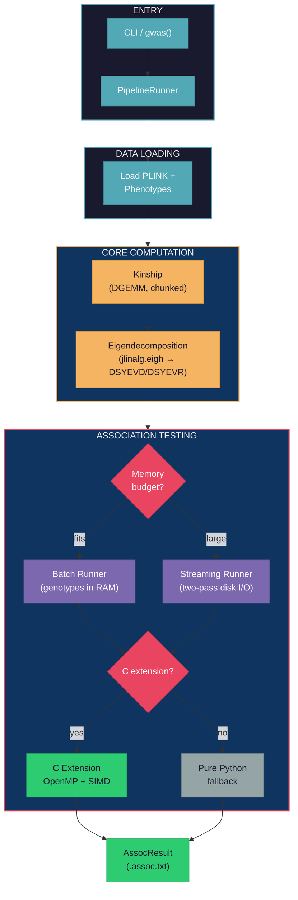

<p align="center">
  <a href="https://github.com/michael-denyer/jamma/actions/workflows/ci.yml"></a>
  <a href="https://pypi.org/project/jamma/"></a>
  <a href="https://www.python.org/downloads/"></a>
  <a href="https://numpy.org/"></a>
  <a href="https://hypothesis.readthedocs.io/"></a>
  <a href="https://www.gnu.org/licenses/gpl-3.0"></a>
  <a href="https://buymeacoffee.com/codenyer"></a>
</p>

<p align="center">
  
</p>

**JAMMA** (Highly-Accelerated Multi-method Mixed-Model Association) -- a modern Python and C reimplementation of [GEMMA](https://github.com/genetics-statistics/GEMMA) for large-scale GWAS.

- **Drop-in GEMMA replacement**: Same CLI flags, same file formats, same results. Change one word in your pipeline.
- **Numerical equivalence**: Validated against GEMMA -- 100% significance agreement, 100% effect direction agreement
- **Fast**: Up to 41x faster than GEMMA 0.98.5 (LOCO mode); 16-32x on single-pass LMM. Against a GEMMA built with Apple Accelerate rather than OpenBLAS, 25x and 10-14x
- **Memory-safe**: Pre-flight memory checks prevent OOM crashes before allocation
- **Cross-platform**: Runs on Linux, macOS, and Windows with NumPy and vendor BLAS
- **Optimized for Intel**: Best performance on Intel CPUs with MKL BLAS. Runs well on Apple Silicon (Accelerate BLAS). Other architectures (AMD, ARM Linux) work correctly but with less BLAS optimization
- **Pure Python + C extensions (OpenMP SIMD)**: NumPy stack with vendor BLAS dispatch (MKL-ILP64, Accelerate-ILP64) via jlinalg C layer for eigendecomposition and OpenMP-parallel Wald tests
- **Large-scale ready**: Optional [numpy-mkl ILP64](https://github.com/michael-denyer/numpy-mkl) wheels (numpy 2.4.6+) for >46k sample eigendecomposition

## Installation

### macOS (13.3+)

```bash
pip install jamma
```

That's it. macOS Accelerate BLAS handles large matrices natively (Accelerate-ILP64).

### Windows (10+), Windows Server (2016+) and Linux (Intel/AMD)

Install [numpy-mkl](https://github.com/michael-denyer/numpy-mkl) first -- standard numpy uses 32-bit BLAS integers which overflow at ~46k samples. Pre-built ILP64 wheels are available for Python 3.11-3.14:

```bash
pip install psutil loguru threadpoolctl click progressbar2 bed-reader
pip install numpy \
  --index-url https://michael-denyer.github.io/numpy-mkl \
  --force-reinstall --upgrade
pip install jamma --no-deps
```

**From Git (latest development version):**

```bash
pip install psutil loguru threadpoolctl click progressbar2 bed-reader
pip install numpy \
  --index-url https://michael-denyer.github.io/numpy-mkl \
  --force-reinstall --upgrade
pip install git+https://github.com/michael-denyer/jamma.git --no-deps
```

> **Why `--no-deps`?** JAMMA depends on `numpy>=2.0.0`, so a normal `pip install jamma` will pull in standard numpy and overwrite the ILP64 build. `--no-deps` prevents this; you install the runtime dependencies manually instead.

See the [User Guide](docs/USER_GUIDE.md#linux--windows) for ILP64 verification steps.

### Platform Support

| Platform | BLAS | ILP64 | Notes |
|----------|------|-------|-------|
| Linux x86_64 | MKL (optimal) | numpy-mkl | Best performance |
| ARM Linux | OpenBLAS | -- | Works correctly |
| ARM Mac (M1+) | Accelerate | native | Excellent performance |
| Intel Mac (macOS 13.3+) | Accelerate | native | Full support |
| Windows x86_64 (10+) | MKL (optimal) | numpy-mkl | Best performance |
| Windows Server x86_64 (2016+) | MKL (optimal) | numpy-mkl | Best performance |

See the [User Guide](docs/USER_GUIDE.md#platform-support) for BLAS backend details.

## Quick Start

```bash
# Compute kinship matrix (centered relatedness)
jamma -gk 1 -bfile data/my_study -o output
# Output: output/output.cXX.npy (binary, fast)
# Add --legacy-text for GEMMA-compatible text format

# Run LMM association (Wald test)
jamma -lmm 1 -bfile data/my_study -k output/output.cXX.npy -o results

# Multiple phenotypes (eigendecomp computed once, reused)
jamma -lmm 1 -bfile data/my_study -k output/output.cXX.npy -n "1 2 3" -o results
```

Output files:

- `output.cXX.npy` -- Kinship matrix (binary NumPy format; `.cXX.txt` with `--legacy-text`)
- `results.assoc.txt` -- Association results (chr, rs, ps, n_miss, allele1, allele0, af, beta, se, logl_H1, l_remle, p_wald)
- `results.log.txt` -- Run log

The reader auto-detects format, so existing `.cXX.txt` files still work as `-k` input.

## GEMMA CLI Parity

JAMMA supports GEMMA's core GWAS flags (`-gk`, `-lmm`, `-bfile`, `-k`, `-c`, `-o`, `-n`, `-loco`, `-snps`, `-hwe`) with identical names and semantics. Existing GEMMA commands work by changing `gemma` to `jamma`:

| GEMMA | JAMMA |
|-------|-------|
| `gemma -gk 1 -bfile study -o out` | `jamma -gk 1 -bfile study -o out` |
| `gemma -lmm 1 -bfile study -k kinship.cXX.txt -o results` | `jamma -lmm 1 -bfile study -k kinship.cXX.txt -o results` |
| `gemma -lmm 4 -bfile study -k k.txt -c covars.txt -o results` | `jamma -lmm 4 -bfile study -k k.txt -c covars.txt -o results` |

- Reads and writes GEMMA `.assoc.txt` and `.cXX.txt` formats
- Accepts PLINK binary `.bed/.bim/.fam` files (same as GEMMA)
- Output columns match GEMMA (mode-dependent -- see [User Guide](docs/USER_GUIDE.md#output-format))
- Also supports binary `.npy` format for kinship (faster I/O); use `--legacy-text` for GEMMA text format

## Python API

The `gwas()` function handles the full pipeline -- data loading, kinship computation, eigendecomposition, and LMM association -- in a single call. You don't need to compute a kinship matrix separately unless you want to reuse it across runs.

```python
from jamma import gwas

# Simplest usage: computes kinship internally, no separate kinship step needed
result = gwas("data/my_study")
print(f"Tested {result.n_snps_tested} SNPs in {result.timing['total_s']:.1f}s")

# Or supply a pre-computed kinship matrix to skip recomputation
result = gwas("data/my_study", kinship_file="data/kinship.cXX.npy")

# Compute kinship from scratch and save it for reuse
result = gwas("data/my_study", save_kinship=True, output_dir="output")

# With covariates and LRT test
result = gwas("data/my_study", kinship_file="k.txt", covariate_file="covars.txt", lmm_mode=2)

# LOCO analysis (leave-one-chromosome-out)
result = gwas("data/my_study", loco=True)

# LOCO with eigen caching: writes a per-chromosome eigen cache to output_dir
result = gwas("data/my_study", loco=True, write_eigen=True, output_dir="output")
# Reusing a LOCO eigen cache on a later run is CLI-only — the cache is a set of
# per-chromosome files keyed by directory, so point --eigen-dir at the same dir:
#   jamma -lmm 1 -bfile data/my_study -loco --eigen-dir output -o result

# Multi-phenotype with eigendecomp reuse (Python API)
result = gwas("data/my_study", write_eigen=True, phenotype_column=1)
result = gwas("data/my_study", eigenvalue_file="output/result.eigenD.npy",
              eigenvector_file="output/result.eigenU.npy", phenotype_column=2)
# Or use the CLI for automatic multi-phenotype: jamma -lmm 1 ... -n "1 2 3"

# SNP filtering
result = gwas("data/my_study", kinship_file="k.txt", snps_file="snps.txt", hwe=0.001)
```

See the [User Guide](docs/USER_GUIDE.md#low-level-api) for the low-level component API (kinship, eigendecomposition, LMM runners).

## Memory Safety

Unlike GEMMA, JAMMA includes pre-flight memory checks that prevent out-of-memory crashes:

- Pre-flight checks before large allocations (eigendecomposition, genotype loading)
- RSS memory logging at workflow boundaries
- Incremental result writing (no memory accumulation)
- Safe chunk size defaults with hard caps

GEMMA will silently OOM and get killed by the OS. JAMMA fails fast with clear error messages. See the [User Guide](docs/USER_GUIDE.md#memory-safety) for the programmatic memory estimation API.

## Performance

JAMMA v6.0.0 on mouse_hs1940 (1,940 samples x 12,226 SNPs), Apple M5 Pro
(18 cores), Accelerate-ILP64, GEMMA 0.98.5. Best observed across 3 rounds of
best-of-3, end-to-end wall clock:

| Operation | GEMMA (OpenBLAS) | GEMMA (Accelerate) | JAMMA NumPy | JAMMA NumPy+C | JAMMA NumPy+C (stream) | C speedup | vs GEMMA (OB) | vs GEMMA (Accel) |
|-----------|-----------------|-------------------|-------------|--------------|------------------------|-----------|---------------|------------------|
| Kinship (`-gk 1`) | 1.1s | 1.2s | 195ms | 195ms | -- | 1.0x | **5.6x** | **6.2x** |
| LMM Wald (`-lmm 1`) | 7.1s | 4.2s | 2.4s | 430ms | 541ms | 5.6x | **16.5x** | **9.8x** |
| LMM All (`-lmm 4`) | 13.0s | 7.4s | 3.6s | 580ms | 695ms | 6.2x | **22.4x** | **12.8x** |
| LMM Wald+4cov (`-lmm 1 -c`) | 26.9s | 11.4s | 5.8s | 836ms | 945ms | 6.9x | **32.2x** | **13.6x** |
| LOCO Wald (`-loco`) | 2m14s | 1m21s | -- | **3.3s** | -- | -- | **~41x** | **~25x** |

v6.0.0 measures within +/-2% of v5.6.0 on every row here, so the version change
carries no performance cost.

See [Performance](docs/PERFORMANCE.md) for benchmark methodology, the v6.0.0
against v5.6.0 comparison, and large-scale (125k) results.

## Supported Features

### Current

- [x] Kinship matrix computation -- centered (`-gk 1`) and standardized (`-gk 2`)
- [x] Univariate LMM Wald test (`-lmm 1`)
- [x] Likelihood ratio test (`-lmm 2`)
- [x] Score test (`-lmm 3`)
- [x] All tests mode (`-lmm 4`)
- [x] LOCO kinship -- leave-one-chromosome-out analysis (`-loco`)
- [x] Binary `.npy` I/O -- default for kinship and eigen files; `--legacy-text` for GEMMA text format
- [x] Multi-phenotype support -- `-n "1 2 3"` with single eigendecomposition reuse
- [x] Eigendecomposition reuse -- manual via `-d`/`-u`/`-eigen`, automatic in multi-phenotype mode
- [x] LOCO eigen caching -- `--eigen-dir` saves/loads per-chromosome eigen files across runs
- [x] Phenotype column selection (`-n`)
- [x] SNP subset selection for association and kinship (`-snps`/`-ksnps`)
- [x] HWE QC filtering (`-hwe`)
- [x] Pre-computed kinship input (`-k`)
- [x] Covariate support (`-c`)
- [x] PLINK binary format (`.bed/.bim/.fam`) with input dimension validation
- [x] Large-scale streaming I/O (>100k samples via [numpy-mkl ILP64](https://github.com/michael-denyer/numpy-mkl) -- numpy 2.4.6+)
- [x] Lambda optimization bounds (`-lmin`/`-lmax`)
- [x] Individual weights for kinship (`-widv`)
- [x] Categorical covariates with one-hot encoding (`-cat`)
- [x] Pre-flight memory checks (fail-fast before OOM)
- [x] RSS memory logging at workflow boundaries
- [x] Incremental result writing
- [x] In-place mean imputation for missing genotypes (per-chunk, zero-copy)
- [x] Early sample filtering -- kinship accumulated at filtered size when phenotype missingness is present
- [x] jlinalg C layer: vendor BLAS dispatch for eigendecomposition (DSYEVD default, DSYEVR O(n) workspace fallback under memory pressure), DSYRK, DGEMM
- [x] Optional C extension: OpenMP-parallel Wald tests (auto-fallback to pure Python)

### Planned

- [ ] Multivariate LMM (mvLMM)

## Architecture

JAMMA uses NumPy for data loading and kinship. Eigendecomposition uses `jlinalg.eigh` which dispatches to vendor DSYEVD (default) or DSYEVR (O(n) workspace, under memory pressure) via the jlinalg C layer. LMM association uses a NumPy backend with an optional C extension for OpenMP-parallel Wald/Score/LRT tests. Mode is auto-selected based on available memory: batch runner when genotypes fit in RAM, streaming runner (two-pass disk I/O) for large datasets.



Core algorithms ([likelihood.py](src/jamma/lmm/likelihood.py), [prepare_common.py](src/jamma/lmm/prepare_common.py)) are shared between batch and streaming runners. See [jlinalg Architecture](docs/JLINALG_ARCHITECTURE.md) for the C vendor BLAS dispatch layer.

See [Code Map](docs/CODEMAP.md) for the full architecture diagram with source links.

## Documentation

- [Why JAMMA?](docs/WHY_JAMMA.md) -- Key differentiators from GEMMA
- [User Guide](docs/USER_GUIDE.md) -- Installation, usage examples, CLI reference
- [Code Map](docs/CODEMAP.md) -- Architecture diagrams and source navigation
- [Equivalence Proof](docs/GEMMA_EQUIVALENCE.md) -- Mathematical proofs and empirical validation against GEMMA
- [Numerical Equivalence Bound](docs/GEMMA_NUMERICAL_EQUIVALENCE_BOUND.md) -- End-to-end FP error bound vs GEMMA
- [GEMMA Divergences](docs/GEMMA_DIVERGENCES.md) -- Known differences from GEMMA
- [Performance](docs/PERFORMANCE.md) -- Bottleneck analysis, scale validation, configuration guide
- [jlinalg Architecture](docs/JLINALG_ARCHITECTURE.md) -- C vendor BLAS dispatch layer design
- [jlinalg Algorithms](docs/JLINALG_ALGORITHMS.md) -- Cache blocking, D&C eigendecomposition, SVD
- [Glossary](docs/GLOSSARY.md) -- Terms and abbreviations (ILP64, REML, LOCO, BLAS, etc.)
- [Contributing](CONTRIBUTING.md) -- Development setup, testing, and PR guidelines
- [Changelog](CHANGELOG.md) -- Version history

## Requirements

- Python 3.11+
- NumPy 2.4.6+

## License

[GPL-3.0](LICENSE.md) (same as GEMMA).
