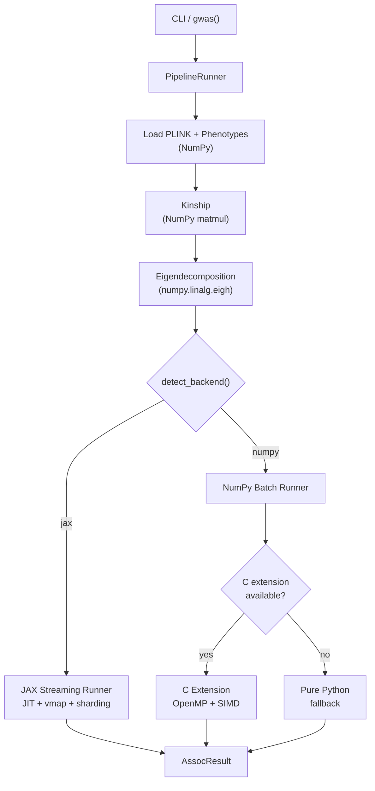

<p align="center">
  <a href="https://github.com/michael-denyer/jamma/actions/workflows/ci.yml"></a>
  <a href="https://pypi.org/project/jamma/"></a>
  <a href="https://www.python.org/downloads/"></a>
  <a href="https://github.com/jax-ml/jax"></a>
  <a href="https://numpy.org/"></a>
  <a href="https://hypothesis.readthedocs.io/"></a>
  <a href="https://www.gnu.org/licenses/gpl-3.0"></a>
  <a href="https://buymeacoffee.com/codenyer"></a>
</p>

<p align="center">
  
</p>

**Fast Mixed Model Association** — A modern Python reimplementation of [GEMMA](https://github.com/genetics-statistics/GEMMA) for genome-wide association studies (GWAS).

- **GEMMA-compatible**: Drop-in replacement with identical CLI flags and output formats
- **Numerical equivalence**: Validated against GEMMA — 100% significance agreement, 100% effect direction agreement
- **Fast**: Up to 10x faster than GEMMA 0.98.5 at scale
- **Memory-safe**: Pre-flight memory checks prevent OOM crashes before allocation
- **Cross-platform**: Runs on Linux, macOS, and Windows — NumPy backend works everywhere, JAX adds batch acceleration on Linux and ARM Mac
- **Pure Python + optional C extension**: NumPy + optional JAX stack; C extension with OpenMP for fast Wald tests, JAX for batch MLE optimization
- **Large-scale ready**: Optional [numpy-mkl ILP64](https://github.com/michael-denyer/numpy-mkl) wheels (numpy 2.4.2) for >46k sample eigendecomposition

## Installation

### macOS (Intel or ARM)

```bash
pip install jamma          # NumPy backend
pip install jamma[jax]     # + JAX acceleration (ARM Mac only)
```

That's it. macOS Accelerate BLAS handles large matrices natively.

### Linux / Windows / Intel Mac

For small datasets (<46k samples), the standard install works:

```bash
pip install jamma          # NumPy backend
pip install jamma[jax]     # + JAX acceleration
```

For large-scale GWAS (>46k samples) on **Linux x86_64**, install [numpy-mkl](https://github.com/michael-denyer/numpy-mkl) first — standard numpy uses 32-bit BLAS integers which overflow at ~46k samples. MKL is x86_64-only; ARM Mac and Windows users are limited to <46k samples. Pre-built ILP64 wheels are available for Python 3.11–3.14:

**NumPy backend only:**

```bash
pip install numpy \
  --extra-index-url https://michael-denyer.github.io/numpy-mkl \
  --force-reinstall --upgrade
pip install jamma --no-deps
pip install psutil loguru threadpoolctl click progressbar2 bed-reader
```

**With JAX acceleration:**

```bash
pip install numpy \
  --extra-index-url https://michael-denyer.github.io/numpy-mkl \
  --force-reinstall --upgrade
pip install jamma[jax] --no-deps
pip install psutil loguru threadpoolctl click progressbar2 bed-reader \
  jax jaxlib jaxtyping
```

**From Git (latest development version):**

```bash
pip install numpy \
  --extra-index-url https://michael-denyer.github.io/numpy-mkl \
  --force-reinstall --upgrade
pip install git+https://github.com/michael-denyer/jamma.git --no-deps
pip install psutil loguru threadpoolctl click progressbar2 bed-reader
```

> **Why `--no-deps`?** JAMMA depends on `numpy>=2.0.0`, so a normal `pip install jamma` will pull in standard numpy and overwrite the ILP64 build. `--no-deps` prevents this; you install the runtime dependencies manually instead.

See the [User Guide](docs/USER_GUIDE.md#linux--windows) for ILP64 verification steps.

### Platform Support

| Platform | `pip install jamma` | `pip install jamma[jax]` | Notes |
|----------|---------------------|--------------------------|-------|
| Linux x86_64 | JAX (auto-included) | — | Full support; ILP64 for >46k samples |
| ARM Mac (M1+) | JAX (auto-included) | — | Full support |
| Intel Mac | NumPy only | Not available | JAX dropped Intel Mac support |
| Windows | NumPy only | Not available | JAX dropped Windows support |

JAX is auto-included on Linux and ARM Mac via platform markers.
Force a specific backend with `--backend numpy` or `--backend jax`.

## Quick Start

```bash
# Compute kinship matrix (centered relatedness)
jamma -gk 1 -bfile data/my_study -o output

# Run LMM association (Wald test)
jamma -lmm 1 -bfile data/my_study -k output/output.cXX.txt -o results
```

Output files match GEMMA format exactly:

- `output.cXX.txt` — Kinship matrix
- `results.assoc.txt` — Association results (chr, rs, ps, n_miss, allele1, allele0, af, beta, se, logl_H1, l_remle, p_wald)
- `results.log.txt` — Run log

## Python API

### One-call GWAS (recommended)

```python
from jamma import gwas

# Full pipeline: load data → kinship → eigendecomp → LMM → results
result = gwas("data/my_study", kinship_file="data/kinship.cXX.txt")
print(f"Tested {result.n_snps_tested} SNPs in {result.timing['total_s']:.1f}s")

# Compute kinship from scratch and save it
result = gwas("data/my_study", save_kinship=True, output_dir="output")

# With covariates and LRT test
result = gwas("data/my_study", kinship_file="k.txt", covariate_file="covars.txt", lmm_mode=2)

# LOCO analysis (leave-one-chromosome-out)
result = gwas("data/my_study", loco=True)

# Multi-phenotype with eigendecomp reuse
result = gwas("data/my_study", write_eigen=True, phenotype_column=1)
result = gwas("data/my_study", eigenvalue_file="output/result.eigenD.txt",
              eigenvector_file="output/result.eigenU.txt", phenotype_column=2)

# SNP filtering
result = gwas("data/my_study", kinship_file="k.txt", snps_file="snps.txt", hwe=0.001)
```

### Low-level API (JAX backend)

```python
import numpy as np

from jamma.io import load_plink_binary
from jamma.kinship import compute_centered_kinship
from jamma.lmm import run_lmm_association_streaming
from jamma.lmm.eigen import eigendecompose_kinship

# Load PLINK data and phenotypes
data = load_plink_binary("data/my_study")
phenotypes = np.loadtxt("data/my_study.pheno")  # loaded separately from .fam or phenotype file

# Compute kinship and eigendecompose (treat kinship as consumed after this)
kinship = compute_centered_kinship(data.genotypes)
eigenvalues, eigenvectors = eigendecompose_kinship(kinship)

# Run association (streaming from disk)
results, n_tested = run_lmm_association_streaming(
    bed_path="data/my_study",
    phenotypes=phenotypes,
    eigenvalues=eigenvalues,
    eigenvectors=eigenvectors,
    chunk_size=5000,
)
```

### Low-level API (NumPy backend)

```python
import numpy as np

from jamma.io import load_plink_binary
from jamma.kinship import compute_centered_kinship
from jamma.lmm import run_lmm_association_numpy
from jamma.lmm.eigen import eigendecompose_kinship

data = load_plink_binary("data/my_study")
phenotypes = np.loadtxt("data/my_study.pheno")
kinship = compute_centered_kinship(data.genotypes)
eigenvalues, eigenvectors = eigendecompose_kinship(kinship)

snp_info = [
    {"chr": str(data.chromosome[i]), "rs": data.sid[i],
     "pos": int(data.bp_position[i]), "a1": data.allele_1[i], "a0": data.allele_2[i]}
    for i in range(data.n_snps)
]

# Returns list[AssocResult] — write to disk via IncrementalAssocWriter
results = run_lmm_association_numpy(
    genotypes=data.genotypes,
    phenotypes=phenotypes,
    kinship=None,  # Not needed when eigenvalues/eigenvectors provided
    snp_info=snp_info,
    eigenvalues=eigenvalues,
    eigenvectors=eigenvectors,
    lmm_mode=1,
)
```

## Memory Safety

Unlike GEMMA, JAMMA includes pre-flight memory checks that prevent out-of-memory crashes:

```python
from jamma.core.memory import estimate_workflow_memory

# Check memory requirements BEFORE loading data
estimate = estimate_workflow_memory(n_samples=200_000, n_snps=95_000)
print(f"Peak memory: {estimate.total_gb:.1f}GB")
print(f"Available: {estimate.available_gb:.1f}GB")
print(f"Sufficient: {estimate.sufficient}")
```

**Key features:**

- Pre-flight checks before large allocations (eigendecomposition, genotype loading)
- RSS memory logging at workflow boundaries
- Incremental result writing (no memory accumulation)
- Safe chunk size defaults with hard caps

GEMMA will silently OOM and get killed by the OS. JAMMA fails fast with clear error messages.

## Performance

Benchmark on mouse_hs1940 (1,940 samples × 12,226 SNPs), Apple M2, JAMMA v2.9.5, GEMMA 0.98.5.
Median of 3 runs, end-to-end wall clock:

| Operation          | GEMMA 0.98.5 | JAMMA (NumPy) | JAMMA (JAX) | vs GEMMA     |
|--------------------|--------------|---------------|-------------|--------------|
| Kinship (`-gk 1`)  | 2.2s         | 1.5s          | 1.5s        | **1.5x**     |
| LMM (`-lmm 1`)     | 11.2s        | 1.0s          | 2.4s        | **11.2x**    |
| LMM (`-lmm 4`)     | 20.7s        | 5.1s          | 3.2s        | **6.5x**     |

For Wald-only (`-lmm 1`), the C extension with OpenMP is fastest — REML-only optimization is compute-bound and parallelizes well across SNPs. For all-tests (`-lmm 4`), JAX pulls ahead because the additional MLE optimization per SNP benefits from `jax.vmap` batching.

## Supported Features

### Current

- [x] Kinship matrix computation — centered (`-gk 1`) and standardized (`-gk 2`)
- [x] Univariate LMM Wald test (`-lmm 1`)
- [x] Likelihood ratio test (`-lmm 2`)
- [x] Score test (`-lmm 3`)
- [x] All tests mode (`-lmm 4`)
- [x] LOCO kinship — leave-one-chromosome-out analysis (`-loco`)
- [x] Eigendecomposition reuse — multi-phenotype workflows (`-d`/`-u`/`-eigen`)
- [x] Phenotype column selection (`-n`)
- [x] SNP subset selection for association and kinship (`-snps`/`-ksnps`)
- [x] HWE QC filtering (`-hwe`)
- [x] Pre-computed kinship input (`-k`)
- [x] Covariate support (`-c`)
- [x] PLINK binary format (`.bed/.bim/.fam`) with input dimension validation
- [x] Large-scale streaming I/O (>100k samples via [numpy-mkl ILP64](https://github.com/michael-denyer/numpy-mkl) — numpy 2.4.2)
- [x] JAX acceleration (CPU) with automatic device sharding
- [x] XLA profiling traces (`--profile-dir`) for TensorBoard/Perfetto
- [x] Lambda optimization bounds (`-lmin`/`-lmax`)
- [x] Individual weights for kinship (`-widv`)
- [x] Categorical covariates with one-hot encoding (`-cat`)
- [x] Pre-flight memory checks (fail-fast before OOM)
- [x] RSS memory logging at workflow boundaries
- [x] Incremental result writing
- [x] Optional C extension with OpenMP for NumPy LMM acceleration (auto-fallback to pure Python)

### Planned

- [ ] Multivariate LMM (mvLMM)

## Architecture

JAMMA uses NumPy for data loading, kinship, and eigendecomposition, then splits at LMM into a **JAX backend** (JIT, vmap, sharding) or a **NumPy backend** with an optional C extension for OpenMP-parallel Wald tests.



Both backends share the same core algorithms ([likelihood.py](src/jamma/lmm/likelihood.py), [prepare_common.py](src/jamma/lmm/prepare_common.py)) and produce identical results. Backend-specific files follow a naming convention: `*_jax.py` / `*_numpy.py`.

See [Code Map](docs/CODEMAP.md) for the full architecture diagram with source links.

## Documentation

- [Why JAMMA?](docs/WHY_JAMMA.md) — Key differentiators from GEMMA
- [User Guide](docs/USER_GUIDE.md) — Installation, usage examples, CLI reference
- [Code Map](docs/CODEMAP.md) — Architecture diagrams and source navigation
- [Equivalence Proof](docs/EQUIVALENCE.md) — Mathematical proofs and empirical validation against GEMMA
- [GEMMA Divergences](docs/GEMMA_DIVERGENCES.md) — Known differences from GEMMA
- [Performance](docs/PERFORMANCE.md) — Bottleneck analysis, scale validation, configuration guide
- [Contributing](CONTRIBUTING.md) — Development setup, testing, and PR guidelines
- [Changelog](CHANGELOG.md) — Version history

## Requirements

- Python 3.11+
- NumPy 2.0+
- JAX 0.8.0+ (optional, for batch acceleration: `pip install jamma[jax]`)

## License

GPL-3.0 (same as GEMMA)
