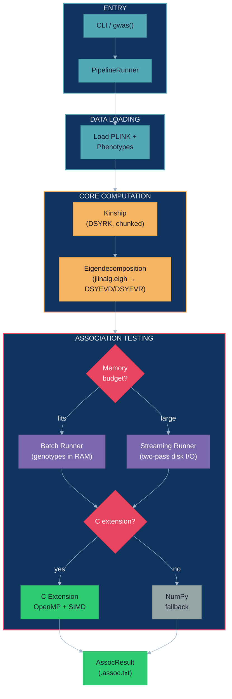

# JAMMA

<p align="center">
  
</p>

[](https://github.com/michael-denyer/jamma/actions/workflows/ci.yml)
[](https://pypi.org/project/jamma/)
[](https://www.python.org/downloads/)
[](LICENSE.md)
[](https://doi.org/10.5281/zenodo.22666119)

**JAMMA** stands for Highly-Accelerated Multi-method Mixed-Model Association.
It is a Python and C reimplementation of [GEMMA](https://github.com/genetics-statistics/GEMMA)
for genome-wide association studies (GWAS), using linear mixed models to account
for relatedness between samples.

JAMMA reads PLINK binary data and supports GEMMA's core univariate LMM commands.
Native C kernels accelerate association testing, while memory checks and chunked
processing help fit analyses to available RAM. Use it from the command line or
through a single Python function.

[Install](#installation) · [First run](#quick-start) · [Python API](#python-api) ·
[Performance](#performance) · [Documentation](#documentation)

## Installation

Requires Python 3.11+ and NumPy 2.4.6+. PLINK itself is not required to read
`.bed`, `.bim`, and `.fam` files.

### macOS 13.3+ or smaller Linux and Windows analyses

```bash
python -m pip install jamma
jamma --help
```

On macOS 13.3+, JAMMA can use Accelerate's native 64-bit BLAS integer interface
on Apple Silicon and Intel Macs. On Linux and Windows, the standard NumPy build
is suitable for smaller datasets; use the installation below for analyses above
roughly 46,000 samples.

### Large analyses on Linux and Windows x86_64

Large eigendecompositions need **ILP64**, a BLAS interface with 64-bit integers.
The usual 32-bit interface can overflow around 46,000 samples. Install the
runtime dependencies first, then [NumPy with MKL ILP64](https://github.com/michael-denyer/numpy-mkl),
then JAMMA:

```bash
python -m pip install psutil loguru threadpoolctl click progressbar2 bed-reader
python -m pip install numpy --index-url https://michael-denyer.github.io/numpy-mkl --force-reinstall --upgrade
python -m pip install jamma --no-deps
```

`--no-deps` preserves the chosen NumPy build during JAMMA installation. Installing
other packages later can replace it, so check the backend before a large run.
See the [installation and backend verification guide](docs/USER_GUIDE.md#linux--windows)
for details, and [Deployment](docs/DEPLOYMENT.md) for Docker setup.

## Quick start

### Run with your data

For a PLINK dataset named `data/study.bed`, `data/study.bim`, and
`data/study.fam`, pass the prefix `data/study`. The default phenotype is column 6
of the `.fam` file.

```bash
# Compute centered kinship and save it for reuse.
jamma -gk 1 -bfile data/study -o kinship -outdir output

# Run a Wald association test using that kinship.
jamma -lmm 1 -bfile data/study -k output/kinship.cXX.npy -o results -outdir output
```

The commands create:

| File | Contents |
|------|----------|
| `output/kinship.cXX.npy` | Centered kinship matrix in NumPy binary format |
| `output/results.assoc.txt` | Association results, including effect estimates and Wald p-values |
| `output/results.log.txt` | Run log |

An association command needs a kinship source: `-k`, the saved eigen files
`-d` and `-u`, or `-loco`, which computes kinship internally. Kinship and eigen
files default to binary `.npy`; add `--legacy-text` when you need GEMMA text
output. Existing text kinship files work as `-k` input.

### BGEN imputed dosages

JAMMA reads BGEN v1.2 files (layout 2, biallelic, unphased diploid, bit depth
1 to 16) with their `.sample` file and a bgenix `.bgi` index
(`bgenix -g data/imputed.bgen -index`). A BGEN file carries no phenotypes, so
pass them with `-p`: a whitespace-separated file with no header and one row per
sample in `.sample` order, where `NA` and `-9` mark a missing value. `-n`
selects the column, starting at 1.

```bash
jamma -gk 1 -bgen data/imputed.bgen -p pheno.txt -info 0.8 -o kinship -outdir output
jamma -lmm 1 -bgen data/imputed.bgen -p pheno.txt -info 0.8 -k output/kinship.cXX.npy -o results -outdir output
```

- `-sample` defaults to the `.bgen` path with `.sample` in place of `.bgen`, and
  `-bgi` defaults to the `.bgen` path plus `.bgi`.
- The counted allele is the first allele of each variant, so the dosage is
  2·P(11) + P(12). `allele1` and `af` in `.assoc.txt` refer to that allele.
- `-info` keeps SNPs whose imputation INFO is at least the threshold, for
  kinship and association alike. INFO is GCTA's `--info`, recomputed over the
  analysed samples rather than read from an imputation summary. It applies
  only to BGEN input.
- `-hwe` is rejected with `-bgen`, because fractional dosages fall in no HWE
  genotype class. `--backend numpy` is rejected too: the batch runner holds
  hard calls in memory, so BGEN input always streams.
- zstd-compressed files need the `zstd` extra below Python 3.14:
  `python -m pip install "jamma[zstd]"`.
- `-p` also works with `-bfile`, in place of the `.fam` phenotype columns.

### Try the included example

After installing JAMMA, clone the repository to obtain the synthetic dataset:

```bash
git clone https://github.com/michael-denyer/jamma.git
cd jamma
jamma -gk 1 -bfile tests/fixtures/gemma_synthetic/test -o kinship -outdir output/example
jamma -lmm 1 -bfile tests/fixtures/gemma_synthetic/test -k output/example/kinship.cXX.npy -o results -outdir output/example
```

Open `output/example/results.assoc.txt` to inspect the results. The fixture is
included in the repository; installing the package alone does not provide it.

## Supported analyses

| Analysis | Option |
|----------|--------|
| PLINK or BGEN genotypes, phenotype file | `-bfile`, `-bgen`, `-p` |
| Centered or standardized kinship | `-gk 1` or `-gk 2` |
| Wald, likelihood ratio, or Score test | `-lmm 1`, `-lmm 2`, or `-lmm 3` |
| All three association tests | `-lmm 4` |
| Leave-one-chromosome-out analysis (LOCO) | `-loco` |
| Covariates, including categorical columns | `-c`, `-cat` |
| Multiple phenotypes with eigendecomposition reuse | `-n "1 2 3"` |
| SNP subsets and quality filters | `-snps`, `-ksnps`, `-maf`, `-miss`, `-hwe`, `-info` |
| Saved eigendecomposition and LOCO caches | `-eigen`, `-d`, `-u`, `--eigen-dir` |

For example, run all tests with covariates, or compute a separate kinship for
each chromosome's LOCO analysis:

```bash
jamma -lmm 4 -bfile data/study -k output/kinship.cXX.npy -c covars.txt -o adjusted
jamma -lmm 1 -bfile data/study -loco -o loco
```

See the [User Guide](docs/USER_GUIDE.md) for input formats and examples, and
[Configuration](docs/CONFIGURATION.md) for every flag and default.

## GEMMA CLI parity

For supported univariate LMM workflows, replace `gemma` with `jamma` while
keeping the core flags and PLINK inputs. Association output uses GEMMA's
mode-dependent `.assoc.txt` format.

Compatibility has limits. JAMMA does not implement multivariate LMM, BSLMM,
plain linear regression, or BIMBAM input. Binary kinship output is the default,
and floating-point results are compared within documented tolerances rather
than required to match bit for bit.

Read the [numerical equivalence analysis](docs/GEMMA_EQUIVALENCE.md),
[validation coverage and remaining scope](docs/MATHEMATICAL_VALIDATION.md), and
[known differences from GEMMA](docs/GEMMA_DIVERGENCES.md) when migrating a pipeline.

## Python API

`gwas()` loads the data, computes or reads kinship, runs the association tests,
and writes results:

```python
from jamma import gwas

result = gwas("data/study", output_dir="output", output_prefix="results")
print(f"Tested {result.n_snps_tested} SNPs in {result.timing.total_s:.1f}s")
print(result.assoc_path)  # output/results.assoc.txt
```

Supply `kinship_file="output/kinship.cXX.npy"` to reuse a matrix, `lmm_mode=4`
to run all tests, or `loco=True` for LOCO. For BGEN input, pass
`gwas(bgen="data/imputed.bgen", phenotype_file="pheno.txt", info=0.8)` in
place of the PLINK prefix. Use `phenotype_columns=[1, 2, 3]` to
share one eigendecomposition across phenotypes; this is separate from a
multivariate LMM.

Results stream to disk. `result.associations` is empty for this pipeline;
`result.assoc_path` identifies the output, and `result.assoc_paths` lists the
files for multiple phenotypes. See the [Python API guide](docs/USER_GUIDE.md#python-api)
for more examples and lower-level components.

## Memory safety

JAMMA checks memory before major allocations, chooses batch or streaming
execution, and writes association results incrementally. These checks reduce
allocation failures; they cannot guarantee that the operating system will never
run out of memory.

Streaming reduces genotype memory, but kinship and eigenvectors still require
dense matrices whose storage grows with the square of the sample count.
ILP64 removes the BLAS integer limit; it does not remove the RAM requirement.
At 100,000 samples, the documented eigendecomposition estimates are roughly
240 GB with DSYEVD or 160 GB with the lower-workspace DSYEVR path. The
estimator adds a safety margin (10%, capped at 10 GB) for the process's own
memory: a 100,000-sample Wald run measured 250 GB peak resident memory on
2026-09-23.

See [memory planning](docs/USER_GUIDE.md#memory-safety) before scaling up.

## Performance

JAMMA on mouse_hs1940 (1,940 samples x 12,226 SNPs; 1,410 samples and 10,768
SNPs retained for association), Apple M5 Pro (18 cores), Accelerate-ILP64,
GEMMA 0.98.5, measured 2026-09-23 at revision `0677ac9e`. Other work shared
the machine, with a load average between 3.2 and 8.9 on 18 cores. Every row
times a fresh process from PLINK input to written output, best of three with
backend order rotated. Association rows read the same precomputed kinship file
in both tools.

| Operation | GEMMA (OpenBLAS) | GEMMA (Accelerate) | JAMMA NumPy | JAMMA NumPy+C | JAMMA NumPy+C (stream) | C speedup | vs GEMMA (OB) | vs GEMMA (Accel) |
|-----------|-----------------|-------------------|-------------|--------------|------------------------|-----------|---------------|------------------|
| Kinship (`-gk 1`) | 1.0s | 1.2s | 803ms | 749ms | n/a | 1.1x | 1.4x | 1.6x |
| LMM Wald (`-lmm 1`) | 7.2s | 4.2s | 6.1s | 531ms | 579ms | 11.6x | 13.6x | 7.9x |
| LMM All (`-lmm 4`) | 13.4s | 7.5s | 8.4s | 567ms | 592ms | 14.7x | 23.7x | 13.2x |
| Full GWAS Wald (compute kinship + association) | 8.3s | 5.4s | 6.3s | 679ms | 713ms | 9.3x | 12.2x | 7.9x |
| LMM Wald+4cov (`-lmm 1 -c`) | 27.2s | 12.1s | 17.0s | 1.1s | 1.1s | 15.5x | 24.8x | 11.1x |

| Backend | LOCO Wald | vs fastest GEMMA |
|---------|-----------|------------------|
| GEMMA (OpenBLAS) | 37.5s | 0.9x |
| GEMMA (Accelerate) | 34.2s | 1.0x |
| JAMMA NumPy+C | 3.4s | 10.1x |

LOCO computes each chromosome's excluded kinship and tests each SNP once in both
tools. Every repetition's output was checked against the first within the
validation tolerances before any time was recorded.

See [Performance](docs/PERFORMANCE.md) for the protocol, raw repetitions,
run-to-run ranges and the large-scale (125k) results.

## Architecture

The pipeline loads PLINK data, computes or reads kinship, decomposes the kinship
matrix, and tests SNPs in batches. The `jlinalg` layer dispatches linear algebra
to vendor ILP64 BLAS/LAPACK, with a NumPy fallback. The association C extension
provides OpenMP-parallel kernels. Batch and streaming execution both run with or
without that extension.

<details>
<summary>View the pipeline diagram</summary>



</details>

See [Architecture](docs/ARCHITECTURE.md) for component responsibilities and
[Code Map](docs/CODEMAP.md) for source navigation.

## Documentation

| I want to... | Read |
|--------------|------|
| Install JAMMA or troubleshoot setup | [Getting Started](docs/GETTING-STARTED.md) |
| Choose inputs, tests, and output formats | [User Guide](docs/USER_GUIDE.md) |
| Look up a flag or environment variable | [Configuration](docs/CONFIGURATION.md) |
| Understand a statistical or computing term | [Glossary](docs/GLOSSARY.md) |
| Reproduce benchmarks or plan a large run | [Performance](docs/PERFORMANCE.md) |
| Assess numerical agreement with GEMMA | [Equivalence](docs/GEMMA_EQUIVALENCE.md) and [validation matrix](docs/MATHEMATICAL_VALIDATION.md) |
| Build, test, or deploy JAMMA | [Development](docs/DEVELOPMENT.md), [Testing](docs/TESTING.md), and [Deployment](docs/DEPLOYMENT.md) |
| See release history | [Changelog](CHANGELOG.md) |

## Contributing

Start with [CONTRIBUTING.md](CONTRIBUTING.md) for prerequisites, test conventions,
and pull request guidance. A development checkout uses `uv` and `prek`:

```bash
git clone https://github.com/michael-denyer/jamma.git
cd jamma
uv sync
uv run python -m jamma.lmm._compile_accel
uv run python -m jamma.jlinalg._compile_jlinalg
prek install
uv run pytest tests/ -x
prek run --all-files
```

Report bugs through [GitHub issues](https://github.com/michael-denyer/jamma/issues).
Include the command, JAMMA version, platform, BLAS backend, and relevant log
output so the problem can be reproduced.

## Citation and acknowledgments

Use the [archived JAMMA release and citation metadata](https://doi.org/10.5281/zenodo.22666119)
when citing the software. JAMMA builds on the methods and file conventions of
[GEMMA](https://github.com/genetics-statistics/GEMMA).

To support development, [buy the maintainer a coffee](https://buymeacoffee.com/codenyer).

## License

JAMMA is licensed under [GPL-3.0-or-later](LICENSE.md).
