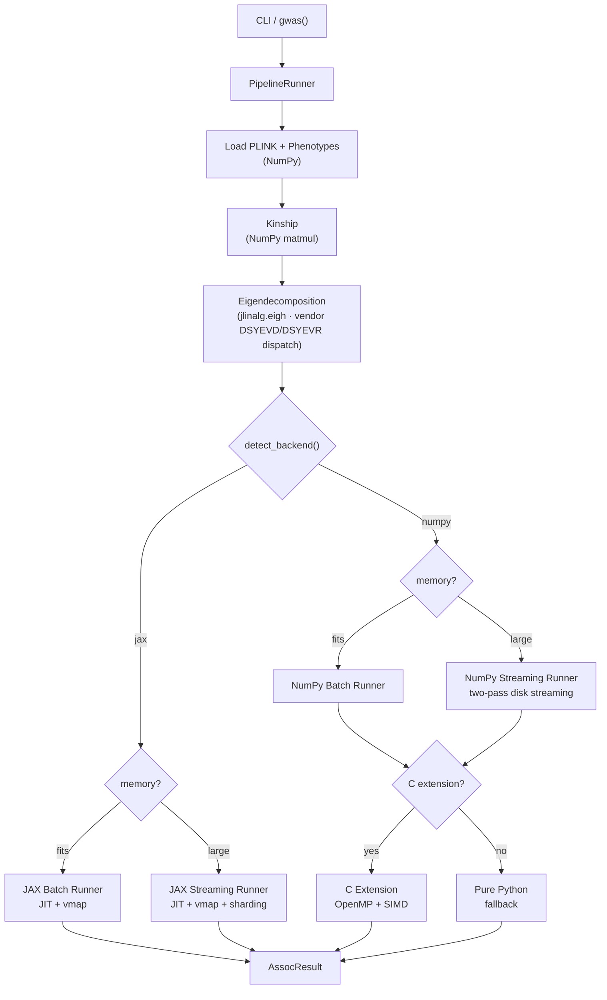
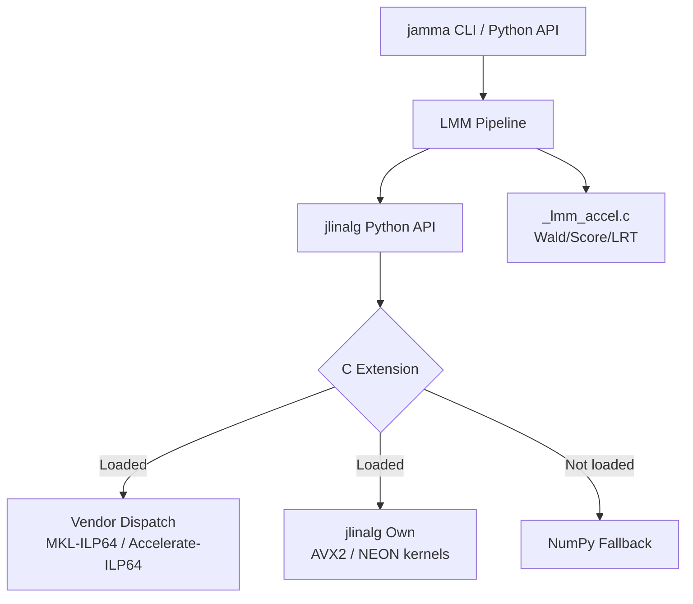

<p align="center">
  <a href="https://github.com/michael-denyer/jamma/actions/workflows/ci.yml"></a>
  <a href="https://pypi.org/project/jamma/"></a>
  <a href="https://www.python.org/downloads/"></a>
  <a href="https://github.com/jax-ml/jax"></a>
  <a href="https://numpy.org/"></a>
  <a href="https://hypothesis.readthedocs.io/"></a>
  <a href="https://www.gnu.org/licenses/gpl-3.0"></a>
  <a href="https://buymeacoffee.com/codenyer"></a>
</p>

<p align="center">
  
</p>

**JAMMA** (High-performance Multi-method Mixed-Model Association) — a modern Python and C reimplementation of [GEMMA](https://github.com/genetics-statistics/GEMMA) for large-scale GWAS.

- **GEMMA-compatible**: Drop-in replacement with identical CLI flags and output formats
- **Numerical equivalence**: Validated against GEMMA — 100% significance agreement, 100% effect direction agreement
- **Fast**: Up to 17x faster than GEMMA 0.98.5
- **Memory-safe**: Pre-flight memory checks prevent OOM crashes before allocation
- **Cross-platform**: Runs on Linux, macOS, and Windows — NumPy backend works everywhere, JAX adds batch acceleration on Linux and ARM Mac
- **Optimized for Intel**: Best performance on Intel CPUs with MKL BLAS. Runs well on Apple Silicon (Accelerate BLAS). Other architectures (AMD, ARM Linux) work correctly but with less BLAS optimization
- **Pure Python + jlinalg + optional C extensions**: NumPy + optional JAX stack; jlinalg C layer for vendor BLAS dispatch (DSYEVD/DSYEVR eigendecomposition, DSYRK, DGEMM) and OpenMP-parallel Wald tests, JAX for batch MLE optimization
- **Large-scale ready**: Optional [numpy-mkl ILP64](https://github.com/michael-denyer/numpy-mkl) wheels (numpy 2.4.2) for >46k sample eigendecomposition

## Installation

### macOS (Intel or ARM)

```bash
pip install jamma          # NumPy backend
pip install 'jamma[jax]'   # + JAX acceleration (ARM Mac only)
```

That's it. macOS Accelerate BLAS handles large matrices natively.

### Linux / Windows / Intel Mac

For small datasets (<46k samples), the standard install works:

```bash
pip install jamma          # NumPy backend
pip install 'jamma[jax]'   # + JAX acceleration
```

For large-scale GWAS (>46k samples) on **x86_64** (Linux or Intel Mac), install [numpy-mkl](https://github.com/michael-denyer/numpy-mkl) first — standard numpy uses 32-bit BLAS integers which overflow at ~46k samples. MKL is x86_64-only; Windows users are limited to <46k samples (ARM Mac uses Accelerate-ILP64 natively). Pre-built ILP64 wheels are available for Python 3.11–3.14:

**NumPy backend only:**

```bash
pip install numpy \
  --extra-index-url https://michael-denyer.github.io/numpy-mkl \
  --force-reinstall --upgrade
pip install jamma --no-deps
pip install psutil loguru threadpoolctl click progressbar2 bed-reader
```

**With JAX acceleration:**

```bash
pip install numpy \
  --extra-index-url https://michael-denyer.github.io/numpy-mkl \
  --force-reinstall --upgrade
pip install 'jamma[jax]' --no-deps
pip install psutil loguru threadpoolctl click progressbar2 bed-reader \
  jax jaxlib jaxtyping
```

**From Git (latest development version):**

```bash
pip install numpy \
  --extra-index-url https://michael-denyer.github.io/numpy-mkl \
  --force-reinstall --upgrade
pip install git+https://github.com/michael-denyer/jamma.git --no-deps
pip install psutil loguru threadpoolctl click progressbar2 bed-reader
```

> **Why `--no-deps`?** JAMMA depends on `numpy>=2.0.0`, so a normal `pip install jamma` will pull in standard numpy and overwrite the ILP64 build. `--no-deps` prevents this; you install the runtime dependencies manually instead.

See the [User Guide](docs/USER_GUIDE.md#linux--windows) for ILP64 verification steps.

### Platform Support

| Platform | `pip install jamma` | `pip install jamma[jax]` | BLAS | Notes |
|----------|---------------------|--------------------------|------|-------|
| Linux x86_64 (Intel) | JAX (auto-included) | — | MKL (optimal) | Best performance; ILP64 for >46k samples |
| Linux x86_64 (AMD) | JAX (auto-included) | — | OpenBLAS | Works well; MKL also works on AMD but less optimized |
| ARM Mac (M1+) | JAX (auto-included) | — | Accelerate | Excellent performance; ILP64 via Accelerate for >46k samples |
| ARM Linux | NumPy only | JAX manual install | OpenBLAS | Works correctly; less BLAS optimization |
| Intel Mac | NumPy only | Not available | MKL / Accelerate | JAX dropped Intel Mac; ILP64 for >46k samples |
| Windows | NumPy only | Not available | OpenBLAS | JAX dropped Windows support; limited to <46k samples |

JAMMA's heavy computation (eigendecomposition, matrix multiplication, REML optimization) is BLAS-bound. Intel MKL delivers the best throughput, particularly at scale. Apple Accelerate is a close second on Apple Silicon. OpenBLAS works correctly everywhere but is less tuned for these workloads.

JAX is auto-included on Linux and ARM Mac via platform markers.
Force a specific backend with `--backend numpy` or `--backend jax`.

## Quick Start

```bash
# Compute kinship matrix (centered relatedness)
jamma -gk 1 -bfile data/my_study -o output
# Output: output/output.cXX.npy (binary, fast)
# Add --legacy-text for GEMMA-compatible text format

# Run LMM association (Wald test)
jamma -lmm 1 -bfile data/my_study -k output/output.cXX.npy -o results

# Multiple phenotypes (eigendecomp computed once, reused)
jamma -lmm 1 -bfile data/my_study -k output/output.cXX.npy -n "1 2 3" -o results
```

Output files:

- `output.cXX.npy` — Kinship matrix (binary NumPy format; `.cXX.txt` with `--legacy-text`)
- `results.assoc.txt` — Association results (chr, rs, ps, n_miss, allele1, allele0, af, beta, se, logl_H1, l_remle, p_wald)
- `results.log.txt` — Run log

The reader auto-detects format, so existing `.cXX.txt` files still work as `-k` input.

## Python API

### One-call GWAS (recommended)

The `gwas()` function is the recommended way to run JAMMA from Python. It handles the full pipeline — data loading, kinship computation, eigendecomposition, and LMM association — in a single call. You don't need to compute a kinship matrix separately unless you want to reuse it across runs.

```python
from jamma import gwas

# Simplest usage: computes kinship internally, no separate kinship step needed
result = gwas("data/my_study")
print(f"Tested {result.n_snps_tested} SNPs in {result.timing['total_s']:.1f}s")

# Or supply a pre-computed kinship matrix to skip recomputation
result = gwas("data/my_study", kinship_file="data/kinship.cXX.npy")

# Compute kinship from scratch and save it for reuse
result = gwas("data/my_study", save_kinship=True, output_dir="output")

# With covariates and LRT test
result = gwas("data/my_study", kinship_file="k.txt", covariate_file="covars.txt", lmm_mode=2)

# LOCO analysis (leave-one-chromosome-out)
result = gwas("data/my_study", loco=True)

# LOCO with eigen caching (skip eigendecomp on subsequent runs)
result = gwas("data/my_study", loco=True, write_eigen=True, eigen_dir="output/eigen")
result = gwas("data/my_study", loco=True, eigen_dir="output/eigen")  # reuses cache

# Multi-phenotype with eigendecomp reuse (Python API)
result = gwas("data/my_study", write_eigen=True, phenotype_column=1)
result = gwas("data/my_study", eigenvalue_file="output/result.eigenD.npy",
              eigenvector_file="output/result.eigenU.npy", phenotype_column=2)
# Or use the CLI for automatic multi-phenotype: jamma -lmm 1 ... -n "1 2 3"

# SNP filtering
result = gwas("data/my_study", kinship_file="k.txt", snps_file="snps.txt", hwe=0.001)
```

### Low-level API (JAX backend)

```python
import numpy as np

from jamma.io import load_plink_binary
from jamma.kinship import compute_centered_kinship
from jamma.lmm import run_lmm_association_streaming
from jamma.lmm.eigen import eigendecompose_kinship

# Load PLINK data and phenotypes
data = load_plink_binary("data/my_study")
phenotypes = np.loadtxt("data/my_study.pheno")  # loaded separately from .fam or phenotype file

# Compute kinship and eigendecompose (treat kinship as consumed after this)
kinship = compute_centered_kinship(data.genotypes)
eigenvalues, eigenvectors = eigendecompose_kinship(kinship)

# Run association (streaming from disk)
results, n_tested = run_lmm_association_streaming(
    bed_path="data/my_study",
    phenotypes=phenotypes,
    eigenvalues=eigenvalues,
    eigenvectors=eigenvectors,
    chunk_size=5000,
)
```

### Low-level API (NumPy backend)

```python
import numpy as np

from jamma.io import load_plink_binary
from jamma.kinship import compute_centered_kinship
from jamma.lmm import run_lmm_association_numpy
from jamma.lmm.eigen import eigendecompose_kinship

data = load_plink_binary("data/my_study")
phenotypes = np.loadtxt("data/my_study.pheno")
kinship = compute_centered_kinship(data.genotypes)
eigenvalues, eigenvectors = eigendecompose_kinship(kinship)

snp_info = [
    {"chr": str(data.chromosome[i]), "rs": data.sid[i],
     "pos": int(data.bp_position[i]), "a1": data.allele_1[i], "a0": data.allele_2[i]}
    for i in range(data.n_snps)
]

# Returns LmmRunResult — .associations for list[AssocResult], .pve for heritability, .pve_se for SE
run_result = run_lmm_association_numpy(
    genotypes=data.genotypes,
    phenotypes=phenotypes,
    kinship=None,  # Not needed when eigenvalues/eigenvectors provided
    snp_info=snp_info,
    eigenvalues=eigenvalues,
    eigenvectors=eigenvectors,
    lmm_mode=1,
)
results = run_result.associations
```

## Memory Safety

Unlike GEMMA, JAMMA includes pre-flight memory checks that prevent out-of-memory crashes:

```python
from jamma.core.memory import estimate_workflow_memory

# Check memory requirements BEFORE loading data
estimate = estimate_workflow_memory(n_samples=125_000, n_snps=95_000)
print(f"Peak memory: {estimate.total_gb:.1f}GB")
print(f"Available: {estimate.available_gb:.1f}GB")
print(f"Sufficient: {estimate.sufficient}")
```

**Key features:**

- Pre-flight checks before large allocations (eigendecomposition, genotype loading)
- RSS memory logging at workflow boundaries
- Incremental result writing (no memory accumulation)
- Safe chunk size defaults with hard caps

GEMMA will silently OOM and get killed by the OS. JAMMA fails fast with clear error messages.

## Performance

Benchmark on mouse_hs1940 (1,940 samples × 12,226 SNPs), Apple M2, GEMMA 0.98.5.
Best-of runs, end-to-end wall clock:

| Operation | GEMMA (OpenBLAS) | GEMMA (Accelerate) | JAMMA NumPy | JAMMA NumPy+C | JAMMA NumPy+C (stream) | JAMMA JAX (batch) | JAMMA JAX (streaming) | C speedup | vs GEMMA (OB) | vs GEMMA (Accel) |
|-----------|-----------------|-------------------|-------------|--------------|------------------------|-------------------|----------------------|-----------|---------------|------------------|
| Kinship (`-gk 1`) | 2.1s | 1.7s | 262ms | 262ms | — | — | — | 1.0x | **8.0x** | **6.5x** |
| LMM Wald (`-lmm 1`) | 11.1s | 7.6s | 3.9s | 989ms | 1.1s | 2.0s | 2.5s | 3.9x | **11.2x** | **7.7x** |
| LMM All (`-lmm 4`) | 20.5s | 13.9s | 5.9s | 1.3s | 1.4s | 2.8s | 4.1s | 4.5x | **15.8x** | **10.7x** |
| LMM Wald+4cov (`-lmm 1 -c`) | 40.8s | 18.8s | 9.1s | 2.4s | 2.6s | 4.1s | 5.1s | 3.8x | **17.0x** | **7.8x** |

GEMMA (Accelerate) is GEMMA 0.98.5 compiled against Apple's Accelerate framework instead of Homebrew OpenBLAS — **1.3–2.2x faster** due to AMX-accelerated BLAS, with identical numerical results. **NumPy+C** uses a C extension with OpenMP for Wald (`-lmm 1`) — REML optimization is compute-bound and parallelizes well across SNPs. The C speedup grows with covariates because the Pab table recursion is more expensive. NumPy+C is the fastest backend at all modes including all-tests (`-lmm 4`) at mouse scale. **NumPy+C (stream)** reads genotypes from disk in chunks — slightly slower than batch but the production code path for large datasets that don't fit in memory. **JAX (batch)** uses `jax.vmap` batching for MLE optimization. **JAX (streaming)** is the JAX equivalent of disk-streaming. Kinship is always pure NumPy/BLAS regardless of backend.

### LOCO (Leave-One-Chromosome-Out)

| Backend | LOCO Wald | vs GEMMA |
|---------|-----------|----------|
| GEMMA 0.98.5 | 3m31s | 1.0x |
| JAMMA NumPy+C | **7.3s** | **28.8x** |
| JAMMA JAX | 11.6s | 18.1x |

The large speedup has two sources: (1) JAMMA computes per-chromosome LOCO kinship via streaming and tests only that chromosome's SNPs, while GEMMA `-loco` tests *all* SNPs against each LOCO kinship (19× redundant work on 19 chromosomes); (2) JAMMA runs all chromosomes in a single process, avoiding 19 cold-start overheads. On this dataset, NumPy+C is faster than JAX because the JIT compilation overhead per chromosome outweighs XLA's compute benefit at 1,940 samples.

## Supported Features

### Current

- [x] Kinship matrix computation — centered (`-gk 1`) and standardized (`-gk 2`)
- [x] Univariate LMM Wald test (`-lmm 1`)
- [x] Likelihood ratio test (`-lmm 2`)
- [x] Score test (`-lmm 3`)
- [x] All tests mode (`-lmm 4`)
- [x] LOCO kinship — leave-one-chromosome-out analysis (`-loco`)
- [x] Binary `.npy` I/O — default for kinship and eigen files; `--legacy-text` for GEMMA text format
- [x] Multi-phenotype support — `-n "1 2 3"` with single eigendecomposition reuse
- [x] Eigendecomposition reuse — manual via `-d`/`-u`/`-eigen`, automatic in multi-phenotype mode
- [x] LOCO eigen caching — `--eigen-dir` saves/loads per-chromosome eigen files across runs
- [x] Phenotype column selection (`-n`)
- [x] SNP subset selection for association and kinship (`-snps`/`-ksnps`)
- [x] HWE QC filtering (`-hwe`)
- [x] Pre-computed kinship input (`-k`)
- [x] Covariate support (`-c`)
- [x] PLINK binary format (`.bed/.bim/.fam`) with input dimension validation
- [x] Large-scale streaming I/O (>100k samples via [numpy-mkl ILP64](https://github.com/michael-denyer/numpy-mkl) — numpy 2.4.2)
- [x] JAX acceleration (CPU) with automatic device sharding
- [x] XLA profiling traces (`--profile-dir`) for TensorBoard/Perfetto
- [x] Lambda optimization bounds (`-lmin`/`-lmax`)
- [x] Individual weights for kinship (`-widv`)
- [x] Categorical covariates with one-hot encoding (`-cat`)
- [x] Pre-flight memory checks (fail-fast before OOM)
- [x] RSS memory logging at workflow boundaries
- [x] Incremental result writing
- [x] In-place mean imputation for missing genotypes (per-chunk, zero-copy)
- [x] Early sample filtering — kinship accumulated at filtered size when phenotype missingness is present
- [x] jlinalg C layer: vendor BLAS dispatch for eigendecomposition (DSYEVD default, DSYEVR O(n) workspace fallback under memory pressure), DSYRK, DGEMM, plus jlinalg D&C fallback when no vendor LAPACK available
- [x] Optional C extension: OpenMP-parallel Wald tests (auto-fallback to pure Python)

### Planned

- [ ] Multivariate LMM (mvLMM)

## Architecture

JAMMA uses NumPy for data loading and kinship. Eigendecomposition uses `jlinalg.eigh` which dispatches to vendor DSYEVD (default) or DSYEVR (O(n) workspace, under memory pressure) via the jlinalg C layer, with a jlinalg D&C fallback when no vendor LAPACK is available. At LMM it splits into a **JAX backend** (JIT, vmap, sharding; batch or streaming) or a **NumPy backend** with an optional C extension for OpenMP-parallel Wald tests (batch or two-pass disk streaming). Mode is auto-selected based on available memory.



Both backends share the same core algorithms ([likelihood.py](src/jamma/lmm/likelihood.py), [prepare_common.py](src/jamma/lmm/prepare_common.py)) and produce identical results. Backend-specific files follow a naming convention: `*_jax.py` / `*_numpy.py`.

### jlinalg: Controlled C Compute Layer

JAMMA includes **jlinalg**, a controlled C compute layer that provides the specific BLAS and LAPACK operations needed for GWAS (dgemm, dsyrk, eigh, QR, SVD). jlinalg dispatches to vendor BLAS (MKL-ILP64, Accelerate-ILP64) when available and falls back to its own C implementations with AVX2/NEON microkernels. This eliminates numpy BLAS compatibility issues (LP64 integer overflow at >46k samples, scipy ILP64 incompatibility).



jlinalg provides symmetric BLAS specialization (dsyrk tile-skipping for ~50% fewer tile iterations than dgemm) and vendor LAPACK dispatch (DSYEVD/DSYEVR) for eigendecomposition. See the [jlinalg Architecture](docs/JLINALG_ARCHITECTURE.md) doc for layer diagrams, microkernel details, and the contributing guide.

See [Code Map](docs/CODEMAP.md) for the full architecture diagram with source links.

## Documentation

- [Why JAMMA?](docs/WHY_JAMMA.md) — Key differentiators from GEMMA
- [User Guide](docs/USER_GUIDE.md) — Installation, usage examples, CLI reference
- [Code Map](docs/CODEMAP.md) — Architecture diagrams and source navigation
- [Equivalence Proof](docs/EQUIVALENCE.md) — Mathematical proofs and empirical validation against GEMMA
- [GEMMA Divergences](docs/GEMMA_DIVERGENCES.md) — Known differences from GEMMA
- [Performance](docs/PERFORMANCE.md) — Bottleneck analysis, scale validation, configuration guide
- [jlinalg Architecture](docs/JLINALG_ARCHITECTURE.md) — C compute layer design, vendor dispatch, microkernel tutorial
- [jlinalg Algorithms](docs/JLINALG_ALGORITHMS.md) — Cache blocking, D&C eigendecomposition, SVD
- [Contributing](CONTRIBUTING.md) — Development setup, testing, and PR guidelines
- [Changelog](CHANGELOG.md) — Version history

## Requirements

- Python 3.11+
- NumPy 2.0+
- JAX 0.5.0+ (auto-included on Linux/ARM Mac; explicit extra on other platforms: `pip install 'jamma[jax]'`)

## License

GPL-3.0 (same as GEMMA)
