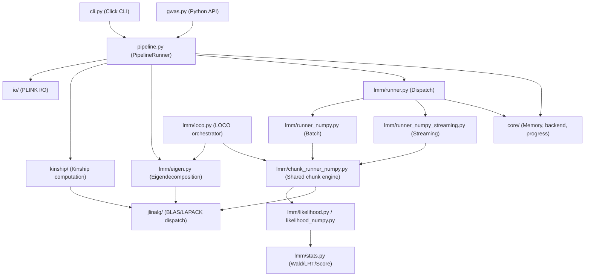

# JAMMA Architecture

## System Overview

JAMMA (Highly-Accelerated Multi-method Mixed-Model Association) is a Python reimplementation of GEMMA for large-scale genome-wide association studies (GWAS). It accepts PLINK binary input (.bed/.bim/.fam), computes a kinship matrix (or accepts a pre-computed one), performs eigendecomposition of the kinship matrix, and runs linear mixed model (LMM) association tests to produce per-SNP association statistics. The primary architectural style is a layered pipeline: a Click-based CLI and a `gwas()` Python API both delegate to a shared `PipelineRunner`, which orchestrates I/O, memory estimation, eigendecomposition, and dispatch to the appropriate compute runner.

## Component Diagram



## Data Flow

A typical LMM association run proceeds as follows:

1. **Entry point** — The user invokes `jamma -bfile data/study -k kinship.cXX.txt -lmm 1` (CLI) or calls `gwas("data/study", kinship_file="kinship.cXX.txt")` (Python API). Both paths instantiate a `PipelineConfig` and hand it to `PipelineRunner`.

2. **Data loading** — `PipelineRunner` calls `io/plink.py` to read PLINK metadata and phenotype vectors from the `.fam` file. Optional covariates are loaded from `io/covariate.py`.

3. **Kinship** — If a kinship file is provided, `kinship/io.py` reads it. Otherwise `kinship/compute.py` computes the centered (or standardized) kinship matrix `K = (1/p) * X_c @ X_c.T` using `jlinalg.dsyrk` for the symmetric rank-k update.

4. **Eigendecomposition** — `lmm/eigen.py` eigendecomposes `K` via `jlinalg.eigh`, which dispatches to vendor DSYEVD (faster, O(N²) workspace) or falls back to DSYEVR (O(N) workspace) when memory is insufficient. The result is eigenvalues `D` and eigenvectors `U`.

5. **Execution plan selection** — `lmm/runner.py:select_execution_mode()` checks available memory via `core/memory.py` and C extension availability to choose between `numpy-batch` (full genotype matrix in RAM) and `numpy-streaming` (two-pass disk streaming).

6. **Null model** — The rotated data `U.T @ Y` and covariates are used to optimize the variance component `lambda` via a 50-point grid search followed by golden section refinement (`lmm/likelihood.py` REML path).

7. **Per-SNP association** — `lmm/chunk_runner_numpy.py` orchestrates the shared chunk loop (missing-value imputation, genotype rotation via `jlinalg.dgemm`, per-chunk compute, and diagnostics) for the batch, streaming, and LOCO paths. Its concerns are split across focused sibling modules: `lmm/chunk_sizing.py` (RAM-budgeted chunk size), `lmm/chunk_workspaces.py` (persistent C-workspace lifecycle), `lmm/chunk_dispatch.py` (the C/Python kernel-selection ladder), and `lmm/chunk_pipeline.py` (rotation/compute thread split and the overlapped pipeline). Result writing goes through the sink factories in `lmm/results.py`. The compute kernels in `lmm/compute_numpy.py` build the Pab projection matrices and compute Wald/LRT/Score statistics via `lmm/stats.py`. The `_lmm_accel` C extension accelerates the per-SNP REML/Wald inner loop.

8. **Output** — `AssocResult` records are written to a GEMMA-compatible `.assoc.txt` file via `lmm/io.py:IncrementalAssocWriter`. When `output_path` is set, results stream to disk per chunk to avoid accumulating a large in-memory list.

## Key Abstractions

| Abstraction | File | Description |
|---|---|---|
| `PipelineRunner` / `PipelineConfig` | `src/jamma/pipeline.py` | Orchestrates the full GWAS pipeline; both CLI and Python API delegate here |
| `gwas()` / `GWASResult` | `src/jamma/gwas.py` | Public Python API for single-call GWAS; wraps `PipelineRunner` |
| `ExecutionPlan` | `src/jamma/lmm/runner.py` | Frozen dataclass encoding backend (`numpy`) and mode (`batch` or `streaming`) with a human-readable reason |
| `LmmConfig` | `src/jamma/lmm/schema.py` | Frozen configuration dataclass shared by all LMM runners (MAF, lambda bounds, test type, etc.) |
| `LmmRunResult` | `src/jamma/lmm/schema.py` | Return type for all runners; bundles association list, PVE estimate, and SNP count |
| `AssocResult` | `src/jamma/lmm/stats.py` | Per-SNP association result dataclass matching GEMMA's output columns |
| `MODE_SPECS` / `ModeSpec` | `src/jamma/lmm/schema.py` | Single source of truth mapping `lmm_mode` integers to output column definitions, headers, and format strings |
| `LazySnpMeta` | `src/jamma/lmm/schema.py` | Lazy view over PLINK metadata arrays; materialises per-SNP dicts on access to avoid O(n_snps) object allocation |
| `PlinkData` | `src/jamma/io/plink.py` | Container for loaded PLINK binary data (genotypes, sample IDs, SNP IDs, positions, alleles) |
| `ToleranceConfig` | `src/jamma/validation/tolerances.py` | Configurable tolerance thresholds for GEMMA numerical comparisons, calibrated from formal error propagation |

## Directory Structure Rationale

```text
src/jamma/
├── cli.py                  # Click CLI; maps GEMMA flags to PipelineConfig
├── gwas.py                 # Public Python API (gwas() function)
├── pipeline.py             # Shared pipeline orchestrator used by CLI and API
├── core/                   # Cross-cutting concerns: memory estimation, backend
│   │                       # selection, progress bars, SNP filtering, threading
│   ├── memory.py           # Pre-flight memory checks and DSYEVD/DSYEVR workspace estimates
│   ├── backend.py          # Backend detection and banner formatting
│   ├── progress.py         # timed_progress() and progress_iterator() wrappers
│   └── threading.py        # BLAS thread-count control via threadpoolctl
├── io/                     # PLINK .bed/.bim/.fam readers and covariate/weight loaders
│   ├── plink.py            # PlinkData loader and streaming chunk iterator
│   └── covariate.py        # GEMMA-format covariate file reader
├── kinship/                # Kinship matrix computation and LOCO variants
│   ├── compute.py          # Centered kinship (dsyrk); streaming LOCO subtraction
│   └── missing.py          # Genotype imputation and centring helpers
├── jlinalg/                # Vendor BLAS/LAPACK dispatch layer with NumPy fallback
│   ├── __init__.py         # Public API: dgemm, dsyrk, eigh, qr, svd, compute_snp_stats_chunk
│   ├── _compile_jlinalg.py # Dev-mode C extension compiler (CI + local)
│   └── src/                # C sources for _jlinalg extension (BLAS dispatch, LAPACK)
├── lmm/                    # LMM association subsystem
│   ├── schema.py           # MODE_SPECS, LmmConfig, LmmRunResult, AssocResult, LazySnpMeta
│   ├── likelihood.py       # REML/MLE log-likelihood; Pab recursion; golden section search
│   ├── likelihood_numpy.py # NumPy-vectorised Uab batch computation
│   ├── stats.py            # Wald/LRT/Score test statistic computation
│   ├── eigen.py            # Kinship eigendecomposition via jlinalg.eigh
│   ├── eigen_io.py         # Read/write eigenvalue and eigenvector files (.npy / .txt)
│   ├── runner.py           # ExecutionPlan; select_execution_mode()
│   ├── runner_numpy.py     # Batch runner: full genotype matrix in RAM + C extension
│   ├── runner_numpy_streaming.py  # Streaming runner: two-pass disk I/O + C extension
│   ├── chunk_runner_numpy.py  # Shared NumPy chunk loop (orchestrator) for batch/streaming/LOCO
│   ├── chunk_sizing.py     # RAM-budgeted chunk-size computation
│   ├── chunk_workspaces.py # Persistent C-workspace lifecycle
│   ├── chunk_dispatch.py   # Per-chunk C/Python kernel dispatch ladder
│   ├── chunk_pipeline.py   # Rotation/compute thread split + overlapped pipeline driver
│   ├── loco.py             # LOCO orchestrator: per-chromosome eigen + LMM loop
│   ├── loco_config.py      # LocoConfig: LOCO-only knobs and artifact naming
│   ├── loco_eigen.py       # LOCO eigenpair sources (cache / compute) + artifact writes
│   ├── compute_numpy.py    # Per-chunk LMM compute kernels and C workspace wrappers
│   ├── special.py          # Pure-stdlib betainc (Cephes CF) and chi2_sf (erfc)
│   └── _lmm_accel.c        # C extension: per-SNP REML/Wald pipeline with OpenMP
├── utils/                  # Shared utilities (logging setup, chromosome sort key)
└── validation/             # GEMMA comparison utilities and tolerance configuration
    ├── compare.py          # Side-by-side JAMMA vs GEMMA result comparisons
    └── tolerances.py       # ToleranceConfig with calibrated per-statistic tolerances
```

## BLAS/LAPACK Dispatch Strategy

`jlinalg` is the internal linear algebra dispatch layer. It preferentially wires **ILP64 vendor BLAS** (MKL-ILP64, OpenBLAS-ILP64, or Accelerate-ILP64) into its dispatch table. LP64 backends are detected but intentionally not wired, because LP64 BLAS uses different floating-point accumulation order, causing subtle result differences that break JAMMA's GEMMA-equivalence tolerances. The dispatch priority is:

| Priority | Backend | Limit |
|---|---|---|
| 1 | ILP64 vendor BLAS (MKL, OpenBLAS, Accelerate) | 200k+ samples |
| 2 | NumPy fallback (`np.linalg`, `np.matmul`) | ~46k samples (LP64 int32 overflow risk) |
| 3 | LP64 vendor BLAS | Not wired — detected only |

The `eigh` function dispatches to DSYEVD (divide-and-conquer, faster, O(N²) workspace) and falls back to DSYEVR (MRRR algorithm, O(N) workspace) when DSYEVD workspace would exceed available memory. At 100k samples, DSYEVD requires ~240 GB; DSYEVR requires ~160 GB.

The `_lmm_accel` C extension (`src/jamma/lmm/_lmm_accel.c`) provides the per-SNP REML/Wald inner loop with optional OpenMP parallelism. Compile flags, source lists, and link flags are centralised in `src/jamma/_build_support/compile_and_link.py` and consumed by all three compile entry points (`hatch_build.py` for wheel builds, `_compile_jlinalg.py` and `_compile_accel.py` for dev-mode and runtime recompile). LAPACK sources use strict IEEE 754 flags (`-O2 -fno-fast-math`) to prevent fast-math optimisations from perturbing eigendecomposition results; a pre-commit lint (`scripts/check-compile-flag-literals.py`) rejects bare flag literals outside `_build_support/`.

## C Extension Architecture

Two compiled C extensions accelerate the hot paths:

| Extension | Source | Purpose |
|---|---|---|
| `jamma.jlinalg._jlinalg` | `src/jamma/jlinalg/src/` | BLAS dispatch (DGEMM, DSYRK), LAPACK dispatch (DSYEVD, DSYEVR), single-pass per-SNP statistics |
| `jamma.lmm._lmm_accel` | `src/jamma/lmm/_lmm_accel.c` | Per-SNP REML Wald pipeline with OpenMP parallelism over SNP chunks |

Both extensions gracefully degrade to NumPy fallbacks if compilation fails or if the ABI version mismatches (each extension checks its own `ABI_VERSION` at import). The streaming runner is only selected by `select_execution_mode()` when `_lmm_accel` is available; explicit `--backend numpy-streaming` raises `ValueError` if the extension is missing.

## LOCO Mode

Leave-one-chromosome-out (LOCO) analysis is orchestrated by `lmm/loco.py`. For each chromosome `c`, a LOCO kinship matrix is derived from the full kinship numerator `S_full` via the subtraction approach: `K_loco_c = (S_full - S_c) / (p - p_c)`. This avoids recomputing kinship from scratch for each chromosome. Each `K_loco_c` is eigendecomposed, LMM is run on chromosome `c`'s SNPs, then `K_loco_c` is discarded before processing the next chromosome. Per-chromosome eigen files can be cached to `--eigen-dir` to skip repeated eigendecompositions.

## Numerical Compatibility with GEMMA

JAMMA targets exact output compatibility with GEMMA v0.98.5. Key design choices supporting this:

- The `likelihood.py` Pab recursion follows GEMMA's `CalcPab` using identical index ordering (GEMMA's `GetabIndex` formula with 1-based indices).
- REML optimization uses a 50-point grid search followed by golden section refinement (`n_refine >= 20` for ~1e-5 tolerance), matching GEMMA's convergence behaviour.
- `lmm/special.py` provides pure-stdlib `betainc` (Cephes Lentz CF) and `chi2_sf` (erfc) to avoid a `scipy` runtime dependency, which would overwrite ILP64 numpy with LP64 numpy on installation.
- `_P_YY_MIN = 1e-8` clamps near-zero projected residuals to prevent `log(0)` in the likelihood, matching GEMMA's behaviour.
- Calibrated tolerances are documented in `src/jamma/validation/tolerances.py` and `docs/GEMMA_EQUIVALENCE.md`.
