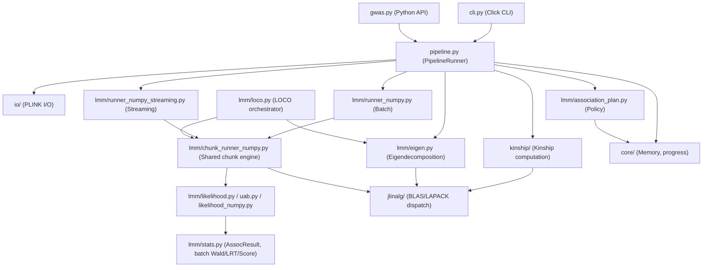

# JAMMA Architecture

## System Overview

JAMMA (Highly-Accelerated Multi-method Mixed-Model Association) is a Python reimplementation of GEMMA for large-scale genome-wide association studies (GWAS). It accepts PLINK binary input (.bed/.bim/.fam), computes a kinship matrix (or accepts a pre-computed one), performs eigendecomposition of the kinship matrix, and runs linear mixed model (LMM) association tests to produce per-SNP association statistics. The primary architectural style is a layered pipeline: a Click-based CLI and a `gwas()` Python API both delegate to a shared `PipelineRunner`, which orchestrates I/O, memory estimation, eigendecomposition, and dispatch to the appropriate compute runner.

## Component Diagram



## Data Flow

A typical LMM association run proceeds as follows:

1. **Entry point** — The user invokes `jamma -bfile data/study -k kinship.cXX.txt -lmm 1` (CLI) or calls `gwas("data/study", kinship_file="kinship.cXX.txt")` (Python API). Both paths instantiate a `PipelineConfig` and hand it to `PipelineRunner`.

2. **Data loading** — `PipelineRunner` calls `io/plink.py` to read PLINK metadata and phenotype vectors from the `.fam` file. Optional covariates are loaded from `io/covariate.py`.

3. **Kinship** — If a kinship file is provided, `kinship/io.py` reads it. Otherwise `kinship/stream.py` computes the centered (or standardized) kinship matrix `K = (1/p) * X_c @ X_c.T` using `jlinalg.dsyrk` for the symmetric rank-k update; `kinship/loco.py` computes LOCO kinship by subtraction.

4. **Eigendecomposition** — `lmm/eigen.py` eigendecomposes `K` via `jlinalg.eigh`, which dispatches to vendor DSYEVD (faster, O(N²) workspace) or falls back to DSYEVR (O(N) workspace) when memory is insufficient. The result is eigenvalues `D` and eigenvectors `U`.

5. **Execution plan selection** — `lmm/association_plan.py:plan_association()` selects all association policy once: it checks available memory via `core/memory.py` and C extension availability to choose between `numpy-batch` (full genotype matrix in RAM) and `numpy-streaming` (two-pass disk streaming), selects the compute dispatch path, and plans conservative chunk geometry. The pipeline calls it once and passes the frozen `ExecutableAssociationPlan` down; runners consume the plan rather than re-deriving policy.

6. **Null model** — The rotated data `U.T @ Y` and covariates are used to optimize the variance component `lambda` via a 50-point grid search followed by golden section refinement (`lmm/likelihood.py` REML path).

7. **Per-SNP association** — `lmm/chunk_runner_numpy.py` orchestrates the shared chunk loop (missing-value imputation, genotype rotation via `jlinalg.dgemm`, per-chunk compute, and diagnostics) for the batch, streaming, and LOCO paths. Its concerns are split across focused sibling modules: `lmm/chunk_sizing.py` (RAM-budgeted chunk size), `lmm/chunk_kernel.py` (the one dispatch match, which builds each path's persistent C workspace and binds the call that consumes it), and `lmm/chunk_pipeline.py` (rotation/compute thread split and the overlapped pipeline). Result writing goes through the sink factories in `lmm/results.py`. The compute kernels in `lmm/compute_numpy.py` build the Pab projection matrices and compute Wald/LRT/Score statistics through the batched `lmm/likelihood_numpy.py` routines, or through `_lmm_accel` when the C extension is loaded. `lmm/stats.py` holds the `AssocResult` record and the scalar reference implementations the tests check the batch path against; production does not call them. The `_lmm_accel` C extension accelerates the per-SNP REML/Wald inner loop.

8. **Output** — `AssocResult` records are written to a GEMMA-compatible `.assoc.txt` file via `lmm/io.py:IncrementalAssocWriter`. When `output_path` is set, results stream to disk per chunk to avoid accumulating a large in-memory list.

## Key Abstractions

| Abstraction | File | Description |
|---|---|---|
| `PipelineRunner` | `src/jamma/pipeline.py` | Orchestrates the `-lmm` pipeline; both CLI and Python API delegate here |
| `PipelineConfig` / `PipelineResult` / `KinshipResult` | `src/jamma/pipeline_config.py` | Frozen configuration and result dataclasses for the pipeline; `KinshipResult` is also re-exported from `jamma.pipeline` |
| `gwas()` | `src/jamma/gwas.py` | Public Python API for single-call GWAS; builds a `PipelineConfig` and returns `PipelineRunner`'s `PipelineResult` |
| `ExecutionPlan` | `src/jamma/lmm/association_plan.py` | Frozen two-field summary of the selected mode (`batch` or `streaming`) with a human-readable reason |
| `ExecutableAssociationPlan` | `src/jamma/lmm/association_plan.py` | Frozen full plan from `plan_association()`: mode summary, dispatch path, conservative chunk geometry, and memory pricing |
| `LmmConfig` | `src/jamma/lmm/schema.py` | Frozen configuration dataclass shared by all LMM runners (MAF, lambda bounds, test type, etc.) |
| `LmmRunResult` | `src/jamma/lmm/schema.py` | Return type for all runners; bundles association list, PVE estimate, and SNP count |
| `AssocResult` | `src/jamma/lmm/stats.py` | Per-SNP association result dataclass matching GEMMA's output columns |
| `MODE_SPECS` / `ModeSpec` | `src/jamma/lmm/schema.py` | Single source of truth mapping `lmm_mode` integers to output column definitions, headers, and format strings |
| `SnpMeta` | `src/jamma/lmm/schema.py` | SNP metadata as one array per column; writers and result builders slice arrays directly, no per-SNP dicts |
| `PlinkData` | `src/jamma/io/plink.py` | Container for loaded PLINK binary data (genotypes, sample IDs, SNP IDs, positions, alleles) |
| `ToleranceConfig` | `src/jamma/validation/tolerances.py` | Configurable tolerance thresholds for GEMMA numerical comparisons, calibrated from formal error propagation |

## Directory Structure Rationale

```text
src/jamma/
├── cli.py                  # Click CLI; maps GEMMA flags to PipelineConfig
├── gwas.py                 # Public Python API (gwas() function)
├── pipeline.py             # The -lmm path: PipelineRunner, used by CLI and API
├── pipeline_config.py      # PipelineConfig / PipelineResult / KinshipResult dataclasses
├── pipeline_banner.py      # GEMMA-style dataset and execution-plan banners
├── pipeline_phenotype_loop.py  # Per-phenotype loop + the batch/streaming runner calls
├── pipeline_kinship.py     # The -gk path: compute a kinship matrix and write it
├── pipeline_memory.py      # The preflight gate: prices the plan per dispatch path and eigen driver
├── _build_support/         # Canonical compile flags, source lists, and the
│   │                       # build/load seam: BuildSpec, run_build, find_c_compiler
│   ├── build_models.py     # BuildSpec values, source manifests, and flag policy
│   ├── build_execution.py  # Toolchain detection and atomic compile/link execution
│   ├── compile_and_link.py # Composition root and compatibility import surface
│   ├── find_compiler.py    # C compiler discovery for build-time and runtime recompile
│   └── openmp_detect.py    # OpenMP flag detection for C extension compilation
├── core/                   # Cross-cutting concerns: memory estimation,
│   │                       # progress bars, SNP filtering, threading
│   ├── constants.py        # Domain constants (e.g. GEMMA's -9 missing-phenotype code)
│   ├── estimates.py        # Wall-clock time estimates for GWAS pipeline phases
│   ├── memory.py           # Cost model: estimators, RAM seam, sufficiency check
│   ├── eigen_plan.py       # Eigen driver planning + shared sizing primitives
│   ├── memory_snapshot.py  # Process RSS / free-RAM snapshots and cleanup
│   ├── hardware.py         # Hardware/software context collection for benchmark repro
│   ├── progress.py         # timed_progress() and progress_iterator() wrappers
│   ├── recompile.py        # _load_c_module(): the one runtime C-import seam, auto-recompile-once
│   ├── snp_filter.py       # Shared per-SNP statistics and filtering utilities
│   ├── snp_stats.py        # Streamed SNP statistics arrays and denominator metadata
│   ├── telemetry.py        # BenchmarkRecord / append_benchmark_record()
│   └── threading.py        # BLAS thread-count control via threadpoolctl
├── io/                     # PLINK .bed/.bim/.fam readers and covariate/weight loaders
│   ├── plink.py            # PlinkData loader and streaming chunk iterator
│   ├── covariate.py        # GEMMA-format covariate file reader
│   ├── matrix_reader.py    # read_matrix_parallel(): multiprocess large-matrix text reader
│   ├── matrix_writer.py    # write_matrix_parallel(): multiprocess large-matrix text writer
│   ├── snp_list.py         # GEMMA-format SNP list file I/O (one RS ID per line)
│   ├── weight.py           # GEMMA-format individual weight file I/O + kinship weighting
│   └── _parallel_text.py   # Shared multiprocess text I/O helpers for matrix_reader/matrix_writer
│                          # (re-exports unlink_quietly from utils/atomic_publish.py)
├── kinship/                # Kinship matrix computation and LOCO variants
│   ├── stream.py           # Streaming centered/standardized kinship (dsyrk), mode-selected
│   ├── loco.py             # Streaming LOCO kinship via subtraction, batch loop
│   ├── io.py               # Kinship matrix I/O (GEMMA text format and binary .npy)
│   └── missing.py          # Genotype imputation and centring helpers
├── jlinalg/                # Vendor BLAS/LAPACK dispatch layer with NumPy fallback
│   ├── __init__.py         # Public API: dgemm, dsyrk, eigh, compute_snp_stats_chunk
│   ├── _blas_dirs.py       # Vendor BLAS/LAPACK library and include directory discovery
│   ├── _compile_jlinalg.py # Dev-mode C extension compiler; calls run_build(JLINALG_SPEC)
│   ├── include/            # jlinalg.h: shared C API surface for the _jlinalg extension
│   └── src/                # C sources for _jlinalg extension (BLAS dispatch, LAPACK)
├── lmm/                    # LMM association subsystem
│   ├── schema.py           # MODE_SPECS, LmmConfig, LmmRunResult, AssocResult, SnpMeta
│   ├── accel.py            # available()/require(): the one loader for _lmm_accel
│   ├── io.py               # IncrementalAssocWriter and the GEMMA .assoc.txt line format
│   ├── likelihood.py       # Index tables, scalar REML/MLE, null-model golden section search
│   ├── uab.py              # Uab/Pab/Iab batch builders in full, split and SoA layouts
│   ├── likelihood_numpy.py # NumPy batch REML/MLE evaluation and lambda optimisation
│   ├── stats.py            # AssocResult and the batch Wald/LRT/Score statistics
│   ├── eigen.py            # Kinship eigendecomposition via jlinalg.eigh
│   ├── eigen_cache.py      # Content + parameter cache key for LOCO per-chromosome eigen
│   ├── eigen_io.py         # Read/write eigenvalue and eigenvector files (.npy / .txt)
│   ├── impute.py           # In-place mean imputation for genotype chunks
│   ├── prepare_common.py   # Covariate matrix construction shared by NumPy LMM runners
│   ├── results.py          # AssocResult building and per-chunk result sinks
│   ├── association_plan.py # plan_association(); ExecutionPlan, ExecutableAssociationPlan
│   ├── runner_numpy.py     # Shared run body (_run_numpy_lmm) + GenotypeSource + batch wrapper
│   ├── runner_numpy_streaming.py  # BedSource (two-pass disk I/O) + streaming wrapper
│   ├── chunk_runner_numpy.py  # Shared NumPy chunk loop (orchestrator) for batch/streaming/LOCO
│   ├── chunk_sizing.py     # RAM-budgeted chunk-size computation
│   ├── dispatch.py         # DispatchPath: the one C-kernel path decision, from n_cvt/lmm_mode/accel
│   ├── chunk_kernel.py     # The one dispatch match: workspace + its call
│   ├── chunk_pipeline.py   # Rotation/compute thread split + overlapped pipeline driver
│   ├── loco.py             # LOCO orchestrator: per-chromosome eigen + LMM loop
│   ├── loco_config.py      # LocoConfig: LOCO-only knobs and artifact naming
│   ├── loco_eigen.py       # eigen_pairs_for(): cache-or-compute decision, cache key, manifest, artifact writes
│   ├── compute_numpy.py    # Per-chunk LMM compute kernels and C workspace wrappers
│   ├── special.py          # Pure-stdlib betainc (Cephes CF) and chi2_sf (erfc)
│   ├── _compile_accel.py   # Dev-mode/runtime compiler; calls run_build(LMM_ACCEL_SPEC)
│   ├── _lmm_accel.c        # CPython module init; the only unit calling import_array()
│   ├── _lmm_accel_ncvt1.c  # Public n_cvt=1 workspace and chunk-compute entry points
│   ├── _lmm_accel_general.c # Public general-workspace and chunk-compute entry points
│   ├── _lmm_accel_internal.h # Private declarations shared with module registration
│   ├── _lmm_support.c/.h   # Shared thread-scratch alloc/free and NumPy C-API glue
│   ├── _lmm_stats.c/.h     # Wald/Score/LRT statistics kernels shared by both workspaces
│   ├── _lmm_kernels_general.c/.h  # General (n_cvt>1) workspace creator and fused compute
│   ├── _lmm_kernels_ncvt1.c/.h    # n_cvt=1 workspace creator and fused compute
│   └── _lmm_types.h        # Shared workspace/result struct definitions
│                          #
│                          # LMM_ACCEL_SOURCES in _build_support/build_models.py is the
│                          # source list every build entry point reads; do not trust a file
│                          # list written down anywhere else, including this one.
├── utils/                  # Shared utilities (logging setup, chromosome sort key)
│   ├── atomic_publish.py   # publish_temp_path()/unlink_quietly(): sibling-temp + rename publish
│   ├── logging.py          # setup_logging() + write_gemma_log(): loguru config, GEMMA .log.txt
│   └── npy_cache.py        # Shared .npy sidecar cache validation for binary I/O
└── validation/             # GEMMA comparison utilities and tolerance configuration
    ├── compare.py          # Side-by-side JAMMA vs GEMMA result comparisons
    └── tolerances.py       # ToleranceConfig with calibrated per-statistic tolerances
```

## BLAS/LAPACK Dispatch Strategy

`jlinalg` is the internal linear algebra dispatch layer. It preferentially wires **ILP64 vendor BLAS** (MKL-ILP64, OpenBLAS-ILP64, or Accelerate-ILP64) into its dispatch table. LP64 backends are detected but intentionally not wired, because LP64 BLAS uses different floating-point accumulation order, causing subtle result differences that break JAMMA's GEMMA-equivalence tolerances. The dispatch priority is:

| Priority | Backend | Limit |
|---|---|---|
| 1 | ILP64 vendor BLAS (MKL, OpenBLAS, Accelerate) | 200k+ samples |
| 2 | NumPy fallback (`np.linalg`, `np.matmul`) | ~46k samples (LP64 int32 overflow risk) |
| 3 | LP64 vendor BLAS | Not wired — detected only |

The `eigh` function dispatches to DSYEVD (divide-and-conquer, faster, O(N²) workspace) and falls back to DSYEVR (MRRR algorithm, O(N) workspace) when DSYEVD workspace would exceed available memory. At 100k samples, DSYEVD requires ~240 GB; DSYEVR requires ~160 GB.

The `_lmm_accel` C extension provides the per-SNP REML/Wald inner loop with optional OpenMP parallelism. It builds from several translation units, not one file. The `LMM_ACCEL_SOURCES` tuple in `src/jamma/_build_support/build_models.py` is the authoritative list.

Two rules govern adding a `.c` file:

1. Put it in that tuple. Both build paths read it, so the wheel and the dev rebuild pick the new source up together. Omitting it does not fail the link on macOS, which uses `-undefined dynamic_lookup`. It fails at import, or silently much later.
2. If it touches the CPython or NumPy C API, define `NO_IMPORT_ARRAY` before including `_lmm_support.h`. Only `_lmm_accel.c` calls `import_array()`. The header sets `PY_ARRAY_UNIQUE_SYMBOL`, so the C-API pointer is one shared extern rather than a per-unit copy, and a unit that forgets fails to link instead of leaving a NULL pointer to segfault on the first `PyArray_*` call. The loud failure is the design.

A separate trap, guarded by [`tests/test_c_include_order.py`](../tests/test_c_include_order.py): `_lmm_support.h` must reach `<math.h>` before anything else does, because `M_PI` is not C11 and glibc defines it only under `_XOPEN_SOURCE`, which `Python.h` sets. macOS defines `M_PI` unconditionally, so a local build and the ARM Mac CI job pass while every Linux job fails.

Native build support is split by responsibility: `_build_support/build_models.py` owns immutable source manifests and flag policy, `build_execution.py` owns toolchain discovery and compile/link execution, and `compile_and_link.py` composes them behind the stable `run_build` / `compile_extension` facade. All three compile entry points (`hatch_build.py`, `_compile_jlinalg.py`, and `_compile_accel.py`) consume that facade. At runtime, `jamma.core.recompile._load_c_module(spec, expected_abi)` is the one seam both C-extension callers (`jamma.lmm.compute_numpy` and `jamma.jlinalg`) use to import, ABI-validate, and rebuild-once via the same spec. LAPACK sources use strict IEEE 754 flags (`-O2 -fno-fast-math`) to prevent fast-math optimisations from perturbing eigendecomposition results; a pre-commit lint (`scripts/check_compile_flag_literals.py`) rejects bare flag literals outside `_build_support/`.

## C Extension Architecture

Two compiled C extensions accelerate the hot paths:

| Extension | Source | Purpose |
|---|---|---|
| `jamma.jlinalg._jlinalg` | `src/jamma/jlinalg/src/` | BLAS dispatch (DGEMM, DSYRK), LAPACK dispatch (DSYEVD, DSYEVR), single-pass per-SNP statistics |
| `jamma.lmm._lmm_accel` | `src/jamma/lmm/_lmm_*.c` | Per-SNP REML Wald pipeline with OpenMP parallelism over SNP chunks |

Both extensions gracefully degrade to NumPy fallbacks if compilation fails or if the ABI version mismatches (each extension checks its own `ABI_VERSION` at import). The streaming runner is only auto-selected by `plan_association()` when `_lmm_accel` is available; an explicit `--backend numpy-streaming` request is rejected with `ValueError` at the pipeline boundary if the extension is missing.

## LOCO Mode

Leave-one-chromosome-out (LOCO) analysis is orchestrated by `lmm/loco.py`. For each chromosome `c`, a LOCO kinship matrix is derived from the full kinship numerator `S_full` via the subtraction approach: `K_loco_c = (S_full - S_c) / (p - p_c)`. This avoids recomputing kinship from scratch for each chromosome. Each `K_loco_c` is eigendecomposed, LMM is run on chromosome `c`'s SNPs, then `K_loco_c` is discarded before processing the next chromosome. Per-chromosome eigen files can be cached to `--eigen-dir` to skip repeated eigendecompositions.

## Numerical Compatibility with GEMMA

JAMMA targets exact output compatibility with GEMMA v0.98.5. Key design choices supporting this:

- The `likelihood.py` Pab recursion follows GEMMA's `CalcPab` using identical index ordering (GEMMA's `GetabIndex` formula with 1-based indices).
- REML optimization uses a 50-point grid search followed by golden section refinement (`n_refine >= 20` for ~1e-5 tolerance), matching GEMMA's convergence behaviour.
- `lmm/special.py` provides pure-stdlib `betainc` (Cephes Lentz CF) and `chi2_sf` (erfc) to avoid a `scipy` runtime dependency, which would overwrite ILP64 numpy with LP64 numpy on installation.
- `_P_YY_MIN = 1e-8` clamps near-zero projected residuals to prevent `log(0)` in the likelihood, matching GEMMA's behaviour.
- Calibrated tolerances are documented in `src/jamma/validation/tolerances.py` and `docs/GEMMA_EQUIVALENCE.md`.
