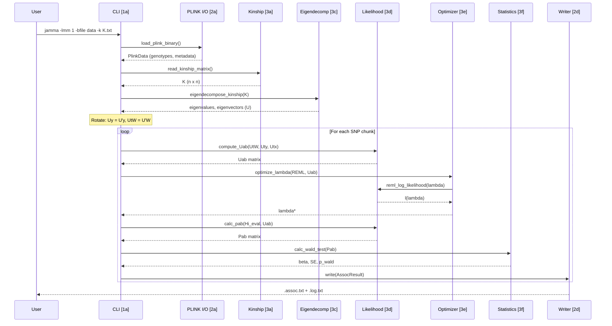
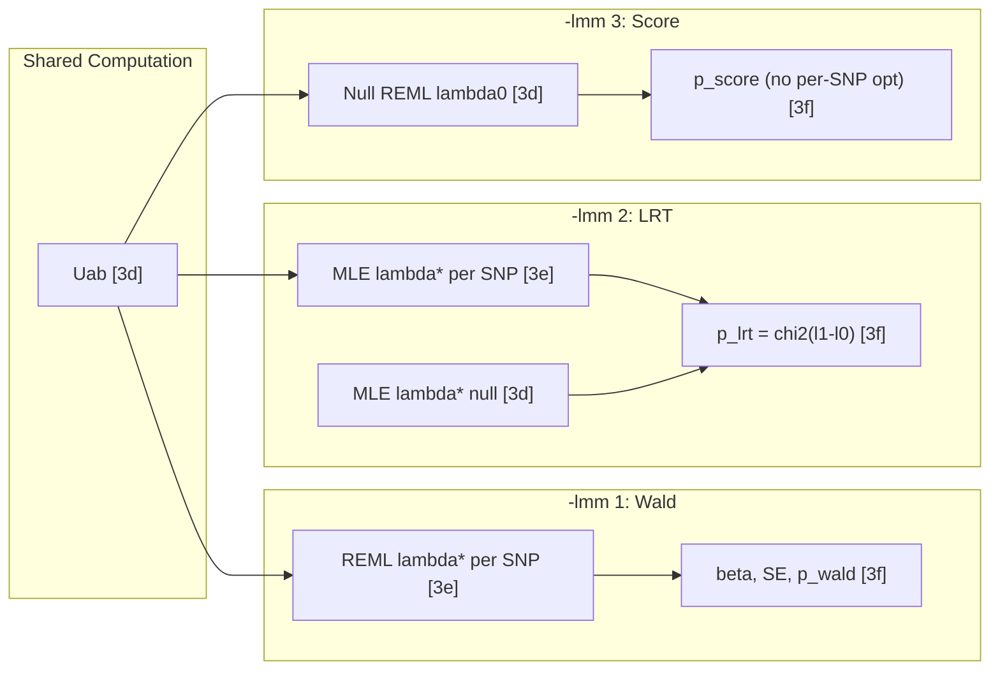
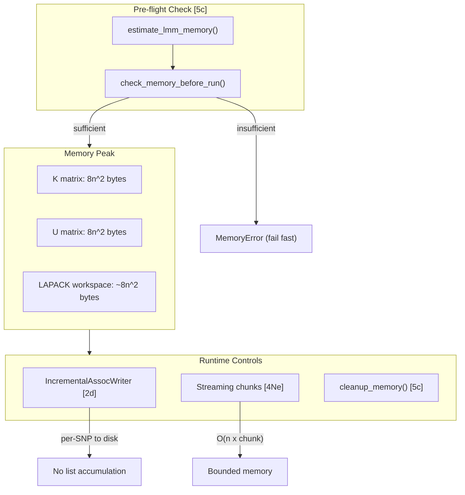
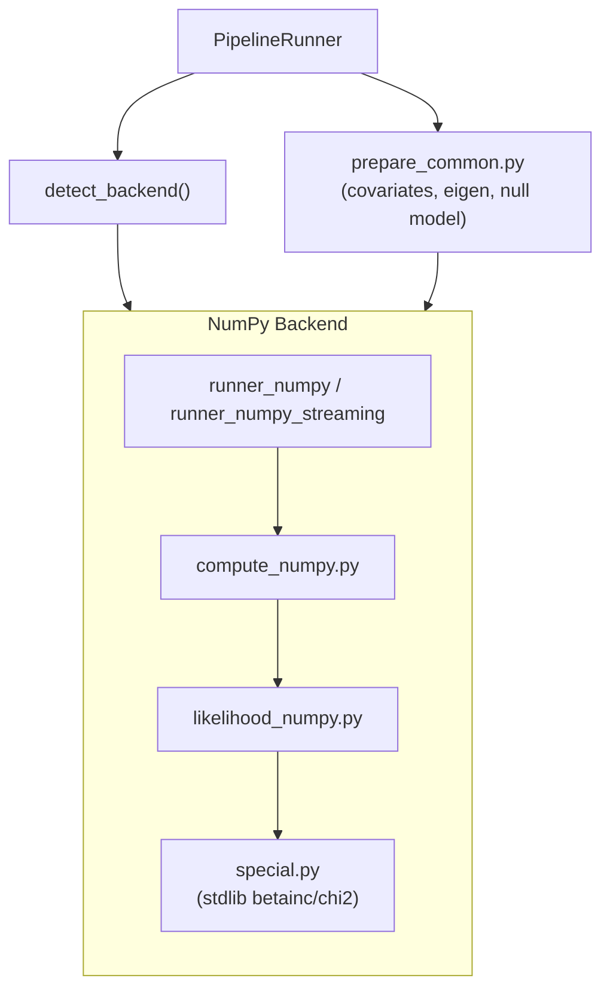

# JAMMA Code Map

Architectural overview with bidirectional links between diagram nodes and source code.

## System Overview

```mermaid
flowchart TB
    subgraph L1["Entry Points [1]"]
        CLI["CLI (click) [1a]"]
        GWAS["gwas() API [1b]"]
        PIPE["PipelineRunner [1c]"]
    end

    subgraph L2["I/O Layer [2]"]
        PLINK["PLINK Reader [2a]"]
        COVAR["Covariate Reader [2b]"]
        KIO["Kinship I/O [2c]"]
        RIO["Result Writer [2d]"]
        SNPLIST["SNP List I/O [2e]"]
        EIGIO["Eigen I/O [2f]"]
        MATIO["Matrix Writer [2g]"]
    end

    subgraph L3["Core Computation [3]"]
        KINSHIP["Kinship Compute [3a]"]
        MISSING["Missing Imputation [3b]"]
        EIGEN["Eigendecomposition [3c]"]
        JLINALG["jlinalg C Layer [3c']"]
        LIKE["REML Likelihood [3d]"]
        OPT["Lambda Optimizer [3e]"]
        STATS["Test Statistics [3f]"]
        SNPF["SNP Filters [3g]"]
        PREPCOM["Shared Preparation [3h]"]
        SPECIAL["Special Functions [3i]"]
    end

    subgraph L4N["NumPy Backend [4N]"]
        LIKENP["Batch Likelihood [4Na]"]
        RUNNERNP["NumPy Runner [4Nb]"]
        COMPUTENP["Chunk Compute [4Nc]"]
        CACCEL["C Extension [4Nd]"]
        SCHEMA["Output Schema [4Nh]"]
        RESULTS["Result Building [4Ni]"]
        LOCO["LOCO Runner [4Nj]"]
    end

    subgraph L5["Infrastructure [5]"]
        CONFIG["Output Config [5a]"]
        MEM["Memory Manager [5c]"]
        LOG["Logging [5d]"]
        THREAD["Threading [5e]"]
        HW["Hardware Context [5f]"]
        PROG["Progress [5g]"]
    end

    subgraph L6["Validation [6]"]
        TOL["Tolerance Config [6a]"]
        CMP["GEMMA Comparator [6b]"]
    end

    CLI --> PIPE
    GWAS --> PIPE

    CLI --> PLINK
    CLI --> KIO
    CLI --> SNPLIST
    CLI --> CONFIG
    CLI --> LOG

    PIPE --> PLINK
    PIPE --> COVAR
    PIPE --> KIO
    PIPE --> RIO
    PIPE --> SNPLIST
    PIPE --> EIGIO
    PIPE --> KINSHIP
    PIPE --> EIGEN
    PIPE --> RUNNERNP
    PIPE --> LOCO
    PIPE --> MEM

    KINSHIP --> MISSING
    KINSHIP --> PLINK
    KINSHIP --> MEM
    KINSHIP --> SNPF

    CLI --> KINSHIP

    LOCO --> KINSHIP
    LOCO --> EIGEN
    LOCO --> RUNNERNP

    %% NumPy backend connections
    RUNNERNP --> LIKENP
    RUNNERNP --> PREPCOM
    RUNNERNP --> RIO
    RUNNERNP --> CACCEL
    COMPUTENP --> LIKENP
    LIKENP --> SPECIAL

    %% jlinalg C layer for eigendecomp
    EIGEN --> JLINALG

    %% Shared connections
    OPT --> LIKE
    STATS --> LIKE

    EIGEN --> MEM
    EIGEN --> THREAD

    KIO --> MATIO

    CMP --> TOL
```

---

### [1] Entry Points

Two user-facing entry points: the `gwas()` API for programmatic use and the CLI for command-line use. Both delegate to `PipelineRunner` for LMM orchestration.

| ID | Component | Description | File:Line |
|----|-----------|-------------|-----------|
| 1a | `main()` | Click command — all flags (`-gk`, `-lmm`, `-bfile`, `-o`, `-outdir`) | [cli.py](../src/jamma/cli.py) |
| 1a | `_run_gk()` | Kinship computation (`-gk 1`) | [cli.py](../src/jamma/cli.py) |
| 1a | `_run_lmm()` | LMM association (`-lmm 1/2/3/4`) | [cli.py](../src/jamma/cli.py) |
| 1b | `gwas()` | One-call GWAS pipeline (load -> kinship -> LMM -> results) | [gwas.py:40](../src/jamma/gwas.py#L40) |
| 1b | `GWASResult` | Pipeline result dataclass (associations, timing, counts) | [gwas.py:22](../src/jamma/gwas.py#L22) |
| 1c | `PipelineRunner` | Shared orchestration (validate -> parse -> memory -> kinship -> LMM); passes `valid_indices` for early sample filtering when `save_kinship=False` | [pipeline.py](../src/jamma/pipeline.py) |
| 1c | `PipelineConfig` | Pipeline configuration dataclass (all CLI flags) | [pipeline.py](../src/jamma/pipeline.py) |

---

### [2] I/O Layer

Reads PLINK binary genotypes, covariates, and kinship matrices. Writes GEMMA-compatible output.

| ID | Component | Description | File:Line |
|----|-----------|-------------|-----------|
| 2a | `PlinkData` | Genotype container (n_samples x n_snps float32) | [plink.py:20](../src/jamma/io/plink.py#L20) |
| 2a | `load_plink_binary()` | Full-load PLINK .bed/.bim/.fam | [plink.py:53](../src/jamma/io/plink.py#L53) |
| 2a | `stream_genotype_chunks()` | Windowed reads from .bed (O(n x chunk)) | [plink.py:296](../src/jamma/io/plink.py#L296) |
| 2a | `get_plink_metadata()` | Dimensions + metadata without loading genotypes | [plink.py:92](../src/jamma/io/plink.py#L92) |
| 2b | `read_covariate_file()` | Whitespace-delimited covariate matrix | [covariate.py:20](../src/jamma/io/covariate.py#L20) |
| 2c | `read_kinship_matrix()` | Load kinship (auto-detects `.npy` or `.txt`; prefers `.npy` sibling) | [kinship/io.py:12](../src/jamma/kinship/io.py#L12) |
| 2c | `write_kinship_matrix()` | Write `.cXX.npy` (default) or `.cXX.txt` (legacy_text=True) | [kinship/io.py:55](../src/jamma/kinship/io.py#L55) |
| 2d | `IncrementalAssocWriter` | Per-SNP disk writer (no memory accumulation) | [lmm/io.py:99](../src/jamma/lmm/io.py#L99) |
| 2d | `format_assoc_line()` | Table-driven output row formatting | [lmm/io.py:40](../src/jamma/lmm/io.py#L40) |
| 2d | `write_assoc_results()` | Batch write from list | [lmm/io.py:80](../src/jamma/lmm/io.py#L80) |
| 2e | `read_snp_list_file()` | Parse SNP list file (one RS ID per line) | [io/snp_list.py](../src/jamma/io/snp_list.py) |
| 2e | `resolve_snp_list_to_indices()` | Map SNP IDs to dataset indices | [io/snp_list.py](../src/jamma/io/snp_list.py) |
| 2f | `read_eigen_files()` | Load eigenvalue/eigenvector files (auto-detects `.npy` or `.txt`) | [lmm/eigen_io.py](../src/jamma/lmm/eigen_io.py) |
| 2f | `write_eigen_files()` | Write eigendecomposition (`.npy` default; `.txt` + `.npy` sidecar with legacy_text) | [lmm/eigen_io.py](../src/jamma/lmm/eigen_io.py) |
| 2f | `npy_cache_valid()` | Shared `.npy` sibling cache validation (mtime-based) | [utils/npy_cache.py](../src/jamma/utils/npy_cache.py) |
| 2g | `write_matrix_parallel()` | Parallel matrix writer using file-backed memmap | [io/matrix_writer.py:91](../src/jamma/io/matrix_writer.py#L91) |
| 2h | `read_matrix_parallel()` | Multi-worker matrix text reader with chunk scanning | [io/matrix_reader.py](../src/jamma/io/matrix_reader.py) |
| 2i | `read_weight_file()` | Parse per-individual weight file (`-widv` flag) | [io/weight.py:25](../src/jamma/io/weight.py#L25) |
| 2i | `apply_individual_weights()` | Apply weights to kinship matrix | [io/weight.py:67](../src/jamma/io/weight.py#L67) |

---

### [3] Core Computation

GEMMA algorithm reimplementation: kinship -> eigendecomp -> REML -> test statistics. These modules are shared across the NumPy backend.

| ID | Component | Description | File:Line |
|----|-----------|-------------|-----------|
| 3a | `compute_centered_kinship()` | K = (1/p) x Xc x Xc' in batches of 10k SNPs | [compute.py:205](../src/jamma/kinship/compute.py#L205) |
| 3a | `compute_kinship_streaming()` | 2-pass streaming (stats -> accumulate); accepts `valid_indices` for early sample filtering | [compute.py:519](../src/jamma/kinship/compute.py#L519) |
| 3a | `_filter_snps()` | MAF, missing rate, monomorphism filters | [compute.py:79](../src/jamma/kinship/compute.py#L79) |
| 3b | `impute_and_center()` | NaN -> mean, then center (in-place for NumPy arrays) | [missing.py:21](../src/jamma/kinship/missing.py#L21) |
| 3b | `impute_missing_inplace()` | In-place NaN -> col-mean for genotype chunks (used by all runners) | [lmm/impute.py:6](../src/jamma/lmm/impute.py#L6) |
| 3c | `eigendecompose_kinship()` | Eigendecomp via `jlinalg.eigh` with BLAS thread control | [eigen.py](../src/jamma/lmm/eigen.py) |
| 3c' | `jlinalg.eigh()` | Vendor DSYEVD/DSYEVR dispatch with NumPy fallback | [jlinalg/\_\_init\_\_.py](../src/jamma/jlinalg/__init__.py) |
| 3c' | `jlinalg_dsyevd_ext()` | C: vendor DSYEVD dispatch (O(n^2) workspace) | [blas_dispatch.c](../src/jamma/jlinalg/src/blas_dispatch.c) |
| 3c' | `jlinalg_dsyevr_ext()` | C: vendor DSYEVR dispatch (O(n) workspace, memory-pressure fallback) | [blas_dispatch.c](../src/jamma/jlinalg/src/blas_dispatch.c) |
| 3d | `reml_log_likelihood()` | REML l(lambda) for variance component estimation | [likelihood.py:356](../src/jamma/lmm/likelihood.py#L356) |
| 3d | `mle_log_likelihood()` | MLE l(lambda) for LRT | [likelihood.py:715](../src/jamma/lmm/likelihood.py#L715) |
| 3d | `compute_Uab()` | Element-wise products of rotated vectors | [likelihood.py:165](../src/jamma/lmm/likelihood.py#L165) |
| 3d | `calc_pab()` | Recursive Schur complement projection (GEMMA CalcPab) | [likelihood.py:264](../src/jamma/lmm/likelihood.py#L264) |
| 3d | `get_ab_index()` | GEMMA GetabIndex -- 1-based upper triangular | [likelihood.py:144](../src/jamma/lmm/likelihood.py#L144) |
| 3d | `compute_null_model_lambda()` | Null model REML for Score test | [likelihood.py:673](../src/jamma/lmm/likelihood.py#L673) |
| 3d | `compute_null_model_mle()` | Null model MLE for LRT | [likelihood.py:768](../src/jamma/lmm/likelihood.py#L768) |
| 3e | `golden_section_optimize_lambda()` | REML optimization per SNP (Wald) | [likelihood_numpy.py](../src/jamma/lmm/likelihood_numpy.py) |
| 3e | `golden_section_optimize_lambda_mle()` | MLE optimization per SNP (LRT) | [likelihood_numpy.py](../src/jamma/lmm/likelihood_numpy.py) |
| 3f | `AssocResult` | Per-SNP result dataclass (all test fields) | [stats.py:40](../src/jamma/lmm/stats.py#L40) |
| 3f | `calc_wald_test()` | beta, SE, p_wald from Pab matrix | [stats.py:99](../src/jamma/lmm/stats.py#L99) |
| 3f | `calc_score_test()` | p_score using null model lambda | [stats.py:229](../src/jamma/lmm/stats.py#L229) |
| 3f | `calc_lrt_test()` | p_lrt via chi-squared CDF | [stats.py:201](../src/jamma/lmm/stats.py#L201) |
| 3f | `f_sf()` | F-distribution survival via Cephes betainc | [stats.py:67](../src/jamma/lmm/stats.py#L67) |
| 3g | `compute_hwe_pvalues()` | Chi-squared HWE test via pure NumPy | [core/snp_filter.py](../src/jamma/core/snp_filter.py) |
| 3g | `apply_snp_list_mask()` | DRY bounds-validated SNP mask application | [core/snp_filter.py](../src/jamma/core/snp_filter.py) |
| 3h | `_build_covariate_matrix()` | Pure-NumPy covariate setup | [prepare_common.py](../src/jamma/lmm/prepare_common.py) |
| 3h | `_eigendecompose_or_reuse()` | Handles kinship decomp or reuses pre-computed eigen | [prepare_common.py](../src/jamma/lmm/prepare_common.py) |
| 3h | `_compute_null_model_common()` | Null model fitting | [prepare_common.py](../src/jamma/lmm/prepare_common.py) |
| 3i | `betainc()` | Regularized incomplete beta (pure-stdlib, no scipy) | [special.py](../src/jamma/lmm/special.py) |
| 3i | `chi2_sf()` | Chi-squared survival function (pure-stdlib) | [special.py](../src/jamma/lmm/special.py) |

---

### [4N] NumPy Backend

Pure-NumPy LMM implementation. Works on all platforms (Intel Mac, Windows, Linux). Uses `np.vectorize` for batch operations and stdlib-only special functions for p-value computation. Optional C extension (`_lmm_accel.c`) provides OpenMP-parallelized Wald test with workspace API for n_cvt=1, with automatic fallback to pure Python. The disk-streaming runner (`runner_numpy_streaming.py`) is a full pipeline-capable runner supporting all LMM modes, HWE filtering, SNP lists, in-place mean imputation, and early sample filtering.

| ID | Component | Description | File:Line |
|----|-----------|-------------|-----------|
| 4Na | `batch_calc_wald_stats_numpy()` | Vectorized Wald: REML optimize -> beta, SE, p_wald | [likelihood_numpy.py](../src/jamma/lmm/likelihood_numpy.py) |
| 4Na | `batch_calc_score_stats_numpy()` | Vectorized Score: null lambda -> p_score | [likelihood_numpy.py](../src/jamma/lmm/likelihood_numpy.py) |
| 4Na | `_batch_lrt_pvalues_numpy()` | Vectorized LRT: MLE optimize -> p_lrt | [likelihood_numpy.py](../src/jamma/lmm/likelihood_numpy.py) |
| 4Nb | `run_lmm_association_numpy()` | In-memory batch runner (full genotype load) | [runner_numpy.py](../src/jamma/lmm/runner_numpy.py) |
| 4Nc | `compute_lmm_chunk_numpy()` | Per-chunk dispatch for NumPy backend | [compute_numpy.py](../src/jamma/lmm/compute_numpy.py) |
| 4Nd | `compute_wald_stats_workspace()` | C extension: OpenMP Wald test with workspace API | [_lmm_accel.c](../src/jamma/lmm/_lmm_accel.c) |
| 4Nd | `_compile_accel.py` | Post-install C extension compilation | [_compile_accel.py](../src/jamma/lmm/_compile_accel.py) |
| 4Ne | `run_lmm_association_numpy_streaming()` | NumPy disk streaming (two-pass, full pipeline support, C extension) | [runner_numpy_streaming.py:103](../src/jamma/lmm/runner_numpy_streaming.py#L103) |
| 4Nf | `select_execution_mode()` | Unified backend+mode selection | [runner.py:83](../src/jamma/lmm/runner.py#L83) |
| 4Nf | `run_lmm()` | Unified dispatch to all runners | [runner.py:233](../src/jamma/lmm/runner.py#L233) |
| 4Nh | `StatColumn` | Frozen dataclass for output column definitions | [lmm/schema.py:17](../src/jamma/lmm/schema.py#L17) |
| 4Nh | `ModeSpec` | Per-mode column specification (single source of truth) | [lmm/schema.py:43](../src/jamma/lmm/schema.py#L43) |
| 4Ni | `_build_results()` | Table-driven result building from numpy arrays | [lmm/results.py:43](../src/jamma/lmm/results.py#L43) |
| 4Ni | `count_lambda_boundary_hits()` | Diagnostic: count SNPs at lambda bounds | [lmm/results.py:185](../src/jamma/lmm/results.py#L185) |
| 4Nj | `run_lmm_loco()` | LOCO: per-chromosome kinship -> eigen -> LMM | [lmm/loco.py](../src/jamma/lmm/loco.py) |

---

### [5] Infrastructure

Configuration, memory management, threading, and logging.

| ID | Component | Description | File:Line |
|----|-----------|-------------|-----------|
| 5a | `OutputConfig` | Output directory + prefix + verbose flag | [config.py:13](../src/jamma/core/config.py#L13) |
| 5c | `MemoryBreakdown` | Estimated memory per workflow stage | [memory.py:154](../src/jamma/core/memory.py#L154) |
| 5c | `estimate_workflow_memory()` | Full pipeline memory estimate (pre-flight) | [memory.py:197](../src/jamma/core/memory.py#L197) |
| 5c | `estimate_lmm_memory()` | LMM-phase-only memory estimate | [memory.py:290](../src/jamma/core/memory.py#L290) |
| 5c | `estimate_lmm_streaming_memory()` | LMM streaming phase memory estimate | [memory.py:498](../src/jamma/core/memory.py#L498) |
| 5c | `check_memory_before_run()` | Raise MemoryError if insufficient | [memory.py:731](../src/jamma/core/memory.py#L731) |
| 5c | `get_memory_snapshot()` | Current RSS, VMS, available | [memory.py:611](../src/jamma/core/memory.py#L611) |
| 5c | `cleanup_memory()` | GC + clear caches | [memory.py:662](../src/jamma/core/memory.py#L662) |
| 5d | `setup_logging()` | Loguru console + optional file | [logging.py:16](../src/jamma/utils/logging.py#L16) |
| 5d | `write_gemma_log()` | GEMMA-compatible `.log.txt` | [logging.py:51](../src/jamma/utils/logging.py#L51) |
| 5d | `log_rss_memory()` | RSS snapshot at phase boundaries | [logging.py:120](../src/jamma/utils/logging.py#L120) |
| 5e | `get_physical_core_count()` | Physical core detection (consolidated helper) | [threading.py:30](../src/jamma/core/threading.py#L30) |
| 5e | `blas_threads()` | Context manager for BLAS thread control | [threading.py:155](../src/jamma/core/threading.py#L155) |
| 5f | `get_hardware_context()` | CPU, BLAS, platform info for benchmarks | [hardware.py:21](../src/jamma/core/hardware.py#L21) |
| 5f | `assert_x64_precision()` | Guard against silent float32 fallback | [hardware.py:65](../src/jamma/core/hardware.py#L65) |
| 5g | `progress_iterator()` | Progress bar wrapper for iterables | [progress.py:13](../src/jamma/core/progress.py#L13) |
| 5h | `estimate_kinship_time()` | Wall-clock time estimate for kinship phase | [estimates.py:69](../src/jamma/core/estimates.py#L69) |
| 5h | `estimate_eigendecomp_time()` | Wall-clock time estimate for eigendecomposition | [estimates.py:101](../src/jamma/core/estimates.py#L101) |
| 5h | `estimate_lmm_time()` | Wall-clock time estimate for LMM association | [estimates.py:137](../src/jamma/core/estimates.py#L137) |
| 5i | `PHENOTYPE_MISSING` | Missing phenotype sentinel (-9.0) | [constants.py:4](../src/jamma/core/constants.py#L4) |

---

### [6] Validation

Tolerance-based comparison infrastructure for GEMMA parity testing.

| ID | Component | Description | File:Line |
|----|-----------|-------------|-----------|
| 6a | `ToleranceConfig` | Per-field tolerance dataclass (strict/default/relaxed) | [tolerances.py:40](../src/jamma/validation/tolerances.py#L40) |
| 6b | `ComparisonResult` | Pass/fail with max diffs and worst location | [compare.py:20](../src/jamma/validation/compare.py#L20) |
| 6b | `AssocComparisonResult` | Per-column comparison results | [compare.py:501](../src/jamma/validation/compare.py#L501) |
| 6b | `compare_assoc_results()` | Full association comparison across test types | [compare.py:536](../src/jamma/validation/compare.py#L536) |
| 6b | `compare_kinship_matrices()` | Symmetric matrix comparison | [compare.py:143](../src/jamma/validation/compare.py#L143) |
| 6b | `load_gemma_assoc()` | Parse GEMMA `.assoc.txt` | [compare.py:205](../src/jamma/validation/compare.py#L205) |
| 6b | `load_gemma_kinship()` | Parse GEMMA `.cXX.txt` | [compare.py:181](../src/jamma/validation/compare.py#L181) |

---

## Data Flow: Genotypes -> Results

```mermaid
sequenceDiagram
    participant U as User
    participant CLI as CLI [1a]
    participant IO as PLINK I/O [2a]
    participant K as Kinship [3a]
    participant E as Eigendecomp [3c]
    participant L as Likelihood [3d]
    participant O as Optimizer [3e]
    participant S as Statistics [3f]
    participant W as Writer [2d]

    U->>CLI: jamma -lmm 1 -bfile data -k K.txt
    CLI->>IO: load_plink_binary()
    IO-->>CLI: PlinkData (genotypes, metadata)
    CLI->>K: read_kinship_matrix()
    K-->>CLI: K (n x n)
    CLI->>E: eigendecompose_kinship(K)
    E-->>CLI: eigenvalues, eigenvectors (U)

    Note over CLI: Rotate: Uy = U'y, UtW = U'W

    loop For each SNP chunk
        CLI->>L: compute_Uab(UtW, Uty, Utx)
        L-->>CLI: Uab matrix
        CLI->>O: optimize_lambda(REML, Uab)
        O->>L: reml_log_likelihood(lambda)
        L-->>O: l(lambda)
        O-->>CLI: lambda*
        CLI->>L: calc_pab(Hi_eval, Uab)
        L-->>CLI: Pab matrix
        CLI->>S: calc_wald_test(Pab)
        S-->>CLI: beta, SE, p_wald
        CLI->>W: write(AssocResult)
    end

    W-->>U: .assoc.txt + .log.txt
```

---

## LMM Test Modes

```mermaid
flowchart LR
    subgraph Input["Shared Computation"]
        UAB["Uab [3d]"]
    end

    subgraph Wald["-lmm 1: Wald"]
        REML1["REML lambda* per SNP [3e]"]
        W1["beta, SE, p_wald [3f]"]
    end

    subgraph LRT["-lmm 2: LRT"]
        MLE1["MLE lambda* per SNP [3e]"]
        MLE0["MLE lambda* null [3d]"]
        L1["p_lrt = chi2(l1-l0) [3f]"]
    end

    subgraph Score["-lmm 3: Score"]
        NULL["Null REML lambda0 [3d]"]
        SC["p_score (no per-SNP opt) [3f]"]
    end

    UAB --> REML1 --> W1
    UAB --> MLE1 --> L1
    MLE0 --> L1
    UAB --> NULL --> SC
```

---

## Memory Architecture

```mermaid
flowchart TD
    subgraph Preflight["Pre-flight Check [5c]"]
        EST["estimate_lmm_memory()"]
        CHK["check_memory_before_run()"]
    end

    subgraph Peak["Memory Peak"]
        KM["K matrix: 8n^2 bytes"]
        UM["U matrix: 8n^2 bytes"]
        WS["LAPACK workspace: ~8n^2 bytes"]
    end

    subgraph Runtime["Runtime Controls"]
        INC["IncrementalAssocWriter [2d]"]
        STR["Streaming chunks [4Ne]"]
        CLN["cleanup_memory() [5c]"]
    end

    EST --> CHK
    CHK -->|"insufficient"| FAIL["MemoryError (fail fast)"]
    CHK -->|"sufficient"| Peak
    Peak --> Runtime
    INC -->|"per-SNP to disk"| DISK["No list accumulation"]
    STR -->|"O(n x chunk)"| LOW["Bounded memory"]
```

---

## Backend Architecture

`PipelineRunner` selects a backend at startup via `detect_backend()` and routes all LMM computation through that backend. The NumPy backend is the sole production backend; batch or streaming mode is selected based on memory availability.

```mermaid
flowchart TD
    PIPE["PipelineRunner"]
    DET["detect_backend()"]
    PREP["prepare_common.py<br>(covariates, eigen, null model)"]

    subgraph NP["NumPy Backend"]
        direction TB
        RN["runner_numpy / runner_numpy_streaming"]
        CN["compute_numpy.py"]
        LN["likelihood_numpy.py"]
        SP["special.py<br>(stdlib betainc/chi2)"]
    end

    PIPE --> DET
    DET --> NP
    PIPE --> PREP
    PREP --> NP
    RN --> CN --> LN
    LN --> SP
```

### Backend Selection

Priority order: `JAMMA_BACKEND` env var -> `--backend` CLI flag -> auto-detect (C+NumPy if C extension available, else NumPy fallback).

### Feature Support

| Feature | NumPy |
|---------|-------|

| Wald test (`-lmm 1`) | Yes |
| LRT (`-lmm 2`) | Yes |
| Score test (`-lmm 3`) | Yes |
| All tests (`-lmm 4`) | Yes |
| C extension acceleration | Yes (n_cvt=1, auto-fallback) |
| LOCO (`-loco`) | Yes |
| HWE filtering (`-hwe`) | Yes (streaming only) |
| Disk streaming | Yes (runner_numpy_streaming.py) |

### File Naming Convention

| Pattern | Purpose | Examples |
|---------|---------|---------|
| `*_numpy.py` | NumPy implementation | `likelihood_numpy.py`, `runner_numpy.py`, `compute_numpy.py` |
| `*_common.py` | Shared preparation code | `prepare_common.py` |
| No suffix | Base algorithms or shared code | `likelihood.py`, `stats.py`, `eigen.py` |

---

## Quick Navigation

| Area | Entry Point |
|------|-------------|
| gwas() API | [gwas.py:40](../src/jamma/gwas.py#L40) |
| PipelineRunner | [pipeline.py](../src/jamma/pipeline.py) |
| CLI dispatch | [cli.py:54](../src/jamma/cli.py#L54) |
| Load genotypes | [plink.py:53](../src/jamma/io/plink.py#L53) |
| SNP list I/O | [io/snp_list.py](../src/jamma/io/snp_list.py) |
| Eigen I/O | [lmm/eigen_io.py](../src/jamma/lmm/eigen_io.py) |
| Matrix writer | [io/matrix_writer.py:91](../src/jamma/io/matrix_writer.py#L91) |
| Kinship compute | [compute.py:204](../src/jamma/kinship/compute.py#L204) |
| Eigendecomposition | [eigen.py](../src/jamma/lmm/eigen.py) |
| REML likelihood | [likelihood.py:356](../src/jamma/lmm/likelihood.py#L356) |
| Lambda optimization | [likelihood_numpy.py](../src/jamma/lmm/likelihood_numpy.py) |
| Wald/Score/LRT tests | [stats.py:99](../src/jamma/lmm/stats.py#L99) |
| SNP filters (HWE) | [core/snp_filter.py](../src/jamma/core/snp_filter.py) |
| Output schema | [lmm/schema.py:17](../src/jamma/lmm/schema.py#L17) |
| NumPy batch runner | [runner_numpy.py](../src/jamma/lmm/runner_numpy.py) |
| NumPy streaming runner | [runner_numpy_streaming.py](../src/jamma/lmm/runner_numpy_streaming.py) |
| NumPy likelihood | [likelihood_numpy.py](../src/jamma/lmm/likelihood_numpy.py) |
| NumPy chunk compute | [compute_numpy.py](../src/jamma/lmm/compute_numpy.py) |
| Shared preparation | [prepare_common.py](../src/jamma/lmm/prepare_common.py) |
| Special functions | [special.py](../src/jamma/lmm/special.py) |
| Backend detection | [backend.py](../src/jamma/core/backend.py) |
| LOCO runner | [lmm/loco.py](../src/jamma/lmm/loco.py) |
| Result writer | [lmm/io.py:99](../src/jamma/lmm/io.py#L99) |
| Memory estimation | [memory.py:197](../src/jamma/core/memory.py#L197) |
| Threading | [threading.py:30](../src/jamma/core/threading.py#L30) |
| Hardware context | [hardware.py:21](../src/jamma/core/hardware.py#L21) |
| Validation comparison | [compare.py:536](../src/jamma/validation/compare.py#L536) |
| Equivalence proof | [EQUIVALENCE.md](EQUIVALENCE.md) |
