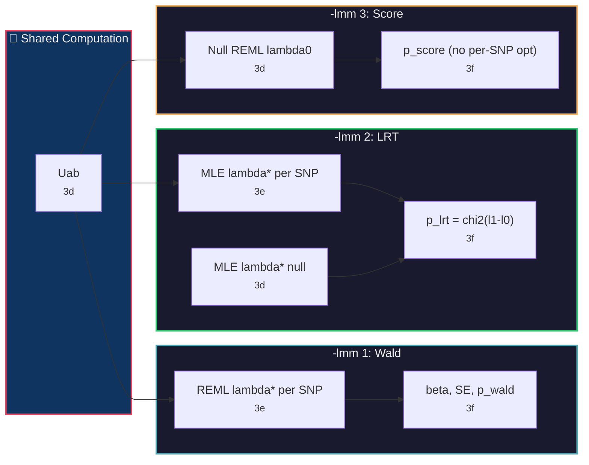
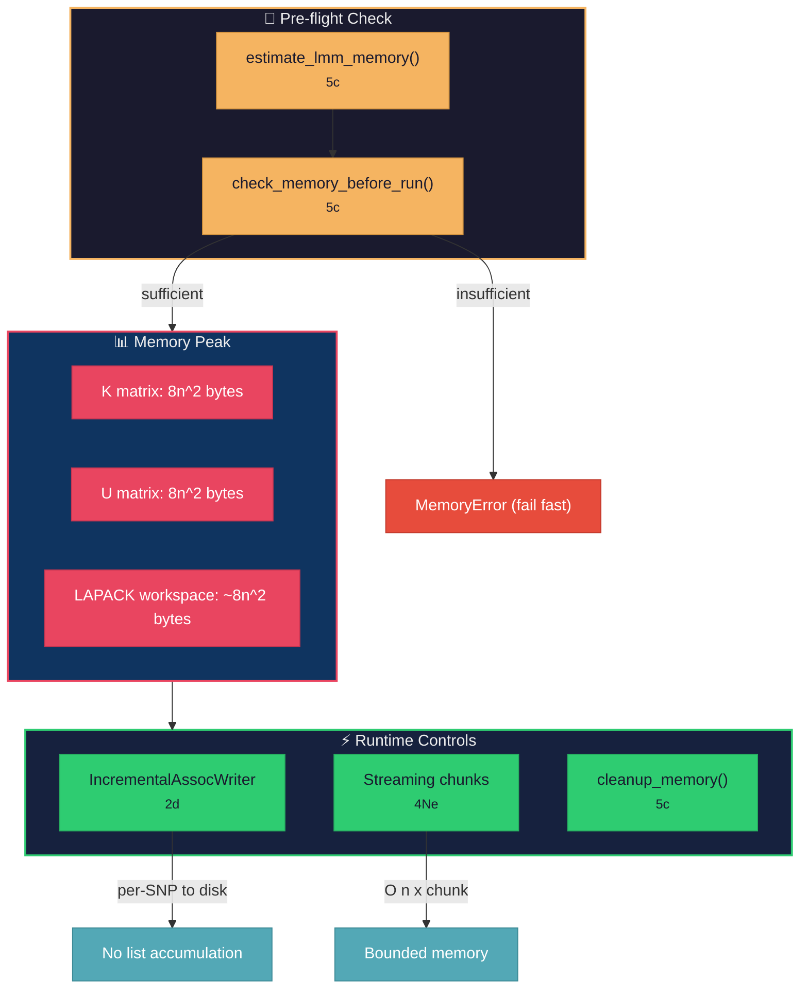
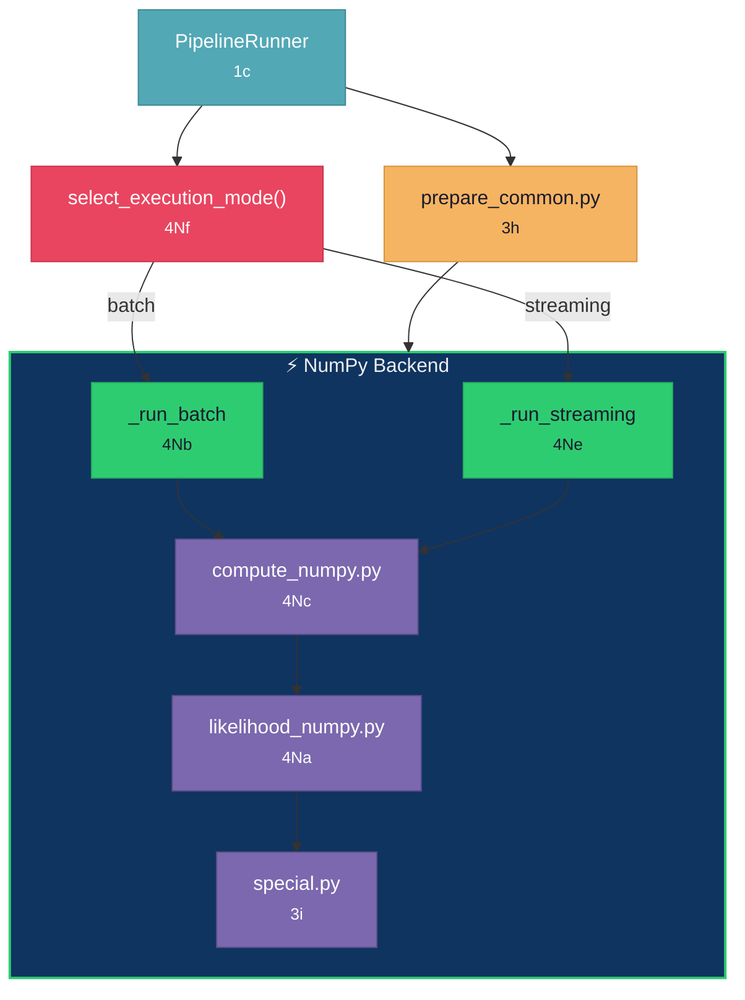

# JAMMA Code Map

Architectural overview with bidirectional links between diagram nodes and source code.

## System Overview

```mermaid
flowchart TB
    subgraph L1["🚀 Entry Points"]
        CLI["CLI (click)<br/><small>1a</small>"]
        GWAS["gwas() API<br/><small>1b</small>"]
        PIPE["PipelineRunner<br/><small>1c</small>"]
    end

    subgraph L2["📂 I/O Layer"]
        PLINK["PLINK Reader<br/><small>2a</small>"]
        COVAR["Covariate Reader<br/><small>2b</small>"]
        KIO["Kinship I/O<br/><small>2c</small>"]
        RIO["Result Writer<br/><small>2d</small>"]
        SNPLIST["SNP List I/O<br/><small>2e</small>"]
        EIGIO["Eigen I/O<br/><small>2f</small>"]
        MATIO["Matrix Writer<br/><small>2g</small>"]
    end

    subgraph L3["🧮 Core Computation"]
        KINSHIP["Kinship Compute<br/><small>3a</small>"]
        MISSING["Missing Imputation<br/><small>3b</small>"]
        EIGEN["Eigendecomposition<br/><small>3c</small>"]
        JLINALG["jlinalg C Layer<br/><small>3c-prime</small>"]
        LIKE["REML Likelihood<br/><small>3d</small>"]
        OPT["Lambda Optimizer<br/><small>3e</small>"]
        STATS["Test Statistics<br/><small>3f</small>"]
        SNPF["SNP Filters<br/><small>3g</small>"]
        PREPCOM["Shared Preparation<br/><small>3h</small>"]
        SPECIAL["Special Functions<br/><small>3i</small>"]
    end

    subgraph L4N["⚡ NumPy Backend"]
        LIKENP["Batch Likelihood<br/><small>4Na</small>"]
        RUNNERNP["NumPy Runner<br/><small>4Nb</small>"]
        COMPUTENP["Chunk Compute<br/><small>4Nc</small>"]
        CACCEL["C Extension<br/><small>4Nd</small>"]
        SCHEMA["Output Schema<br/><small>4Nh</small>"]
        RESULTS["Result Building<br/><small>4Ni</small>"]
        LOCO["LOCO Runner<br/><small>4Nj</small>"]
    end

    subgraph L5["🔧 Infrastructure"]
        CONFIG["Output Config<br/><small>5a</small>"]
        MEM["Memory Manager<br/><small>5c</small>"]
        LOG["Logging<br/><small>5d</small>"]
        THREAD["Threading<br/><small>5e</small>"]
        HW["Hardware Context<br/><small>5f</small>"]
        PROG["Progress<br/><small>5g</small>"]
    end

    subgraph L6["🔬 Validation"]
        TOL["Tolerance Config<br/><small>6a</small>"]
        CMP["GEMMA Comparator<br/><small>6b</small>"]
    end

    CLI --> PIPE
    GWAS --> PIPE

    CLI --> PLINK
    CLI --> KIO
    CLI --> SNPLIST
    CLI --> CONFIG
    CLI --> LOG

    PIPE --> PLINK
    PIPE --> COVAR
    PIPE --> KIO
    PIPE --> RIO
    PIPE --> SNPLIST
    PIPE --> EIGIO
    PIPE --> KINSHIP
    PIPE --> EIGEN
    PIPE --> RUNNERNP
    PIPE --> LOCO
    PIPE --> MEM

    KINSHIP --> MISSING
    KINSHIP --> PLINK
    KINSHIP --> MEM
    KINSHIP --> SNPF

    CLI --> KINSHIP

    LOCO --> KINSHIP
    LOCO --> EIGEN
    LOCO --> RUNNERNP

    %% NumPy backend connections
    RUNNERNP --> LIKENP
    RUNNERNP --> PREPCOM
    RUNNERNP --> RIO
    RUNNERNP --> CACCEL
    COMPUTENP --> LIKENP
    LIKENP --> SPECIAL

    %% jlinalg C layer for eigendecomp
    EIGEN --> JLINALG

    %% Shared connections
    OPT --> LIKE
    STATS --> LIKE

    EIGEN --> MEM
    EIGEN --> THREAD

    KIO --> MATIO

    CMP --> TOL

    style L1 fill:#1a1a2e,stroke:#53a8b6,color:#eee,stroke-width:2px
    style L2 fill:#1a1a2e,stroke:#f5b461,color:#eee,stroke-width:2px
    style L3 fill:#0f3460,stroke:#e94560,color:#eee,stroke-width:2px
    style L4N fill:#0f3460,stroke:#2ecc71,color:#eee,stroke-width:2px
    style L5 fill:#16213e,stroke:#a29bfe,color:#eee,stroke-width:2px
    style L6 fill:#16213e,stroke:#95a5a6,color:#eee,stroke-width:2px

    style CLI fill:#53a8b6,stroke:#3d8a96,color:#fff
    style GWAS fill:#53a8b6,stroke:#3d8a96,color:#fff
    style PIPE fill:#53a8b6,stroke:#3d8a96,color:#fff

    style PLINK fill:#f5b461,stroke:#d4943f,color:#1a1a2e
    style COVAR fill:#f5b461,stroke:#d4943f,color:#1a1a2e
    style KIO fill:#f5b461,stroke:#d4943f,color:#1a1a2e
    style RIO fill:#f5b461,stroke:#d4943f,color:#1a1a2e
    style SNPLIST fill:#f5b461,stroke:#d4943f,color:#1a1a2e
    style EIGIO fill:#f5b461,stroke:#d4943f,color:#1a1a2e
    style MATIO fill:#f5b461,stroke:#d4943f,color:#1a1a2e

    style KINSHIP fill:#e94560,stroke:#c73550,color:#fff
    style MISSING fill:#e94560,stroke:#c73550,color:#fff
    style EIGEN fill:#e94560,stroke:#c73550,color:#fff
    style JLINALG fill:#e94560,stroke:#c73550,color:#fff
    style LIKE fill:#e94560,stroke:#c73550,color:#fff
    style OPT fill:#e94560,stroke:#c73550,color:#fff
    style STATS fill:#e94560,stroke:#c73550,color:#fff
    style SNPF fill:#e94560,stroke:#c73550,color:#fff
    style PREPCOM fill:#e94560,stroke:#c73550,color:#fff
    style SPECIAL fill:#e94560,stroke:#c73550,color:#fff

    style LIKENP fill:#2ecc71,stroke:#27ae60,color:#1a1a2e
    style RUNNERNP fill:#2ecc71,stroke:#27ae60,color:#1a1a2e
    style COMPUTENP fill:#2ecc71,stroke:#27ae60,color:#1a1a2e
    style CACCEL fill:#2ecc71,stroke:#27ae60,color:#1a1a2e
    style SCHEMA fill:#2ecc71,stroke:#27ae60,color:#1a1a2e
    style RESULTS fill:#2ecc71,stroke:#27ae60,color:#1a1a2e
    style LOCO fill:#2ecc71,stroke:#27ae60,color:#1a1a2e

    style CONFIG fill:#a29bfe,stroke:#7c73d9,color:#fff
    style MEM fill:#a29bfe,stroke:#7c73d9,color:#fff
    style LOG fill:#a29bfe,stroke:#7c73d9,color:#fff
    style THREAD fill:#a29bfe,stroke:#7c73d9,color:#fff
    style HW fill:#a29bfe,stroke:#7c73d9,color:#fff
    style PROG fill:#a29bfe,stroke:#7c73d9,color:#fff

    style TOL fill:#95a5a6,stroke:#7f8c8d,color:#1a1a2e
    style CMP fill:#95a5a6,stroke:#7f8c8d,color:#1a1a2e
```

---

### [1] Entry Points

Two user-facing entry points: the `gwas()` API for programmatic use and the CLI for command-line use. Both delegate to `PipelineRunner` for LMM orchestration.

| ID | Component | Description | File:Line |
|----|-----------|-------------|-----------|
| 1a | `main()` | Click command — all flags (`-gk`, `-lmm`, `-bfile`, `-o`, `-outdir`) | [cli.py](../src/jamma/cli.py) |
| 1a | `_run_gk()` | Kinship CLI shell (`-gk 1/2`); delegates compute/write to `compute_kinship()` | [cli.py:373](../src/jamma/cli.py#L373) |
| 1a | `_run_lmm()` | LMM association (`-lmm 1/2/3/4`) | [cli.py:480](../src/jamma/cli.py#L480) |
| 1b | `gwas()` | One-call GWAS pipeline (load -> kinship -> LMM -> results) | [gwas.py:57](../src/jamma/gwas.py#L57) |
| 1b | `GWASResult` | Pipeline result dataclass (associations, timing, counts) | [gwas.py:34](../src/jamma/gwas.py#L34) |
| 1c | `PipelineRunner` | `-lmm` orchestration (validate -> parse -> memory -> kinship -> LMM); passes `valid_indices` for early sample filtering when `save_kinship=False` | [pipeline.py](../src/jamma/pipeline.py) |
| 1c | `run_phenotype_loop()` | Per-phenotype loop; dispatches each column to the batch or streaming runner | [pipeline_phenotype_loop.py](../src/jamma/pipeline_phenotype_loop.py) |
| 1c | `compute_kinship()` | `-gk` kinship orchestration (compute + write), returns `KinshipResult` | [pipeline_kinship.py](../src/jamma/pipeline_kinship.py) |
| 1c | `memory_preflight()` | Memory gate before compute; streaming and batch estimators behind one entry point | [pipeline_memory.py](../src/jamma/pipeline_memory.py) |
| 1c | `log_dataset_banner()` / `log_pipeline_banner()` | GEMMA-style dataset summary and execution-plan banner | [pipeline_banner.py](../src/jamma/pipeline_banner.py) |
| 1c | `PipelineConfig` | Pipeline configuration dataclass (all CLI flags) | [pipeline_config.py](../src/jamma/pipeline_config.py) |

---

### [2] I/O Layer

Reads PLINK binary genotypes, covariates, and kinship matrices. Writes GEMMA-compatible output.

| ID | Component | Description | File:Line |
|----|-----------|-------------|-----------|
| 2a | `PlinkData` | Genotype container (n_samples x n_snps float32) | [plink.py:20](../src/jamma/io/plink.py#L20) |
| 2a | `load_plink_binary()` | Full-load PLINK .bed/.bim/.fam | [plink.py:53](../src/jamma/io/plink.py#L53) |
| 2a | `stream_genotype_chunks()` | Windowed reads from .bed (O(n x chunk)) | [plink.py:296](../src/jamma/io/plink.py#L296) |
| 2a | `get_plink_metadata()` | Dimensions + metadata without loading genotypes | [plink.py:92](../src/jamma/io/plink.py#L92) |
| 2b | `read_covariate_file()` | Whitespace-delimited covariate matrix | [covariate.py:20](../src/jamma/io/covariate.py#L20) |
| 2c | `read_kinship_matrix()` | Load kinship (auto-detects `.npy` or `.txt`; prefers `.npy` sibling) | [kinship/io.py:45](../src/jamma/kinship/io.py#L45) |
| 2c | `write_kinship_matrix()` | Write `.cXX.npy` (default) or `.cXX.txt` (legacy_text=True) | [kinship/io.py:97](../src/jamma/kinship/io.py#L97) |
| 2d | `IncrementalAssocWriter` | Per-SNP disk writer (no memory accumulation) | [lmm/io.py:96](../src/jamma/lmm/io.py#L96) |
| 2d | `format_assoc_line()` | Table-driven output row formatting | [lmm/io.py:37](../src/jamma/lmm/io.py#L37) |
| 2d | `write_assoc_results()` | Batch write from list | [lmm/io.py:77](../src/jamma/lmm/io.py#L77) |
| 2e | `read_snp_list_file()` | Parse SNP list file (one RS ID per line) | [io/snp_list.py](../src/jamma/io/snp_list.py) |
| 2e | `resolve_snp_list_to_indices()` | Map SNP IDs to dataset indices | [io/snp_list.py](../src/jamma/io/snp_list.py) |
| 2f | `read_eigen_files()` | Load eigenvalue/eigenvector files (auto-detects `.npy` or `.txt`) | [lmm/eigen_io.py](../src/jamma/lmm/eigen_io.py) |
| 2f | `write_eigen_files()` | Write eigendecomposition (`.npy` default; `.txt` + `.npy` sidecar with legacy_text) | [lmm/eigen_io.py](../src/jamma/lmm/eigen_io.py) |
| 2f | `npy_cache_valid()` | Shared `.npy` sibling cache validation (mtime-based) | [utils/npy_cache.py](../src/jamma/utils/npy_cache.py) |
| 2g | `write_matrix_parallel()` | Parallel matrix writer using file-backed memmap | [io/matrix_writer.py:91](../src/jamma/io/matrix_writer.py#L91) |
| 2h | `read_matrix_parallel()` | Multi-worker matrix text reader with chunk scanning | [io/matrix_reader.py](../src/jamma/io/matrix_reader.py) |
| 2i | `read_weight_file()` | Parse per-individual weight file (`-widv` flag) | [io/weight.py:25](../src/jamma/io/weight.py#L25) |
| 2i | `apply_individual_weights()` | Apply weights to kinship matrix | [io/weight.py:67](../src/jamma/io/weight.py#L67) |

---

### [3] Core Computation

GEMMA algorithm reimplementation: kinship -> eigendecomp -> REML -> test statistics. These modules are shared across the NumPy backend.

| ID | Component | Description | File:Line |
|----|-----------|-------------|-----------|
| 3a | `compute_centered_kinship()` | K = (1/p) x Xc x Xc' in batches of 10k SNPs | [compute.py:228](../src/jamma/kinship/compute.py#L228) |
| 3a | `compute_kinship_streaming()` | 2-pass streaming (stats -> accumulate); accepts `valid_indices` for early sample filtering; canonical streaming kinship (LOCO streaming merged in) | [compute.py:545](../src/jamma/kinship/compute.py#L545) |
| 3a | `compute_loco_kinship_streaming()` | Streaming per-chromosome LOCO kinship matrices | [compute.py:1113](../src/jamma/kinship/compute.py#L1113) |
| 3a | `_filter_snps()` | MAF, missing rate, monomorphism filters | [compute.py:103](../src/jamma/kinship/compute.py#L103) |
| 3b | `impute_and_center()` | NaN -> mean, then center (in-place for NumPy arrays) | [missing.py:21](../src/jamma/kinship/missing.py#L21) |
| 3b | `impute_missing_inplace()` | In-place NaN -> col-mean for genotype chunks (used by all runners) | [lmm/impute.py:6](../src/jamma/lmm/impute.py#L6) |
| 3c | `eigendecompose_kinship()` | Eigendecomp via `jlinalg.eigh` with BLAS thread control | [eigen.py](../src/jamma/lmm/eigen.py) |
| 3c' | `jlinalg.eigh()` | Vendor DSYEVD/DSYEVR dispatch with NumPy fallback | [jlinalg/\_\_init\_\_.py](../src/jamma/jlinalg/__init__.py) |
| 3c' | `jlinalg_dsyevd_ext()` | C: vendor DSYEVD dispatch (O(n^2) workspace) | [blas_dispatch.c](../src/jamma/jlinalg/src/blas_dispatch.c) |
| 3c' | `jlinalg_dsyevr_ext()` | C: vendor DSYEVR dispatch (O(n) workspace, memory-pressure fallback) | [blas_dispatch.c](../src/jamma/jlinalg/src/blas_dispatch.c) |
| 3d | `reml_log_likelihood()` | REML l(lambda) for variance component estimation | [likelihood.py:652](../src/jamma/lmm/likelihood.py#L652) |
| 3d | `mle_log_likelihood()` | MLE l(lambda) for LRT | [likelihood.py:1122](../src/jamma/lmm/likelihood.py#L1122) |
| 3d | `compute_Uab()` | Element-wise products of rotated vectors | [likelihood.py:168](../src/jamma/lmm/likelihood.py#L168) |
| 3d | `calc_pab()` | Recursive Schur complement projection (GEMMA CalcPab) | [likelihood.py:267](../src/jamma/lmm/likelihood.py#L267) |
| 3d | `get_ab_index()` | GEMMA GetabIndex -- 1-based upper triangular | [likelihood.py:147](../src/jamma/lmm/likelihood.py#L147) |
| 3d | `compute_null_model_lambda()` | Null model REML for Score test | [likelihood.py:1080](../src/jamma/lmm/likelihood.py#L1080) |
| 3d | `compute_null_model_mle()` | Null model MLE for LRT | [likelihood.py:1175](../src/jamma/lmm/likelihood.py#L1175) |
| 3e | `golden_section_optimize_lambda_numpy()` | REML optimization per SNP (Wald) | [likelihood_numpy.py](../src/jamma/lmm/likelihood_numpy.py) |
| 3e | `golden_section_optimize_lambda_mle_numpy()` | MLE optimization per SNP (LRT) | [likelihood_numpy.py](../src/jamma/lmm/likelihood_numpy.py) |
| 3f | `AssocResult` | Per-SNP result dataclass (all test fields) | [stats.py:40](../src/jamma/lmm/stats.py#L40) |
| 3f | `batch_calc_wald_stats_from_pab_numpy()` | Production: beta, SE, p_wald across a chunk | [likelihood_numpy.py:1660](../src/jamma/lmm/likelihood_numpy.py#L1660) |
| 3f | `batch_calc_score_stats_numpy()` | Production: p_score across a chunk | [likelihood_numpy.py:1702](../src/jamma/lmm/likelihood_numpy.py#L1702) |
| 3f | `calc_wald_test()` | Scalar reference for the batch path; tests only | [stats.py:99](../src/jamma/lmm/stats.py#L99) |
| 3f | `calc_score_test()` | Scalar reference for the batch path; tests only | [stats.py:198](../src/jamma/lmm/stats.py#L198) |
| 3f | `calc_lrt_test()` | Scalar reference for the batch path; tests only | [stats.py:170](../src/jamma/lmm/stats.py#L170) |
| 3f | `f_sf()` | F-distribution survival via Cephes betainc; tests only | [stats.py:67](../src/jamma/lmm/stats.py#L67) |
| 3g | `compute_hwe_pvalues()` | Chi-squared HWE test via pure NumPy | [core/snp_filter.py](../src/jamma/core/snp_filter.py) |
| 3g | `apply_snp_list_mask()` | DRY bounds-validated SNP mask application | [core/snp_filter.py](../src/jamma/core/snp_filter.py) |
| 3h | `_build_covariate_matrix()` | Pure-NumPy covariate setup | [prepare_common.py](../src/jamma/lmm/prepare_common.py) |
| 3h | `_eigendecompose_or_reuse()` | Handles kinship decomp or reuses pre-computed eigen | [prepare_common.py](../src/jamma/lmm/prepare_common.py) |
| 3h | `_compute_null_model_common()` | Null model fitting | [prepare_common.py](../src/jamma/lmm/prepare_common.py) |
| 3i | `betainc()` | Regularized incomplete beta (pure-stdlib, no scipy) | [special.py](../src/jamma/lmm/special.py) |
| 3i | `chi2_sf()` | Chi-squared survival function (pure-stdlib) | [special.py](../src/jamma/lmm/special.py) |

---

### [4N] NumPy Backend

Pure-NumPy LMM implementation. Works on all platforms (Intel Mac, Windows, Linux). Uses `np.vectorize` for batch operations and stdlib-only special functions for p-value computation. Optional C extension (`_lmm_accel.c`) provides OpenMP-parallelized Wald test with workspace API for n_cvt=1, with automatic fallback to pure Python. Batch, disk-streaming, and LOCO runners share `chunk_runner_numpy.py` for chunk sizing, rotation, C/Python dispatch, diagnostics, and per-chunk result writes.

| ID | Component | Description | File:Line |
|----|-----------|-------------|-----------|
| 4Na | `batch_calc_wald_stats_numpy()` | Vectorized Wald: REML optimize -> beta, SE, p_wald | [likelihood_numpy.py](../src/jamma/lmm/likelihood_numpy.py) |
| 4Na | `batch_calc_score_stats_numpy()` | Vectorized Score: null lambda -> p_score | [likelihood_numpy.py](../src/jamma/lmm/likelihood_numpy.py) |
| 4Na | `_batch_lrt_pvalues_numpy()` | Vectorized LRT: MLE optimize -> p_lrt | [likelihood_numpy.py](../src/jamma/lmm/likelihood_numpy.py) |
| 4Nb | `run_lmm_association_numpy()` | In-memory batch runner (full genotype load) | [runner_numpy.py:43](../src/jamma/lmm/runner_numpy.py#L43) |
| 4Nb | `run_lmm_chunk_source_numpy()` | Shared NumPy chunk-loop orchestrator for batch, streaming, and LOCO paths | [chunk_runner_numpy.py:141](../src/jamma/lmm/chunk_runner_numpy.py#L141) |
| 4Nb | `_create_workspaces()` | Persistent C-workspace lifecycle | [chunk_workspaces.py:102](../src/jamma/lmm/chunk_workspaces.py#L102) |
| 4Nb | `_dispatch_compute()` | Per-chunk C/Python kernel-selection ladder | [chunk_dispatch.py:282](../src/jamma/lmm/chunk_dispatch.py#L282) |
| 4Nb | `_drive_pipeline()` | Overlapped rotate-and-compute pipeline + adaptive thread split | [chunk_pipeline.py:99](../src/jamma/lmm/chunk_pipeline.py#L99) |
| 4Nb | `compute_chunk_size_numpy()` | RAM-budgeted chunk-size computation | [chunk_sizing.py:23](../src/jamma/lmm/chunk_sizing.py#L23) |
| 4Nc | `create_lmm_workspace()` | Allocate reusable per-chunk Wald workspace (split C path) | [compute_numpy.py:274](../src/jamma/lmm/compute_numpy.py#L274) |
| 4Nc | `compute_wald_split_c_ws()` | Workspace-based Wald compute dispatch to C extension | [compute_numpy.py:317](../src/jamma/lmm/compute_numpy.py#L317) |
| 4Nd | `compute_lmm_batch_c()` | C extension: batch REML Wald pipeline for n_cvt=1 with OpenMP | [_lmm_accel.c](../src/jamma/lmm/_lmm_accel.c) |
| 4Nd | `alloc_thread_scratch()` / `free_thread_scratch()` | C: per-thread scratch buffer alloc/free helpers | [_lmm_support.c:25](../src/jamma/lmm/_lmm_support.c#L25) |
| 4Nd | `_compile_accel.py` | Dev-mode / runtime recompile for `_lmm_accel` | [_compile_accel.py](../src/jamma/lmm/_compile_accel.py) |
| 4Nd | `_compile_jlinalg.py` | Dev-mode / runtime recompile for jlinalg | [_compile_jlinalg.py](../src/jamma/jlinalg/_compile_jlinalg.py) |
| 4Nd | `compile_and_link.py` | Shared compile flags, source lists, link flags (single source of truth, consumed by `hatch_build.py` + both `_compile_*.py`) | [compile_and_link.py](../src/jamma/_build_support/compile_and_link.py) |
| 4Ne | `run_lmm_association_numpy_streaming()` | NumPy disk streaming (two-pass, full pipeline support, C extension) | [runner_numpy_streaming.py:64](../src/jamma/lmm/runner_numpy_streaming.py#L64) |
| 4Nf | `select_execution_mode()` | Batch vs streaming mode selection | [runner.py:115](../src/jamma/lmm/runner.py#L115) |
| 4Nh | `StatColumn` | Frozen dataclass for output column definitions | [lmm/schema.py:73](../src/jamma/lmm/schema.py#L73) |
| 4Nh | `ModeSpec` | Per-mode column specification (single source of truth) | [lmm/schema.py:99](../src/jamma/lmm/schema.py#L99) |
| 4Ni | `_build_results()` | Table-driven result building from numpy arrays | [lmm/results.py:56](../src/jamma/lmm/results.py#L56) |
| 4Ni | `count_lambda_boundary_hits()` | Diagnostic: count SNPs at lambda bounds | [lmm/results.py:188](../src/jamma/lmm/results.py#L188) |
| 4Nj | `run_lmm_loco()` | LOCO: per-chromosome kinship -> eigen -> LMM | [lmm/loco.py:175](../src/jamma/lmm/loco.py#L175) |

---

### [5] Infrastructure

Configuration, memory management, threading, and logging.

| ID | Component | Description | File:Line |
|----|-----------|-------------|-----------|
| 5a | `OutputConfig` | Output directory + prefix + verbose flag | [config.py:13](../src/jamma/core/config.py#L13) |
| 5c | `MemoryBreakdown` | Estimated memory per workflow stage | [memory.py:248](../src/jamma/core/memory.py#L248) |
| 5c | `estimate_workflow_memory()` | Full pipeline memory estimate (pre-flight) | [memory.py:304](../src/jamma/core/memory.py#L304) |
| 5c | `estimate_lmm_memory()` | LMM-phase-only memory estimate | [memory.py:397](../src/jamma/core/memory.py#L397) |
| 5c | `estimate_lmm_streaming_memory()` | LMM streaming phase memory estimate | [memory.py:647](../src/jamma/core/memory.py#L647) |
| 5c | `check_memory_before_run()` | Raise MemoryError if insufficient | [memory.py:876](../src/jamma/core/memory.py#L876) |
| 5c | `get_memory_snapshot()` | Current RSS, VMS, available | [memory.py:771](../src/jamma/core/memory.py#L771) |
| 5c | `cleanup_memory()` | GC + clear caches | [memory.py:822](../src/jamma/core/memory.py#L822) |
| 5d | `setup_logging()` | Loguru console + optional file | [logging.py:16](../src/jamma/utils/logging.py#L16) |
| 5d | `write_gemma_log()` | GEMMA-compatible `.log.txt` | [logging.py:51](../src/jamma/utils/logging.py#L51) |
| 5d | `log_rss_memory()` | RSS snapshot at phase boundaries | [logging.py:120](../src/jamma/utils/logging.py#L120) |
| 5e | `get_physical_core_count()` | Physical core detection (consolidated helper) | [threading.py:43](../src/jamma/core/threading.py#L43) |
| 5e | `blas_threads()` | Context manager for BLAS thread control | [threading.py:162](../src/jamma/core/threading.py#L162) |
| 5f | `get_hardware_context()` | CPU, BLAS, platform info for benchmarks | [hardware.py:37](../src/jamma/core/hardware.py#L37) |
| 5g | `progress_iterator()` | Progress bar wrapper for iterables | [progress.py:94](../src/jamma/core/progress.py#L94) |
| 5h | `estimate_kinship_time()` | Wall-clock time estimate for kinship phase | [estimates.py:166](../src/jamma/core/estimates.py#L166) |
| 5h | `estimate_eigendecomp_time()` | Wall-clock time estimate for eigendecomposition | [estimates.py:202](../src/jamma/core/estimates.py#L202) |
| 5i | `PHENOTYPE_MISSING` | Missing phenotype sentinel (-9.0) | [constants.py:4](../src/jamma/core/constants.py#L4) |

---

### [6] Validation

Tolerance-based comparison infrastructure for GEMMA parity testing.

| ID | Component | Description | File:Line |
|----|-----------|-------------|-----------|
| 6a | `ToleranceConfig` | Per-field tolerance dataclass (strict/default/relaxed) | [tolerances.py:40](../src/jamma/validation/tolerances.py#L40) |
| 6b | `ComparisonResult` | Pass/fail with max diffs and worst location | [compare.py:21](../src/jamma/validation/compare.py#L22) |
| 6b | `AssocComparisonResult` | Per-column comparison results | [compare.py:312](../src/jamma/validation/compare.py#L324) |
| 6b | `compare_assoc_results()` | Full association comparison across test types | [compare.py:399](../src/jamma/validation/compare.py#L481) |
| 6b | `compare_kinship_matrices()` | Symmetric matrix comparison | [compare.py:144](../src/jamma/validation/compare.py#L145) |
| 6b | `load_gemma_assoc()` | Parse GEMMA `.assoc.txt` (schema-derived) | [compare.py:245](../src/jamma/validation/compare.py#L258) |
| 6b | `load_gemma_kinship()` | Parse GEMMA `.cXX.txt` | [compare.py:182](../src/jamma/validation/compare.py#L183) |

---

## Data Flow: Genotypes -> Results

```mermaid
sequenceDiagram
    participant U as User
    participant CLI as "CLI (1a)"
    participant IO as "PLINK I/O (2a)"
    participant K as "Kinship (3a)"
    participant E as "Eigendecomp (3c)"
    participant L as "Likelihood (3d)"
    participant O as "Optimizer (3e)"
    participant S as "Statistics (3f)"
    participant W as "Writer (2d)"

    U->>CLI: jamma -lmm 1 -bfile data -k K.txt
    activate CLI

    rect rgba(53, 168, 182, 0.75)
        CLI->>IO: load_plink_binary()
        activate IO
        IO-->>CLI: PlinkData (genotypes, metadata)
        deactivate IO
        CLI->>K: read_kinship_matrix()
        activate K
        K-->>CLI: K (n x n)
        deactivate K
    end

    rect rgba(245, 180, 97, 0.75)
        CLI->>E: eigendecompose_kinship(K)
        activate E
        E-->>CLI: eigenvalues, eigenvectors (U)
        deactivate E
        Note over CLI: Rotate: Uy = U'y, UtW = U'W
    end

    rect rgba(233, 69, 96, 0.75)
        loop For each SNP chunk
            CLI->>L: compute_Uab(UtW, Uty, Utx)
            activate L
            L-->>CLI: Uab matrix
            deactivate L
            CLI->>O: optimize_lambda(REML, Uab)
            activate O
            O->>L: reml_log_likelihood(lambda)
            activate L
            L-->>O: l(lambda)
            deactivate L
            O-->>CLI: lambda*
            deactivate O
            CLI->>L: calc_pab(Hi_eval, Uab)
            activate L
            L-->>CLI: Pab matrix
            deactivate L
            CLI->>S: calc_wald_test(Pab)
            activate S
            S-->>CLI: beta, SE, p_wald
            deactivate S
            CLI->>W: write(AssocResult)
        end
    end

    W-->>U: .assoc.txt + .log.txt
    deactivate CLI
```

---

## LMM Test Modes

```mermaid
flowchart LR
    subgraph Input["🧮 Shared Computation"]
        UAB["Uab<br/><small>3d</small>"]
    end

    subgraph Wald["-lmm 1: Wald"]
        REML1["REML lambda* per SNP<br/><small>3e</small>"]
        W1["beta, SE, p_wald<br/><small>3f</small>"]
    end

    subgraph LRT["-lmm 2: LRT"]
        MLE1["MLE lambda* per SNP<br/><small>3e</small>"]
        MLE0["MLE lambda* null<br/><small>3d</small>"]
        L1["p_lrt = chi2(l1-l0)<br/><small>3f</small>"]
    end

    subgraph Score["-lmm 3: Score"]
        NULL["Null REML lambda0<br/><small>3d</small>"]
        SC["p_score (no per-SNP opt)<br/><small>3f</small>"]
    end

    UAB --> REML1 --> W1
    UAB --> MLE1 --> L1
    MLE0 --> L1
    UAB --> NULL --> SC

    style Input fill:#0f3460,stroke:#e94560,color:#eee,stroke-width:2px
    style Wald fill:#1a1a2e,stroke:#53a8b6,color:#eee,stroke-width:2px
    style LRT fill:#1a1a2e,stroke:#2ecc71,color:#eee,stroke-width:2px
    style Score fill:#1a1a2e,stroke:#f5b461,color:#eee,stroke-width:2px
```

---

## Memory Architecture

```mermaid
flowchart TD
    subgraph Preflight["🔧 Pre-flight Check"]
        EST["estimate_lmm_memory()<br/><small>5c</small>"]
        CHK["check_memory_before_run()<br/><small>5c</small>"]
    end

    subgraph Peak["📊 Memory Peak"]
        KM["K matrix: 8n^2 bytes"]
        UM["U matrix: 8n^2 bytes"]
        WS["LAPACK workspace: ~8n^2 bytes"]
    end

    subgraph Runtime["⚡ Runtime Controls"]
        INC["IncrementalAssocWriter<br/><small>2d</small>"]
        STR["Streaming chunks<br/><small>4Ne</small>"]
        CLN["cleanup_memory()<br/><small>5c</small>"]
    end

    EST --> CHK
    CHK -->|insufficient| FAIL["MemoryError (fail fast)"]
    CHK -->|sufficient| Peak
    Peak --> Runtime
    INC -->|per-SNP to disk| DISK["No list accumulation"]
    STR -->|O n x chunk| LOW["Bounded memory"]

    style Preflight fill:#1a1a2e,stroke:#f5b461,color:#eee,stroke-width:2px
    style Peak fill:#0f3460,stroke:#e94560,color:#eee,stroke-width:2px
    style Runtime fill:#16213e,stroke:#2ecc71,color:#eee,stroke-width:2px

    style EST fill:#f5b461,stroke:#d4943f,color:#1a1a2e
    style CHK fill:#f5b461,stroke:#d4943f,color:#1a1a2e
    style KM fill:#e94560,stroke:#c73550,color:#fff
    style UM fill:#e94560,stroke:#c73550,color:#fff
    style WS fill:#e94560,stroke:#c73550,color:#fff
    style FAIL fill:#e74c3c,stroke:#c0392b,color:#fff
    style INC fill:#2ecc71,stroke:#27ae60,color:#1a1a2e
    style STR fill:#2ecc71,stroke:#27ae60,color:#1a1a2e
    style CLN fill:#2ecc71,stroke:#27ae60,color:#1a1a2e
    style DISK fill:#53a8b6,stroke:#3d8a96,color:#fff
    style LOW fill:#53a8b6,stroke:#3d8a96,color:#fff
```

---

## Backend Architecture

`PipelineRunner` always uses the NumPy backend. `select_execution_mode()` chooses batch or streaming mode based on memory availability. In [pipeline_phenotype_loop.py](../src/jamma/pipeline_phenotype_loop.py), `_run_batch` handles in-memory genotypes and `_run_streaming` reads chunks from disk.

```mermaid
flowchart TD
    PIPE["PipelineRunner<br/><small>1c</small>"]
    SEL["select_execution_mode()<br/><small>4Nf</small>"]
    PREP["prepare_common.py<br/><small>3h</small>"]

    subgraph NP["⚡ NumPy Backend"]
        direction TB
        BATCH["_run_batch<br/><small>4Nb</small>"]
        STREAM["_run_streaming<br/><small>4Ne</small>"]
        CN["compute_numpy.py<br/><small>4Nc</small>"]
        LN["likelihood_numpy.py<br/><small>4Na</small>"]
        SP["special.py<br/><small>3i</small>"]
    end

    PIPE --> SEL
    SEL -->|batch| BATCH
    SEL -->|streaming| STREAM
    PIPE --> PREP
    PREP --> NP
    BATCH --> CN --> LN
    STREAM --> CN
    LN --> SP

    style NP fill:#0f3460,stroke:#2ecc71,color:#eee,stroke-width:2px

    style PIPE fill:#53a8b6,stroke:#3d8a96,color:#fff
    style SEL fill:#e94560,stroke:#c73550,color:#fff
    style PREP fill:#f5b461,stroke:#d4943f,color:#1a1a2e
    style BATCH fill:#2ecc71,stroke:#27ae60,color:#1a1a2e
    style STREAM fill:#2ecc71,stroke:#27ae60,color:#1a1a2e
    style CN fill:#7b68ae,stroke:#5a4d8a,color:#fff
    style LN fill:#7b68ae,stroke:#5a4d8a,color:#fff
    style SP fill:#7b68ae,stroke:#5a4d8a,color:#fff
```

### Backend Selection

Priority order: `JAMMA_BACKEND` env var -> `--backend` CLI flag -> auto (batch if memory sufficient, streaming otherwise).

### Feature Support

| Feature | NumPy |
|---------|-------|
| Wald test (`-lmm 1`) | Yes |
| LRT (`-lmm 2`) | Yes |
| Score test (`-lmm 3`) | Yes |
| All tests (`-lmm 4`) | Yes |
| C extension acceleration | Yes (n_cvt=1, auto-fallback) |
| LOCO (`-loco`) | Yes |
| HWE filtering (`-hwe`) | Yes (streaming only) |
| Disk streaming | Yes (runner_numpy_streaming.py) |

### File Naming Convention

| Pattern | Purpose | Examples |
|---------|---------|---------|
| `*_numpy.py` | NumPy implementation | `likelihood_numpy.py`, `runner_numpy.py`, `chunk_runner_numpy.py`, `compute_numpy.py` |
| `*_common.py` | Shared preparation code | `prepare_common.py` |
| No suffix | Base algorithms or shared code | `likelihood.py`, `stats.py`, `eigen.py` |

---

## Quick Navigation

| Area | Entry Point |
|------|-------------|
| gwas() API | [gwas.py:57](../src/jamma/gwas.py#L57) |
| PipelineRunner (`-lmm`) | [pipeline.py](../src/jamma/pipeline.py) |
| Kinship computation (`-gk`) | [pipeline_kinship.py](../src/jamma/pipeline_kinship.py) |
| CLI dispatch | [cli.py:213](../src/jamma/cli.py#L213) |
| Load genotypes | [plink.py:53](../src/jamma/io/plink.py#L53) |
| SNP list I/O | [io/snp_list.py](../src/jamma/io/snp_list.py) |
| Eigen I/O | [lmm/eigen_io.py](../src/jamma/lmm/eigen_io.py) |
| Matrix writer | [io/matrix_writer.py:91](../src/jamma/io/matrix_writer.py#L91) |
| Kinship compute | [compute.py:228](../src/jamma/kinship/compute.py#L228) |
| Eigendecomposition | [eigen.py](../src/jamma/lmm/eigen.py) |
| REML likelihood | [likelihood.py:652](../src/jamma/lmm/likelihood.py#L652) |
| Lambda optimization | [likelihood_numpy.py](../src/jamma/lmm/likelihood_numpy.py) |
| Wald/Score/LRT tests | [stats.py:99](../src/jamma/lmm/stats.py#L99) |
| SNP filters (HWE) | [core/snp_filter.py](../src/jamma/core/snp_filter.py) |
| Output schema | [lmm/schema.py:73](../src/jamma/lmm/schema.py#L73) |
| NumPy batch runner | [runner_numpy.py](../src/jamma/lmm/runner_numpy.py) |
| NumPy streaming runner | [runner_numpy_streaming.py](../src/jamma/lmm/runner_numpy_streaming.py) |
| Shared NumPy chunk-loop orchestrator | [chunk_runner_numpy.py](../src/jamma/lmm/chunk_runner_numpy.py) |
| Chunk sizing / workspaces / dispatch / pipeline | [chunk_sizing.py](../src/jamma/lmm/chunk_sizing.py), [chunk_workspaces.py](../src/jamma/lmm/chunk_workspaces.py), [chunk_dispatch.py](../src/jamma/lmm/chunk_dispatch.py), [chunk_pipeline.py](../src/jamma/lmm/chunk_pipeline.py) |
| NumPy likelihood | [likelihood_numpy.py](../src/jamma/lmm/likelihood_numpy.py) |
| NumPy chunk compute | [compute_numpy.py](../src/jamma/lmm/compute_numpy.py) |
| Shared preparation | [prepare_common.py](../src/jamma/lmm/prepare_common.py) |
| Special functions | [special.py](../src/jamma/lmm/special.py) |
| Backend info | [backend.py](../src/jamma/core/backend.py) |
| LOCO runner | [lmm/loco.py](../src/jamma/lmm/loco.py) |
| LOCO config and artifact naming | [lmm/loco_config.py](../src/jamma/lmm/loco_config.py) |
| LOCO eigenpair sources | [lmm/loco_eigen.py](../src/jamma/lmm/loco_eigen.py) |
| Result writer | [lmm/io.py:96](../src/jamma/lmm/io.py#L96) |
| Memory estimation | [memory.py:304](../src/jamma/core/memory.py#L304) |
| Threading | [threading.py:43](../src/jamma/core/threading.py#L43) |
| Hardware context | [hardware.py:37](../src/jamma/core/hardware.py#L37) |
| Validation comparison | [compare.py:399](../src/jamma/validation/compare.py#L481) |
| Equivalence proof | [GEMMA_EQUIVALENCE.md](GEMMA_EQUIVALENCE.md) |
| Numerical equivalence bound | [GEMMA_NUMERICAL_EQUIVALENCE_BOUND.md](GEMMA_NUMERICAL_EQUIVALENCE_BOUND.md) |
