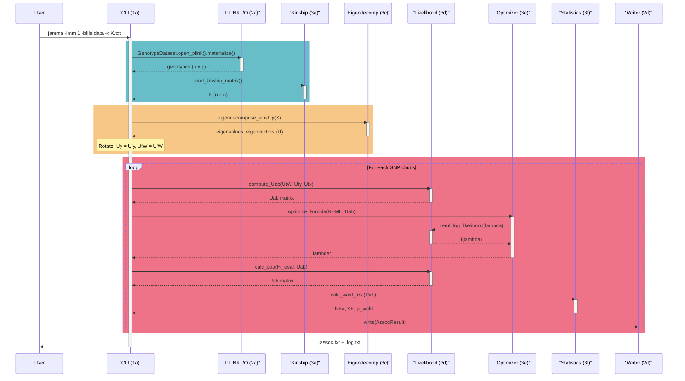
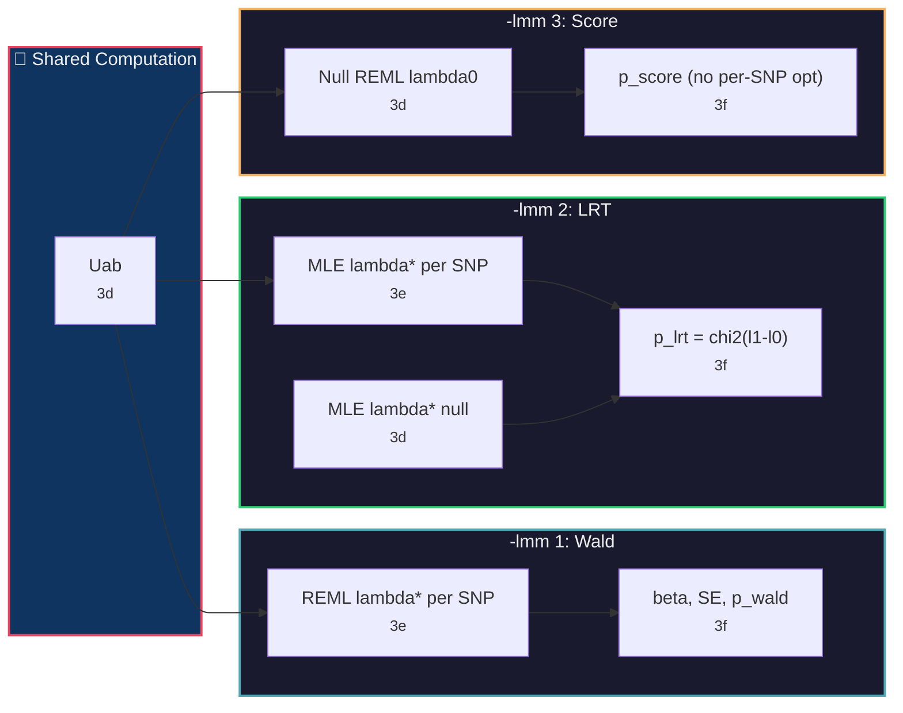
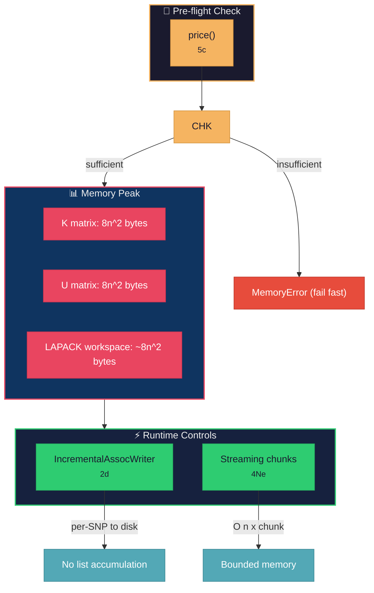
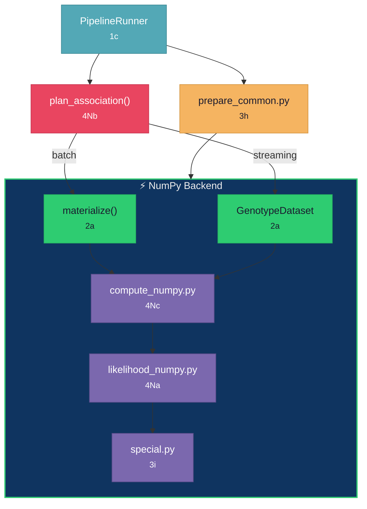

# JAMMA Code Map

Architectural overview with bidirectional links between diagram nodes and source code.

## System Overview

```mermaid
flowchart TB
    subgraph L1["🚀 Entry Points"]
        CLI["CLI (click)<br/><small>1a</small>"]
        GWAS["gwas() API<br/><small>1b</small>"]
        PIPE["PipelineRunner<br/><small>1c</small>"]
    end

    subgraph L2["📂 I/O Layer"]
        PLINK["PLINK Reader<br/><small>2a</small>"]
        COVAR["Covariate Reader<br/><small>2b</small>"]
        KIO["Kinship I/O<br/><small>2c</small>"]
        RIO["Result Writer<br/><small>2d</small>"]
        SNPLIST["SNP List I/O<br/><small>2e</small>"]
        EIGIO["Eigen I/O<br/><small>2f</small>"]
        MATIO["Matrix Writer<br/><small>2g</small>"]
    end

    subgraph L3["🧮 Core Computation"]
        KINSHIP["Kinship Compute<br/><small>3a</small>"]
        MISSING["Missing Imputation<br/><small>3b</small>"]
        EIGEN["Eigendecomposition<br/><small>3c</small>"]
        JLINALG["jlinalg C Layer<br/><small>3c-prime</small>"]
        LIKE["REML Likelihood<br/><small>3d</small>"]
        OPT["Lambda Optimizer<br/><small>3e</small>"]
        STATS["Test Statistics<br/><small>3f</small>"]
        SNPF["SNP Filters<br/><small>3g</small>"]
        PREPCOM["Shared Preparation<br/><small>3h</small>"]
        SPECIAL["Special Functions<br/><small>3i</small>"]
    end

    subgraph L4N["⚡ NumPy Backend"]
        LIKENP["Batch Likelihood<br/><small>4Na</small>"]
        RUNNERNP["NumPy Runner<br/><small>4Nb</small>"]
        COMPUTENP["Chunk Compute<br/><small>4Nc</small>"]
        CACCEL["C Extension<br/><small>4Nd</small>"]
        SCHEMA["Output Schema<br/><small>4Nh</small>"]
        RESULTS["Result Building<br/><small>4Ni</small>"]
        LOCO["LOCO Runner<br/><small>4Nj</small>"]
    end

    subgraph L5["🔧 Infrastructure"]
        MEM["Memory Manager<br/><small>5c</small>"]
        LOG["Logging<br/><small>5d</small>"]
        THREAD["Threading<br/><small>5e</small>"]
        HW["Hardware Context<br/><small>5f</small>"]
        PROG["Progress<br/><small>5g</small>"]
    end

    subgraph L6["🔬 Validation"]
        TOL["Tolerance Config<br/><small>6a</small>"]
        CMP["GEMMA Comparator<br/><small>6b</small>"]
    end

    CLI --> PIPE
    GWAS --> PIPE

    CLI --> PLINK
    CLI --> KIO
    CLI --> SNPLIST
    CLI --> LOG

    PIPE --> PLINK
    PIPE --> COVAR
    PIPE --> KIO
    PIPE --> RIO
    PIPE --> SNPLIST
    PIPE --> EIGIO
    PIPE --> KINSHIP
    PIPE --> EIGEN
    PIPE --> RUNNERNP
    PIPE --> LOCO
    PIPE --> MEM

    KINSHIP --> MISSING
    KINSHIP --> PLINK
    KINSHIP --> MEM
    KINSHIP --> SNPF

    CLI --> KINSHIP

    LOCO --> KINSHIP
    LOCO --> EIGEN
    LOCO --> RUNNERNP

    %% NumPy backend connections
    RUNNERNP --> LIKENP
    RUNNERNP --> PREPCOM
    RUNNERNP --> RIO
    RUNNERNP --> CACCEL
    COMPUTENP --> LIKENP
    LIKENP --> SPECIAL

    %% jlinalg C layer for eigendecomp
    EIGEN --> JLINALG

    %% Shared connections
    OPT --> LIKE
    STATS --> LIKE

    EIGEN --> MEM
    EIGEN --> THREAD

    KIO --> MATIO

    CMP --> TOL

    style L1 fill:#1a1a2e,stroke:#53a8b6,color:#eee,stroke-width:2px
    style L2 fill:#1a1a2e,stroke:#f5b461,color:#eee,stroke-width:2px
    style L3 fill:#0f3460,stroke:#e94560,color:#eee,stroke-width:2px
    style L4N fill:#0f3460,stroke:#2ecc71,color:#eee,stroke-width:2px
    style L5 fill:#16213e,stroke:#a29bfe,color:#eee,stroke-width:2px
    style L6 fill:#16213e,stroke:#95a5a6,color:#eee,stroke-width:2px

    style CLI fill:#53a8b6,stroke:#3d8a96,color:#fff
    style GWAS fill:#53a8b6,stroke:#3d8a96,color:#fff
    style PIPE fill:#53a8b6,stroke:#3d8a96,color:#fff

    style PLINK fill:#f5b461,stroke:#d4943f,color:#1a1a2e
    style COVAR fill:#f5b461,stroke:#d4943f,color:#1a1a2e
    style KIO fill:#f5b461,stroke:#d4943f,color:#1a1a2e
    style RIO fill:#f5b461,stroke:#d4943f,color:#1a1a2e
    style SNPLIST fill:#f5b461,stroke:#d4943f,color:#1a1a2e
    style EIGIO fill:#f5b461,stroke:#d4943f,color:#1a1a2e
    style MATIO fill:#f5b461,stroke:#d4943f,color:#1a1a2e

    style KINSHIP fill:#e94560,stroke:#c73550,color:#fff
    style MISSING fill:#e94560,stroke:#c73550,color:#fff
    style EIGEN fill:#e94560,stroke:#c73550,color:#fff
    style JLINALG fill:#e94560,stroke:#c73550,color:#fff
    style LIKE fill:#e94560,stroke:#c73550,color:#fff
    style OPT fill:#e94560,stroke:#c73550,color:#fff
    style STATS fill:#e94560,stroke:#c73550,color:#fff
    style SNPF fill:#e94560,stroke:#c73550,color:#fff
    style PREPCOM fill:#e94560,stroke:#c73550,color:#fff
    style SPECIAL fill:#e94560,stroke:#c73550,color:#fff

    style LIKENP fill:#2ecc71,stroke:#27ae60,color:#1a1a2e
    style RUNNERNP fill:#2ecc71,stroke:#27ae60,color:#1a1a2e
    style COMPUTENP fill:#2ecc71,stroke:#27ae60,color:#1a1a2e
    style CACCEL fill:#2ecc71,stroke:#27ae60,color:#1a1a2e
    style SCHEMA fill:#2ecc71,stroke:#27ae60,color:#1a1a2e
    style RESULTS fill:#2ecc71,stroke:#27ae60,color:#1a1a2e
    style LOCO fill:#2ecc71,stroke:#27ae60,color:#1a1a2e

    style MEM fill:#a29bfe,stroke:#7c73d9,color:#fff
    style LOG fill:#a29bfe,stroke:#7c73d9,color:#fff
    style THREAD fill:#a29bfe,stroke:#7c73d9,color:#fff
    style HW fill:#a29bfe,stroke:#7c73d9,color:#fff
    style PROG fill:#a29bfe,stroke:#7c73d9,color:#fff

    style TOL fill:#95a5a6,stroke:#7f8c8d,color:#1a1a2e
    style CMP fill:#95a5a6,stroke:#7f8c8d,color:#1a1a2e
```

---

### [1] Entry Points

Two user-facing entry points: the `gwas()` API for programmatic use and the CLI for command-line use. Both delegate to `PipelineRunner` for LMM orchestration.

| ID | Component | Description | File:Line |
|----|-----------|-------------|-----------|
| 1a | `main()` | Click command — all flags (`-gk`, `-lmm`, `-bfile`, `-o`, `-outdir`) | [cli.py](../src/jamma/cli.py) |
| 1a | `_run_gk()` | Kinship CLI shell (`-gk 1/2`); delegates compute/write to `compute_kinship()` | [cli.py:382](../src/jamma/cli.py#L383) |
| 1a | `_run_lmm()` | LMM association (`-lmm 1/2/3/4`) | [cli.py:426](../src/jamma/cli.py#L433) |
| 1b | `gwas()` | One-call GWAS pipeline (load -> kinship -> LMM -> results) | [gwas.py:38](../src/jamma/gwas.py#L38) |
| 1c | `PipelineRunner` | `-lmm` orchestration (validate -> parse -> memory -> kinship -> LMM); passes `valid_indices` for early sample filtering when `save_kinship=False` | [pipeline.py](../src/jamma/pipeline.py) |
| 1c | `resolve_analysis_plan()` | Converts the validated flat public config into explicit standard/LOCO and eigen/kinship variants | [pipeline_plan.py](../src/jamma/pipeline_plan.py) |
| 1c | `run_phenotype_loop()` | Prepares shared genotype selection and covariates once, then runs each phenotype and retains its result metadata | [pipeline_phenotype_loop.py](../src/jamma/pipeline_phenotype_loop.py) |
| 1c | `compute_kinship()` | `-gk` kinship orchestration (compute + write), returns `KinshipResult` | [pipeline_kinship.py](../src/jamma/pipeline_kinship.py) |
| 1c | `load_analysed_samples()` | GEMMA's `indicator_idv` for both `-lmm` and `-gk`: phenotype columns, validated covariates, and the `SampleBasis` their masks intersect to | [pipeline_samples.py](../src/jamma/pipeline_samples.py) |
| 1c | `memory_preflight()` | Memory gate before compute; streaming and batch estimators behind one entry point | [pipeline_memory.py](../src/jamma/pipeline_memory.py) |
| 1c | `log_dataset_banner()` / `log_pipeline_banner()` | GEMMA-style dataset summary and execution-plan banner | [pipeline_banner.py](../src/jamma/pipeline_banner.py) |
| 1c | `PipelineConfig` | Pipeline configuration dataclass (all CLI flags) | [pipeline_config.py](../src/jamma/pipeline_config.py) |

---

### [2] I/O Layer

Reads PLINK binary and BGEN v1.2 genotypes, covariates, and kinship matrices. Writes GEMMA-compatible output.

| ID | Component | Description | File:Line |
|----|-----------|-------------|-----------|
| 2a | `GenotypeDataset` | Samples x variants behind a reader strategy: metadata at open, `blocks()` and `stats()` stream columns (O(n x chunk)), `partitions`, `fingerprint()` | [genotype/dataset.py:304](../src/jamma/genotype/dataset.py#L304) |
| 2a | `materialize()` | Batch mode: every variant read once into a float32 in-memory HARD_CALLS dataset | [genotype/dataset.py:419](../src/jamma/genotype/dataset.py#L419) |
| 2a | `PlinkReader` | bed-reader behind `GenotypeDataset.open_plink`: float64 blocks, float32 for statistics | [plink.py:113](../src/jamma/io/plink.py#L113) |
| 2a | `validate_plink_dimensions()` | .bed size against .fam and .bim line counts, checked at open | [plink.py:48](../src/jamma/io/plink.py#L48) |
| 2a | `open_bgen()` | BGEN v1.2 layout 2 as a PROBABILITIES dataset: variants from the `.bgi`, samples from the `.sample`, header counts and sample IDs cross-checked at open | [genotype/dataset.py:353](../src/jamma/genotype/dataset.py#L353) |
| 2a | `BgenReader` | Reads variant blocks by `.bgi` offset, inflates zstd in Python, decodes in C; yields `ProbabilityBlock`s (float64 first-allele dosages, the quantised q11/q12 and missing mask, and INFO sums over the requested `info_rows`) | [io/bgen.py:268](../src/jamma/io/bgen.py#L272) |
| 2a | `decode_bgen_probabilities_c` | C: zlib inflate and B-bit unpack (B 1..16) per variant, accumulating the exact INFO sums over a row mask in the same loop; OpenMP across variants, GIL released | [_lmm_accel_bgen.c](../src/jamma/lmm/_lmm_accel_bgen.c) |
| 2b | `read_covariate_file()` | Whitespace-delimited covariate matrix | [covariate.py:21](../src/jamma/io/covariate.py#L21) |
| 2b | `read_phenotype_table()` | GEMMA `-p` phenotype file; `phenotype_file_column()` selects a column, `NA`/`-9` missing | [io/phenotype.py](../src/jamma/io/phenotype.py) |
| 2c | `read_kinship_matrix()` | Load kinship (auto-detects `.npy` or `.txt`; prefers `.npy` sibling) | [kinship/io.py:45](../src/jamma/kinship/io.py#L46) |
| 2c | `write_kinship_matrix()` | Write `.cXX.npy` (default) or `.cXX.txt` (legacy_text=True) | [kinship/io.py:97](../src/jamma/kinship/io.py#L87) |
| 2d | `IncrementalAssocWriter` | Per-SNP disk writer (no memory accumulation) | [lmm/assoc_output.py:71](../src/jamma/lmm/assoc_output.py#L71) |
| 2e | `read_snp_list_file()` | Parse SNP list file (one RS ID per line) | [io/snp_list.py](../src/jamma/io/snp_list.py) |
| 2e | `resolve_snp_list_to_indices()` | Map SNP IDs to dataset indices | [io/snp_list.py](../src/jamma/io/snp_list.py) |
| 2f | `read_eigen_files()` | Load eigenvalue/eigenvector files (auto-detects `.npy` or `.txt`) | [lmm/eigen_io.py](../src/jamma/lmm/eigen_io.py) |
| 2f | `write_eigen_files()` | Write eigendecomposition (`.npy` default; `.txt` + `.npy` sidecar with legacy_text) | [lmm/eigen_io.py](../src/jamma/lmm/eigen_io.py) |
| 2f | `npy_cache_valid()` | Shared `.npy` sibling cache validation (mtime-based) | [utils/npy_cache.py](../src/jamma/utils/npy_cache.py) |
| 2f | `read_array_artifact()` | One reader for `.npy`, `.txt`, and the `.npy` sidecar (corrupt-sidecar recovery, sidecar write after parse) | [utils/npy_cache.py](../src/jamma/utils/npy_cache.py) |
| 2g | `write_matrix_parallel()` | Parallel matrix writer using file-backed memmap | [io/matrix_writer.py:106](../src/jamma/io/matrix_writer.py#L106) |
| 2h | `read_matrix_parallel()` | Multi-worker matrix text reader with chunk scanning | [io/matrix_reader.py](../src/jamma/io/matrix_reader.py) |
| 2i | `read_weight_file()` | Parse per-individual weight file (`-widv` flag) | [io/weight.py:16](../src/jamma/io/weight.py#L16) |
| 2i | `apply_individual_weights()` | Apply weights to kinship matrix | [io/weight.py:75](../src/jamma/io/weight.py#L75) |

---

### [3] Core Computation

GEMMA algorithm reimplementation: kinship -> eigendecomp -> REML -> test statistics. These modules are shared across the NumPy backend.

| ID | Component | Description | File:Line |
|----|-----------|-------------|-----------|
| 3a | `compute_kinship_streaming()` | -gk 1/-gk 2 from a `GenotypeDataset` in one read: `_stream_kinship` accumulates one dsyrk per chunk from `filtered_kinship_chunks` | [stream.py:334](../src/jamma/kinship/stream.py#L334) |
| 3a | `filtered_kinship_chunks()` | The one kinship chunk generator, shared by standard and LOCO kinship: filters each `GenotypeDataset.blocks()` block with `compute_snp_stats` and, for probabilities, the block's INFO (taken before its dosages), applies the transform over all samples, then cuts output rows; one yield per block | [stream.py:151](../src/jamma/kinship/stream.py#L151) |
| 3a | `compute_loco_kinship_streaming()` | Streaming per-chromosome LOCO kinship over `filtered_kinship_chunks`, chromosomes from `dataset.partitions`; the first pass records SNP statistics, INFO included; returns a consume-once `LocoKinshipStream` | [loco.py:279](../src/jamma/kinship/loco.py#L279) |
| 3a | `accumulate_kinship()` | The rank-k update both kinship paths call once per chunk | [accumulation.py](../src/jamma/kinship/accumulation.py) |
| 3a | `compute_centered_kinship()` (in-memory oracle, no production caller) | K = (1/p) x Xc x Xc' in batches of 10k SNPs | [kinship.py:170](../tests/reference/kinship.py#L171) |
| 3a | `_filter_snps()` (in-memory oracle, no production caller) | MAF, missing rate, monomorphism filters | [kinship.py:46](../tests/reference/kinship.py#L46) |
| 3b | `impute_and_center()` | NaN -> mean, then center (in-place for NumPy arrays) | [missing.py:21](../src/jamma/kinship/missing.py#L21) |
| 3b | `impute_missing_inplace()` | In-place NaN -> col-mean for genotype chunks (used by all runners) | [lmm/impute.py:6](../src/jamma/lmm/impute.py#L6) |
| 3c | `eigendecompose_kinship()` | Eigendecomp via `jlinalg.eigh` with BLAS thread control | [eigen.py](../src/jamma/lmm/eigen.py) |
| 3c' | `jlinalg.eigh()` | Facade dispatch to vendor DSYEVD/DSYEVR or the operation-specific NumPy fallback | [jlinalg/\_\_init\_\_.py:136](../src/jamma/jlinalg/__init__.py#L136), [jlinalg/\_eigh.py](../src/jamma/jlinalg/_eigh.py) |
| 3c' | `jlinalg_dsyevd_ext()` | C: vendor DSYEVD dispatch (O(n^2) workspace) | [blas_operations.c](../src/jamma/jlinalg/src/blas_operations.c) |
| 3c' | `jlinalg_dsyevr_ext()` | C: vendor DSYEVR dispatch (O(n) workspace, memory-pressure fallback) | [blas_operations.c](../src/jamma/jlinalg/src/blas_operations.c) |
| 3d | `reml_log_likelihood()` | Null-model REML l(lambda) for variance component estimation | [likelihood.py:103](../src/jamma/lmm/likelihood.py#L103) |
| 3d | `mle_log_likelihood()` | Null-model MLE l(lambda) for LRT | [likelihood.py:316](../src/jamma/lmm/likelihood.py#L316) |
| 3d | `reml_log_likelihood_alt()` | Alternative-model REML l(lambda), scalar reference for the batch Wald path; tests only | [tests/reference/likelihood.py](../tests/reference/likelihood.py) |
| 3d | `compute_Uab()` | Element-wise products of rotated vectors | [pab.py:168](../src/jamma/lmm/pab.py#L168) |
| 3d | `calc_pab()` | Recursive Schur complement projection (GEMMA CalcPab) | [pab.py:223](../src/jamma/lmm/pab.py#L223) |
| 3d | `get_ab_index()` | GEMMA GetabIndex -- 1-based upper triangular | [pab.py:114](../src/jamma/lmm/pab.py#L114) |
| 3d | `compute_null_model_lambda()` | Null model REML for Score test | [likelihood.py:275](../src/jamma/lmm/likelihood.py#L275) |
| 3d | `compute_null_model_mle()` | Null model MLE for LRT | [likelihood.py:370](../src/jamma/lmm/likelihood.py#L370) |
| 3e | `golden_section_optimize_lambda_numpy()` | REML optimization per SNP (Wald) | [likelihood_numpy.py](../src/jamma/lmm/likelihood_numpy.py) |
| 3e | `golden_section_optimize_lambda_mle_numpy()` | MLE optimization per SNP (LRT) | [likelihood_numpy.py](../src/jamma/lmm/likelihood_numpy.py) |
| 3f | `AssocResult` | Per-SNP result dataclass (all test fields) | [assoc_output.py:44](../src/jamma/lmm/assoc_output.py#L44) |
| 3f | `batch_calc_wald_stats_from_pab_numpy()` | Production: beta, SE, p_wald across a chunk | [stats.py](../src/jamma/lmm/stats.py) |
| 3f | `batch_calc_score_stats_numpy()` | Production: p_score across a chunk | [stats.py](../src/jamma/lmm/stats.py) |
| 3f | `calc_wald_test()` | Scalar reference for the batch path; tests only | [tests/reference/stats.py](../tests/reference/stats.py) |
| 3f | `calc_score_test()` | Scalar reference for the batch path; tests only | [tests/reference/stats.py](../tests/reference/stats.py) |
| 3f | `calc_lrt_test()` | Scalar reference for the batch path; tests only | [tests/reference/stats.py](../tests/reference/stats.py) |
| 3f | `f_sf()` | F-distribution survival via Cephes betainc; tests only | [tests/reference/stats.py](../tests/reference/stats.py) |
| 3g | `compute_hwe_pvalues()` | Chi-squared HWE test via pure NumPy | [genotype/snp_filter.py](../src/jamma/genotype/snp_filter.py) |
| 3g | `info_from_quantised()` | GCTA `--info` per variant from quantised q11/q12 over the non-missing requested rows: exact int64 sums, then `info_from_sums()` (GCTA's floating-point order, shared with the decoder's sums); the fallback when a block's INFO is asked for other rows than it was read with; `SnpFilterSpec.info_threshold` keeps INFO >= t | [genotype/info.py:23](../src/jamma/genotype/info.py#L23) |
| 3g | `validate_snp_indices()` | Boundary range check for -snps restriction indices | [genotype/snp_filter.py](../src/jamma/genotype/snp_filter.py) |
| 3h | `_build_covariate_matrix()` | Pure-NumPy covariate setup | [prepare_common.py](../src/jamma/lmm/prepare_common.py) |
| 3h | `parse_eigen_input()` | Converts public nullable arguments once to `KinshipMatrix` or complete `EigenPairs`; supplied eigenpairs take precedence | [prepare_common.py](../src/jamma/lmm/prepare_common.py) |
| 3h | `_eigendecompose_or_reuse()` | Dispatches on the complete eigen input to decompose kinship or reuse both eigen arrays | [prepare_common.py](../src/jamma/lmm/prepare_common.py) |
| 3h | `_compute_null_model_common()` | Null model fitting | [prepare_common.py](../src/jamma/lmm/prepare_common.py) |
| 3i | `betainc_batch()` | Production: regularized incomplete beta over a chunk (Cephes CF, no scipy) | [special.py](../src/jamma/lmm/special.py) |
| 3i | `chi2_sf_batch()` | Production: chi-squared survival over a chunk (erfc, no scipy) | [special.py](../src/jamma/lmm/special.py) |
| 3i | `betainc()`, `chi2_sf()` | Scalar references for the batch forms; tests only | [tests/reference/special.py](../tests/reference/special.py) |

---

### [4N] NumPy Backend

Pure-NumPy LMM implementation. Works on all platforms (Intel Mac, Windows, Linux). Uses `np.vectorize` for batch operations and NumPy special functions (no scipy) for p-value computation. The optional multi-source `_lmm_accel` extension provides OpenMP-parallelized LMM kernels, with automatic fallback to pure Python. Batch, disk-streaming, and LOCO runners share `chunk_runner_numpy.py` for chunk sizing, rotation, C/Python dispatch, diagnostics, and per-chunk result writes.

| ID | Component | Description | File:Line |
|----|-----------|-------------|-----------|
| 4Na | `batch_calc_wald_stats_from_pab_numpy()` | Vectorized Wald: beta, SE, p_wald from a precomputed Pab batch | [stats.py](../src/jamma/lmm/stats.py) |
| 4Na | `batch_calc_score_stats_numpy()` | Vectorized Score: null lambda -> p_score | [stats.py](../src/jamma/lmm/stats.py) |
| 4Na | `batch_lrt_pvalues_numpy()` | Vectorized LRT: MLE optimize -> p_lrt | [stats.py](../src/jamma/lmm/stats.py) |
| 4Nb | `plan_association()` | Select mode, dispatch, memory geometry, and price once for an association run | [association_plan.py:302](../src/jamma/lmm/association_plan.py#L302) |
| 4Nb | `ExecutableAssociationPlan` | Immutable pre-filter policy; its `conservative_chunks` plan is narrowed once after filtering | [association_plan.py:93](../src/jamma/lmm/association_plan.py#L93) |
| 4Nb | `run_single()` | One phenotype as a group of one: stats, filter (MAF, missingness, HWE, `-snps`), eigendecomposition, then `run_association`, over any `GenotypeDataset` under one `LmmRunSpec` | [runner_numpy.py:310](../src/jamma/lmm/runner_numpy.py#L310) |
| 4Nb | `run_association()` | The shared run body: null fit per phenotype, chunk loop, and result routing for a bounded phenotype group over one `RotatedBasis` | [runner_numpy.py:245](../src/jamma/lmm/runner_numpy.py#L245) |
| 4Nb | `LmmRunSpec` | One run's policy: config, execution plan, SNP restriction, HWE and INFO thresholds, PVE choice, labels, statistics block size; `snp_filters` builds its `SnpFilterSpec` | [runner_numpy.py:94](../src/jamma/lmm/runner_numpy.py#L94) |
| 4Nb | `prepare_genotypes()` | Measures (or, for LOCO, accepts) SNP statistics over the analysed rows, filters them, and binds the dataset's float64 chunk stream | [runner_numpy.py:157](../src/jamma/lmm/runner_numpy.py#L157) |
| 4Nb | `SampleBasis` | Immutable mapping from analyzed rows to source-local rows | [genotype_source.py:25](../src/jamma/lmm/genotype_source.py#L25) |
| 4Nb | `PreparedGenotypes` | Bound SNP selection, statistics, metadata, and chunk factory | [genotype_source.py:65](../src/jamma/lmm/genotype_source.py#L65) |
| 4Nb | `run_lmm_association_numpy()` | Public batch entry: plans, gates memory, then the shared body over `GenotypeDataset.from_matrix` | [runner_numpy.py:416](../src/jamma/lmm/runner_numpy.py#L416) |
| 4Nb | `AnalysedPhenotype` | One phenotype and its covariates restricted to the analysed samples, with the valid mask | [prepare_common.py:125](../src/jamma/lmm/prepare_common.py#L125) |
| 4Nb | `restrict_eigen_input()` | Restrict a kinship to the analysed samples, or check eigenpairs match them | [prepare_common.py:189](../src/jamma/lmm/prepare_common.py#L189) |
| 4Nb | `RotatedBasis` | Eigenbasis and rotated covariates every phenotype in a group shares | [prepare_common.py:304](../src/jamma/lmm/prepare_common.py#L304) |
| 4Nb | `fit_null()` | Rotate one phenotype, solve its null model, and estimate PVE into a `NullFit` | [prepare_common.py:459](../src/jamma/lmm/prepare_common.py#L459) |
| 4Nb | `run_lmm_chunk_source_numpy_group()` | Shared NumPy chunk-loop orchestrator for batch, streaming, LOCO, and phenotype groups; rotates each chunk once for every phenotype | [chunk_runner_numpy.py:342](../src/jamma/lmm/chunk_runner_numpy.py#L342) |
| 4Nb | `_ChunkEngine` | Chunk buffers, live thread split, and loop counters | [chunk_runner_numpy.py:244](../src/jamma/lmm/chunk_runner_numpy.py#L244) |
| 4Nb | `RunInvariants` | Per-run state a kernel needs, built once from the basis, the null fit, and the config | [chunk_kernel.py:39](../src/jamma/lmm/chunk_kernel.py#L39) |
| 4Nb | `make_kernel()` | The one dispatch match: builds each path's workspace and binds its call | [chunk_kernel.py:148](../src/jamma/lmm/chunk_kernel.py#L148) |
| 4Nb | `_overlapped_chunks()` | Generator yielding each prepared chunk while the next rotates on the executor | [chunk_pipeline.py:98](../src/jamma/lmm/chunk_pipeline.py#L98) |
| 4Nb | `_drive_pipeline()` | Computes every overlapped chunk under one BLAS limit and one progress iterator | [chunk_pipeline.py:133](../src/jamma/lmm/chunk_pipeline.py#L133) |
| 4Nb | `compute_chunk_size_numpy()` | Chunk size from a per-chunk budget and the dispatch path's per-SNP bytes; pure | [chunk_sizing.py:94](../src/jamma/lmm/chunk_sizing.py#L94) |
| 4Nb | `LmmChunkPlan.plan()` | Chunk size, chunk count, and pipelining decision; cuts a native run of at most 10,000 samples to 16 chunks when the budget alone would not pipeline and the BLAS is uncontrollable (Accelerate). Pure: `plan_association` reads RAM and BLAS controllability once and passes them in | [chunk_sizing.py:160](../src/jamma/lmm/chunk_sizing.py#L160) |
| 4Nb | `LmmChunkPlan.narrow()` | Narrows a conservative plan to the filtered SNP count; width only decreases and pipelining only switches off | [chunk_sizing.py:270](../src/jamma/lmm/chunk_sizing.py#L270) |
| 4Nb | `available()` / `require()` | The one loader for `_lmm_accel`: import, ABI-validate, auto-recompile once, expose the module or raise | [accel.py](../src/jamma/lmm/accel.py) |
| 4Nc | `_fused_kernel()` | Build the one C workspace for the run's `n_cvt` and `lmm_mode` and bind its compute | [chunk_kernel.py:173](../src/jamma/lmm/chunk_kernel.py#L173) |
| 4Nc | `create_workspace_c()` | C extension: the per-run workspace, keyed by `lmm_mode`; `n_cvt` 1 builds the n_cvt=1 family, otherwise the general family | [_lmm_accel.c](../src/jamma/lmm/_lmm_accel.c) |
| 4Nd | `compute_lmm_chunk_c()` | C extension: chunked compute with OpenMP for any workspace. n_cvt=1 runs one loop for Wald/LRT/mode 4 and a separate standalone-Score loop; the general family runs one loop for every mode | [_lmm_accel.c](../src/jamma/lmm/_lmm_accel.c) |
| 4Nd | `alloc_thread_scratch()` / `free_thread_scratch()` | C: per-thread scratch buffer alloc/free helpers | [_lmm_support.c:51](../src/jamma/lmm/_lmm_support.c#L51) |
| 4Nd | `logdet_h_lambda()` | C: logdet(H) as a mantissa product with an exact exponent, shared by every REML/MLE evaluation and both grid precomputes | [_lmm_logdet.h](../src/jamma/lmm/_lmm_logdet.h) |
| 4Nd | `_compile_accel.py` | Dev-mode / runtime recompile for `_lmm_accel` | [_compile_accel.py](../src/jamma/lmm/_compile_accel.py) |
| 4Nd | `_compile_jlinalg.py` | Dev-mode / runtime recompile for jlinalg | [_compile_jlinalg.py](../src/jamma/jlinalg/_compile_jlinalg.py) |
| 4Nd | `build_models.py` | Immutable source manifests, compile/link flag policy, and `BuildSpec` values | [build_models.py](../src/jamma/_build_support/build_models.py) |
| 4Nd | `build_execution.py` | Toolchain detection and atomic compile/link execution | [build_execution.py](../src/jamma/_build_support/build_execution.py) |
| 4Nd | `compile_and_link.py` | Composition root and compatibility facade used by wheel and dev builds | [compile_and_link.py](../src/jamma/_build_support/compile_and_link.py) |
| 4Ne | `run_lmm_association_numpy_streaming()` | Public streaming entry: plans, validates `-snps`, then the shared body over a `GenotypeDataset` streamed from disk | [runner_numpy_streaming.py:34](../src/jamma/lmm/runner_numpy_streaming.py#L34) |
| 4Nh | `StatColumn` | Frozen dataclass for output column definitions | [lmm/schema.py:59](../src/jamma/lmm/schema.py#L59) |
| 4Nh | `ModeSpec` | Per-mode test set and column specification (single source of truth) | [lmm/schema.py:87](../src/jamma/lmm/schema.py#L87) |
| 4Ni | `build_results()` | Table-driven result building from numpy arrays | [lmm/assoc_output.py:365](../src/jamma/lmm/assoc_output.py#L365) |
| 4Ni | `_count_lambda_boundary_hits()` | Diagnostic: count SNPs at lambda bounds | [lmm/chunk_runner_numpy.py:51](../src/jamma/lmm/chunk_runner_numpy.py#L51) |
| 4Nj | `run_lmm_loco()` | LOCO: per-chromosome kinship -> eigen -> LMM over a `GenotypeDataset` | [lmm/loco.py:69](../src/jamma/lmm/loco.py#L69) |
| 4Nj | `run_loco()` | The LOCO body over a resolved `LocoRun`, which carries the opened `GenotypeDataset`; each chromosome runs `run_single` with that chromosome's statistics from the kinship pass | [lmm/loco.py:145](../src/jamma/lmm/loco.py#L145) |
| 4Nj | `eigen_pairs_for()` | Chooses cached vs computed eigenpairs once; owns the cache key, manifest and artifact writes | [lmm/loco_eigen.py:117](../src/jamma/lmm/loco_eigen.py#L117) |
| 4Nj | `solve_eigen_pairs()` | Ordered eigenpairs with `workers` solves in flight under one consumer-thread BLAS scope | [lmm/loco_workers.py](../src/jamma/lmm/loco_workers.py) |
| 4Nj | `plan_loco_workers()` | Worker cap and complete consumer memory reservation | [lmm/loco_workers.py](../src/jamma/lmm/loco_workers.py) |

---

### [5] Infrastructure

Configuration, memory management, threading, and logging.

| ID | Component | Description | File:Line |
|----|-----------|-------------|-----------|
| 5c | `ExecutableAssociationPlan.price()` | The run's memory quote: kinship, eigen, statistics, and association phases and their peak | [association_plan.py:143](../src/jamma/lmm/association_plan.py#L143) |
| 5c | `require()` | The one memory gate; callers read `available_ram_gb()` once | [memory.py:67](../src/jamma/core/memory.py#L67) |
| 5c | `get_memory_snapshot()` | Current RSS, VMS, available | [memory_snapshot.py:27](../src/jamma/core/memory_snapshot.py#L27) |
| 5d | `setup_logging()` | Loguru console + optional file | [logging.py:9](../src/jamma/utils/logging.py#L9) |
| 5d | `write_gemma_log()` | GEMMA-compatible `.log.txt` | [gemma_log.py:13](../src/jamma/gemma_log.py#L13) |
| 5c | `log_memory_snapshot()` | RSS + free-RAM snapshot at phase boundaries | [memory_snapshot.py](../src/jamma/core/memory_snapshot.py) |
| 5e | `get_physical_core_count()` | Physical core detection (consolidated helper) | [threading.py:55](../src/jamma/core/threading.py#L55) |
| 5e | `blas_threads()` | Context manager for BLAS thread control | [threading.py:180](../src/jamma/core/threading.py#L180) |
| 5f | `get_hardware_context()` | CPU, BLAS, platform info for benchmarks | [_hardware_context.py:33](../scripts/_hardware_context.py#L33) |
| 5g | `progress_iterator()` | Progress bar wrapper for iterables | [progress.py:94](../src/jamma/core/progress.py#L94) |
| 5h | `estimate_kinship_time()` | Wall-clock time estimate for kinship phase | [estimates.py:149](../src/jamma/estimates.py#L144) |
| 5h | `estimate_eigendecomp_time()` | Wall-clock time estimate for eigendecomposition | [estimates.py:185](../src/jamma/estimates.py#L180) |
| 5i | `PHENOTYPE_MISSING` | Missing phenotype sentinel (-9.0) | [constants.py:10](../src/jamma/core/constants.py#L10) |

---

### [6] Validation

Tolerance-based comparison infrastructure for GEMMA parity testing.

| ID | Component | Description | File:Line |
|----|-----------|-------------|-----------|
| 6a | `ToleranceConfig` | Per-field tolerance dataclass (strict/default/relaxed) | [tolerances.py:55](../src/jamma/validation/tolerances.py#L54) |
| 6b | `ComparisonResult` | Pass/fail with max diffs and worst location | [compare.py:23](../src/jamma/validation/compare.py#L22) |
| 6b | `AssocComparisonResult` | One comparison per column the mode carries, plus `af` | [compare.py:382](../src/jamma/validation/compare.py#L382) |
| 6b | `compare_assoc_results()` | Full association comparison across test types | [compare.py:574](../src/jamma/validation/compare.py#L574) |
| 6b | `compare_kinship_matrices()` | Symmetric matrix comparison | [compare.py:163](../src/jamma/validation/compare.py#L163) |
| 6b | `load_gemma_assoc()` | Parse GEMMA `.assoc.txt` (schema-derived) | [compare.py:301](../src/jamma/validation/compare.py#L301) |
| 6b | `load_gemma_kinship()` | Parse GEMMA `.cXX.txt` | [compare.py:201](../src/jamma/validation/compare.py#L201) |

---

## Data Flow: Genotypes -> Results

```mermaid
sequenceDiagram
    participant U as User
    participant CLI as "CLI (1a)"
    participant IO as "PLINK I/O (2a)"
    participant K as "Kinship (3a)"
    participant E as "Eigendecomp (3c)"
    participant L as "Likelihood (3d)"
    participant O as "Optimizer (3e)"
    participant S as "Statistics (3f)"
    participant W as "Writer (2d)"

    U->>CLI: jamma -lmm 1 -bfile data -k K.txt
    activate CLI

    rect rgba(53, 168, 182, 0.75)
        CLI->>IO: GenotypeDataset.open_plink().materialize()
        activate IO
        IO-->>CLI: genotypes (n x p)
        deactivate IO
        CLI->>K: read_kinship_matrix()
        activate K
        K-->>CLI: K (n x n)
        deactivate K
    end

    rect rgba(245, 180, 97, 0.75)
        CLI->>E: eigendecompose_kinship(K)
        activate E
        E-->>CLI: eigenvalues, eigenvectors (U)
        deactivate E
        Note over CLI: Rotate: Uy = U'y, UtW = U'W
    end

    rect rgba(233, 69, 96, 0.75)
        loop For each SNP chunk
            CLI->>L: compute_Uab(UtW, Uty, Utx)
            activate L
            L-->>CLI: Uab matrix
            deactivate L
            CLI->>O: optimize_lambda(REML, Uab)
            activate O
            O->>L: reml_log_likelihood(lambda)
            activate L
            L-->>O: l(lambda)
            deactivate L
            O-->>CLI: lambda*
            deactivate O
            CLI->>L: calc_pab(Hi_eval, Uab)
            activate L
            L-->>CLI: Pab matrix
            deactivate L
            CLI->>S: calc_wald_test(Pab)
            activate S
            S-->>CLI: beta, SE, p_wald
            deactivate S
            CLI->>W: write(AssocResult)
        end
    end

    W-->>U: .assoc.txt + .log.txt
    deactivate CLI
```

---

## LMM Test Modes

```mermaid
flowchart LR
    subgraph Input["🧮 Shared Computation"]
        UAB["Uab<br/><small>3d</small>"]
    end

    subgraph Wald["-lmm 1: Wald"]
        REML1["REML lambda* per SNP<br/><small>3e</small>"]
        W1["beta, SE, p_wald<br/><small>3f</small>"]
    end

    subgraph LRT["-lmm 2: LRT"]
        MLE1["MLE lambda* per SNP<br/><small>3e</small>"]
        MLE0["MLE lambda* null<br/><small>3d</small>"]
        L1["p_lrt = chi2(l1-l0)<br/><small>3f</small>"]
    end

    subgraph Score["-lmm 3: Score"]
        NULL["Null REML lambda0<br/><small>3d</small>"]
        SC["p_score (no per-SNP opt)<br/><small>3f</small>"]
    end

    UAB --> REML1 --> W1
    UAB --> MLE1 --> L1
    MLE0 --> L1
    UAB --> NULL --> SC

    style Input fill:#0f3460,stroke:#e94560,color:#eee,stroke-width:2px
    style Wald fill:#1a1a2e,stroke:#53a8b6,color:#eee,stroke-width:2px
    style LRT fill:#1a1a2e,stroke:#2ecc71,color:#eee,stroke-width:2px
    style Score fill:#1a1a2e,stroke:#f5b461,color:#eee,stroke-width:2px
```

---

## Memory Architecture

```mermaid
flowchart TD
    subgraph Preflight["🔧 Pre-flight Check"]
        EST["price()<br/><small>5c</small>"]
    end

    subgraph Peak["📊 Memory Peak"]
        KM["K matrix: 8n^2 bytes"]
        UM["U matrix: 8n^2 bytes"]
        WS["LAPACK workspace: ~8n^2 bytes"]
    end

    subgraph Runtime["⚡ Runtime Controls"]
        INC["IncrementalAssocWriter<br/><small>2d</small>"]
        STR["Streaming chunks<br/><small>4Ne</small>"]
    end

    EST --> CHK
    CHK -->|insufficient| FAIL["MemoryError (fail fast)"]
    CHK -->|sufficient| Peak
    Peak --> Runtime
    INC -->|per-SNP to disk| DISK["No list accumulation"]
    STR -->|O n x chunk| LOW["Bounded memory"]

    style Preflight fill:#1a1a2e,stroke:#f5b461,color:#eee,stroke-width:2px
    style Peak fill:#0f3460,stroke:#e94560,color:#eee,stroke-width:2px
    style Runtime fill:#16213e,stroke:#2ecc71,color:#eee,stroke-width:2px

    style EST fill:#f5b461,stroke:#d4943f,color:#1a1a2e
    style CHK fill:#f5b461,stroke:#d4943f,color:#1a1a2e
    style KM fill:#e94560,stroke:#c73550,color:#fff
    style UM fill:#e94560,stroke:#c73550,color:#fff
    style WS fill:#e94560,stroke:#c73550,color:#fff
    style FAIL fill:#e74c3c,stroke:#c0392b,color:#fff
    style INC fill:#2ecc71,stroke:#27ae60,color:#1a1a2e
    style STR fill:#2ecc71,stroke:#27ae60,color:#1a1a2e
    style DISK fill:#53a8b6,stroke:#3d8a96,color:#fff
    style LOW fill:#53a8b6,stroke:#3d8a96,color:#fff
```

---

## Backend Architecture

`PipelineRunner` always uses the NumPy backend. `plan_association()` chooses batch or streaming mode based on memory availability. In [pipeline_phenotype_loop.py](../src/jamma/pipeline_phenotype_loop.py), the mode picks the genotype dataset, `dataset.materialize()` in memory or the opened dataset streamed from the .bed file, `prepare_genotypes()` binds either, and `run_association()` runs the same body over both.

```mermaid
flowchart TD
    PIPE["PipelineRunner<br/><small>1c</small>"]
    SEL["plan_association()<br/><small>4Nb</small>"]
    PREP["prepare_common.py<br/><small>3h</small>"]

    subgraph NP["⚡ NumPy Backend"]
        direction TB
        BATCH["materialize()<br/><small>2a</small>"]
        STREAM["GenotypeDataset<br/><small>2a</small>"]
        CN["compute_numpy.py<br/><small>4Nc</small>"]
        LN["likelihood_numpy.py<br/><small>4Na</small>"]
        SP["special.py<br/><small>3i</small>"]
    end

    PIPE --> SEL
    SEL -->|batch| BATCH
    SEL -->|streaming| STREAM
    PIPE --> PREP
    PREP --> NP
    BATCH --> CN --> LN
    STREAM --> CN
    LN --> SP

    style NP fill:#0f3460,stroke:#2ecc71,color:#eee,stroke-width:2px

    style PIPE fill:#53a8b6,stroke:#3d8a96,color:#fff
    style SEL fill:#e94560,stroke:#c73550,color:#fff
    style PREP fill:#f5b461,stroke:#d4943f,color:#1a1a2e
    style BATCH fill:#2ecc71,stroke:#27ae60,color:#1a1a2e
    style STREAM fill:#2ecc71,stroke:#27ae60,color:#1a1a2e
    style CN fill:#7b68ae,stroke:#5a4d8a,color:#fff
    style LN fill:#7b68ae,stroke:#5a4d8a,color:#fff
    style SP fill:#7b68ae,stroke:#5a4d8a,color:#fff
```

### Backend Selection

Priority order: `JAMMA_BACKEND` env var -> `--backend` CLI flag -> auto (batch if memory sufficient, streaming otherwise).

### Feature Support

| Feature | NumPy |
|---------|-------|
| Wald test (`-lmm 1`) | Yes |
| LRT (`-lmm 2`) | Yes |
| Score test (`-lmm 3`) | Yes |
| All tests (`-lmm 4`) | Yes |
| C extension acceleration | Yes (n_cvt=1, auto-fallback) |
| LOCO (`-loco`) | Yes |
| HWE filtering (`-hwe`) | Yes (batch and streaming; not with `-loco` or `-bgen`) |
| Disk streaming | Yes (runner_numpy_streaming.py) |

### File Naming Convention

| Pattern | Purpose | Examples |
|---------|---------|---------|
| `*_numpy.py` | NumPy implementation | `likelihood_numpy.py`, `runner_numpy.py`, `chunk_runner_numpy.py`, `compute_numpy.py` |
| `*_common.py` | Shared preparation code | `prepare_common.py` |
| No suffix | Base algorithms or shared code | `likelihood.py`, `pab.py`, `uab.py`, `stats.py`, `eigen.py` |

---

## Quick Navigation

| Area | Entry Point |
|------|-------------|
| `gwas()` API | [gwas.py:38](../src/jamma/gwas.py#L38) |
| PipelineRunner (`-lmm`) | [pipeline.py](../src/jamma/pipeline.py) |
| Kinship computation (`-gk`) | [pipeline_kinship.py](../src/jamma/pipeline_kinship.py) |
| CLI dispatch (`main`) | [cli.py:258](../src/jamma/cli.py#L259) |
| Load genotypes | [genotype/dataset.py:299](../src/jamma/genotype/dataset.py#L299) |
| SNP list I/O | [io/snp_list.py](../src/jamma/io/snp_list.py) |
| Eigen I/O | [lmm/eigen_io.py](../src/jamma/lmm/eigen_io.py) |
| Matrix writer | [io/matrix_writer.py:106](../src/jamma/io/matrix_writer.py#L106) |
| Kinship compute | [stream.py:334](../src/jamma/kinship/stream.py#L334) |
| Eigendecomposition | [eigen.py](../src/jamma/lmm/eigen.py) |
| REML likelihood (`reml_log_likelihood()`) | [likelihood.py:103](../src/jamma/lmm/likelihood.py#L103) |
| Pab projection/indexing | [pab.py](../src/jamma/lmm/pab.py) |
| Uab/Pab/Iab batches | [uab.py](../src/jamma/lmm/uab.py) |
| Lambda optimization | [likelihood_numpy.py](../src/jamma/lmm/likelihood_numpy.py) |
| Wald/Score/LRT tests | [stats.py](../src/jamma/lmm/stats.py) |
| SNP filters (HWE) | [genotype/snp_filter.py](../src/jamma/genotype/snp_filter.py) |
| Output schema (`StatColumn`) | [lmm/schema.py:59](../src/jamma/lmm/schema.py#L59) |
| NumPy batch runner | [runner_numpy.py](../src/jamma/lmm/runner_numpy.py) |
| NumPy streaming runner | [runner_numpy_streaming.py](../src/jamma/lmm/runner_numpy_streaming.py) |
| Shared NumPy chunk-loop orchestrator | [chunk_runner_numpy.py](../src/jamma/lmm/chunk_runner_numpy.py) |
| Chunk sizing / kernel / pipeline | [chunk_sizing.py](../src/jamma/lmm/chunk_sizing.py), [chunk_kernel.py](../src/jamma/lmm/chunk_kernel.py), [chunk_pipeline.py](../src/jamma/lmm/chunk_pipeline.py) |
| Kernel allocation contract | [workspace.py](../src/jamma/lmm/workspace.py) |
| NumPy likelihood | [likelihood_numpy.py](../src/jamma/lmm/likelihood_numpy.py) |
| NumPy chunk compute | [compute_numpy.py](../src/jamma/lmm/compute_numpy.py) |
| Shared preparation | [prepare_common.py](../src/jamma/lmm/prepare_common.py) |
| Special functions | [special.py](../src/jamma/lmm/special.py) |
| LOCO runner | [lmm/loco.py](../src/jamma/lmm/loco.py) |
| LOCO config | [lmm/loco_config.py](../src/jamma/lmm/loco_config.py) |
| LOCO eigenpair sources | [lmm/loco_eigen.py](../src/jamma/lmm/loco_eigen.py) |
| Result writer | [IncrementalAssocWriter](../src/jamma/lmm/assoc_output.py#L71) |
| Memory estimation | [price](../src/jamma/lmm/association_plan.py#L143) |
| Threading | [threading.py:55](../src/jamma/core/threading.py#L55) |
| Hardware context | [_hardware_context.py:33](../scripts/_hardware_context.py#L33) |
| Validation comparison | [compare_assoc_results](../src/jamma/validation/compare.py#L574) |
| Formula derivations and validation | [GEMMA_EQUIVALENCE.md](GEMMA_EQUIVALENCE.md) |
| Numerical equivalence bound | [GEMMA_NUMERICAL_EQUIVALENCE_BOUND.md](GEMMA_NUMERICAL_EQUIVALENCE_BOUND.md) |
