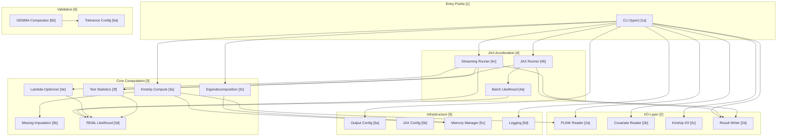

# JAMMA Code Map

Architectural overview with bidirectional links between diagram nodes and source code.

## System Overview

---

### [1] Entry Points

The CLI is the sole entry point, dispatching to `gk` (kinship) and `lmm` (association) subcommands.

| ID | Component | Description | File:Line |
|----|-----------|-------------|-----------|
| 1a | `main()` | Typer app callback — global flags (`-o`, `-outdir`, `-v`) | [cli.py:54](../src/jamma/cli.py#L54) |
| 1a | `gk_command()` | Kinship computation (`-gk 1`) | [cli.py:88](../src/jamma/cli.py#L88) |
| 1a | `lmm_command()` | LMM association (`-lmm 1/2/3/4`) | [cli.py:193](../src/jamma/cli.py#L193) |

---

### [2] I/O Layer

Reads PLINK binary genotypes, covariates, and kinship matrices. Writes GEMMA-compatible output.

| ID | Component | Description | File:Line |
|----|-----------|-------------|-----------|
| 2a | `PlinkData` | Genotype container (n_samples × n_snps float32) | [plink.py:39](../src/jamma/io/plink.py#L39) |
| 2a | `load_plink_binary()` | Full-load PLINK .bed/.bim/.fam | [plink.py:72](../src/jamma/io/plink.py#L72) |
| 2a | `stream_genotype_chunks()` | Windowed reads from .bed (O(n×chunk)) | [plink.py:158](../src/jamma/io/plink.py#L158) |
| 2a | `get_plink_metadata()` | Dimensions + metadata without loading genotypes | [plink.py:111](../src/jamma/io/plink.py#L111) |
| 2b | `read_covariate_file()` | Whitespace-delimited covariate matrix | [covariate.py:19](../src/jamma/io/covariate.py#L19) |
| 2c | `read_kinship_matrix()` | Load GEMMA `.cXX.txt` format | [kinship/io.py:8](../src/jamma/kinship/io.py#L8) |
| 2c | `write_kinship_matrix()` | Write `.cXX.txt` (10 sig digits) | [kinship/io.py:42](../src/jamma/kinship/io.py#L42) |
| 2d | `IncrementalAssocWriter` | Per-SNP disk writer (no memory accumulation) | [lmm/io.py:172](../src/jamma/lmm/io.py#L172) |
| 2d | `format_assoc_line()` | Wald output row (12 columns) | [lmm/io.py:12](../src/jamma/lmm/io.py#L12) |
| 2d | `write_assoc_results()` | Batch write from list | [lmm/io.py:150](../src/jamma/lmm/io.py#L150) |

---

### [3] Core Computation

GEMMA algorithm reimplementation: kinship → eigendecomp → REML → test statistics.

| ID | Component | Description | File:Line |
|----|-----------|-------------|-----------|
| 3a | `compute_centered_kinship()` | K = (1/p) × Xc × Xc' in batches of 10k SNPs | [compute.py:118](../src/jamma/kinship/compute.py#L118) |
| 3a | `compute_kinship_streaming()` | 2-pass streaming (stats → accumulate) | [compute.py:234](../src/jamma/kinship/compute.py#L234) |
| 3a | `_filter_snps()` | MAF, missing rate, monomorphism filters | [compute.py:74](../src/jamma/kinship/compute.py#L74) |
| 3b | `impute_and_center()` | NaN → mean, then center (JIT-compiled) | [missing.py:23](../src/jamma/kinship/missing.py#L23) |
| 3c | `eigendecompose_kinship()` | numpy.linalg.eigh with BLAS thread control | [eigen.py:93](../src/jamma/lmm/eigen.py#L93) |
| 3c | `_get_blas_backend()` | Detect OpenBLAS/MKL/BLIS for thread tuning | [eigen.py:43](../src/jamma/lmm/eigen.py#L43) |
| 3d | `reml_log_likelihood()` | REML ℓ(λ) for variance component estimation | [likelihood.py:384](../src/jamma/lmm/likelihood.py#L384) |
| 3d | `mle_log_likelihood()` | MLE ℓ(λ) for LRT | [likelihood.py:652](../src/jamma/lmm/likelihood.py#L652) |
| 3d | `compute_Uab()` | Element-wise products of rotated vectors | [likelihood.py:60](../src/jamma/lmm/likelihood.py#L60) |
| 3d | `calc_pab()` | Recursive Schur complement projection (GEMMA CalcPab) | [likelihood.py:159](../src/jamma/lmm/likelihood.py#L159) |
| 3d | `get_ab_index()` | GEMMA GetabIndex — 1-based upper triangular | [likelihood.py:39](../src/jamma/lmm/likelihood.py#L39) |
| 3d | `compute_null_model_lambda()` | Null model REML for Score test | [likelihood.py:550](../src/jamma/lmm/likelihood.py#L550) |
| 3d | `compute_null_model_mle()` | Null model MLE for LRT | [likelihood.py:711](../src/jamma/lmm/likelihood.py#L711) |
| 3e | `golden_section_optimize_lambda()` | REML optimization per SNP (Wald) | [likelihood_jax.py](../src/jamma/lmm/likelihood_jax.py) |
| 3e | `golden_section_optimize_lambda_mle()` | MLE optimization per SNP (LRT) | [likelihood_jax.py](../src/jamma/lmm/likelihood_jax.py) |
| 3f | `AssocResult` | Per-SNP result dataclass (all test fields) | [stats.py:40](../src/jamma/lmm/stats.py#L40) |
| 3f | `calc_wald_test()` | β, SE, p_wald from Pab matrix | [stats.py:98](../src/jamma/lmm/stats.py#L98) |
| 3f | `calc_score_test()` | p_score using null model lambda | [stats.py:232](../src/jamma/lmm/stats.py#L232) |
| 3f | `calc_lrt_test()` | p_lrt via chi-squared CDF | [stats.py:202](../src/jamma/lmm/stats.py#L202) |
| 3f | `f_sf()` | F-distribution survival via JAX betainc | [stats.py:67](../src/jamma/lmm/stats.py#L67) |

---

### [4] JAX Acceleration

Batch SNP processing with JIT compilation and vmap vectorization.

| ID | Component | Description | File:Line |
|----|-----------|-------------|-----------|
| 4a | `compute_uab_jax()` | JIT-compiled Uab for n_cvt=1 | [likelihood_jax.py:48](../src/jamma/lmm/likelihood_jax.py#L48) |
| 4a | `calc_pab_jax()` | JIT-compiled Pab projection | [likelihood_jax.py:79](../src/jamma/lmm/likelihood_jax.py#L79) |
| 4a | `batch_compute_uab()` | vmap across SNP dimension | [likelihood_jax.py:279](../src/jamma/lmm/likelihood_jax.py#L279) |
| 4a | `golden_section_optimize_lambda()` | Grid search + 20 golden section iterations | [likelihood_jax.py:342](../src/jamma/lmm/likelihood_jax.py#L342) |
| 4b | `run_lmm_association_jax()` | Full-load JAX batch runner | [runner_jax.py:246](../src/jamma/lmm/runner_jax.py#L246) |
| 4c | `run_lmm_association_streaming()` | Streaming from disk, O(n² + n×chunk) | [runner_jax.py:668](../src/jamma/lmm/runner_jax.py#L668) |

---

### [5] Infrastructure

Configuration, memory management, and logging.

| ID | Component | Description | File:Line |
|----|-----------|-------------|-----------|
| 5a | `OutputConfig` | Output directory + prefix + verbose flag | [config.py:12](../src/jamma/core/config.py#L12) |
| 5b | `configure_jax()` | Enable x64, set platform, XLA cache | [jax_config.py:41](../src/jamma/core/jax_config.py#L41) |
| 5b | `_pin_blas_threads()` | Prevent BLAS oversubscription (called on import) | [jax_config.py:22](../src/jamma/core/jax_config.py#L22) |
| 5b | `get_jax_info()` | JAX version, backend, devices | [jax_config.py:87](../src/jamma/core/jax_config.py#L87) |
| 5c | `MemoryBreakdown` | Estimated memory per workflow stage | [memory.py:41](../src/jamma/core/memory.py#L41) |
| 5c | `estimate_lmm_memory()` | Pre-flight memory estimate | [memory.py:261](../src/jamma/core/memory.py#L261) |
| 5c | `check_memory_before_run()` | Raise MemoryError if insufficient | [memory.py:522](../src/jamma/core/memory.py#L522) |
| 5c | `get_memory_snapshot()` | Current RSS, VMS, available | [memory.py:389](../src/jamma/core/memory.py#L389) |
| 5c | `cleanup_memory()` | GC + clear JAX caches | [memory.py:447](../src/jamma/core/memory.py#L447) |
| 5d | `setup_logging()` | Loguru console + optional file | [logging.py:16](../src/jamma/utils/logging.py#L16) |
| 5d | `write_gemma_log()` | GEMMA-compatible `.log.txt` | [logging.py:51](../src/jamma/utils/logging.py#L51) |
| 5d | `log_rss_memory()` | RSS snapshot at phase boundaries | [logging.py:120](../src/jamma/utils/logging.py#L120) |

---

### [6] Validation

Tolerance-based comparison infrastructure for GEMMA parity testing.

| ID | Component | Description | File:Line |
|----|-----------|-------------|-----------|
| 6a | `ToleranceConfig` | Per-field tolerance dataclass (strict/default/relaxed) | [tolerances.py:34](../src/jamma/validation/tolerances.py#L34) |
| 6b | `ComparisonResult` | Pass/fail with max diffs and worst location | [compare.py:20](../src/jamma/validation/compare.py#L20) |
| 6b | `AssocComparisonResult` | Per-column comparison results | [compare.py:425](../src/jamma/validation/compare.py#L425) |
| 6b | `compare_assoc_results()` | Full association comparison across test types | [compare.py:460](../src/jamma/validation/compare.py#L460) |
| 6b | `compare_kinship_matrices()` | Symmetric matrix comparison | [compare.py:143](../src/jamma/validation/compare.py#L143) |
| 6b | `load_gemma_assoc()` | Parse GEMMA `.assoc.txt` | [compare.py:205](../src/jamma/validation/compare.py#L205) |
| 6b | `load_gemma_kinship()` | Parse GEMMA `.cXX.txt` | [compare.py:181](../src/jamma/validation/compare.py#L181) |

---

## Data Flow: Genotypes → Results

---

## LMM Test Modes

---

## Memory Architecture

---

## Quick Navigation

| Area | Entry Point |
|------|-------------|
| CLI dispatch | [cli.py:54](../src/jamma/cli.py#L54) |
| Load genotypes | [plink.py:72](../src/jamma/io/plink.py#L72) |
| Kinship compute | [compute.py:118](../src/jamma/kinship/compute.py#L118) |
| Eigendecomposition | [eigen.py:93](../src/jamma/lmm/eigen.py#L93) |
| REML likelihood | [likelihood.py:384](../src/jamma/lmm/likelihood.py#L384) |
| Lambda optimization | [likelihood_jax.py](../src/jamma/lmm/likelihood_jax.py) |
| Wald/Score/LRT tests | [stats.py:98](../src/jamma/lmm/stats.py#L98) |
| JAX batch runner | [runner_jax.py:246](../src/jamma/lmm/runner_jax.py#L246) |
| Streaming runner | [runner_jax.py:668](../src/jamma/lmm/runner_jax.py#L668) |
| Result writer | [lmm/io.py:172](../src/jamma/lmm/io.py#L172) |
| Memory estimation | [memory.py:261](../src/jamma/core/memory.py#L261) |
| Validation comparison | [compare.py:460](../src/jamma/validation/compare.py#L460) |
| Formal proof | [FORMAL_PROOF.md](FORMAL_PROOF.md) |
| Equivalence data | [MATHEMATICAL_EQUIVALENCE.md](MATHEMATICAL_EQUIVALENCE.md) |
