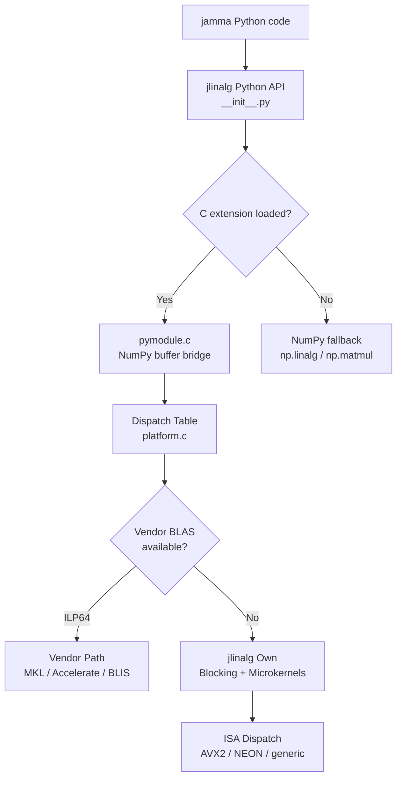
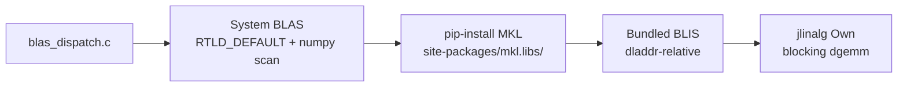
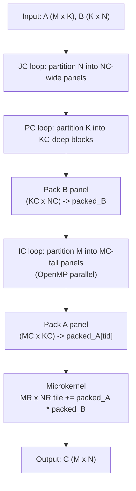

# jlinalg Architecture

jlinalg is JAMMA's controlled C compute layer, providing BLAS and LAPACK
operations with vendor dispatch when ILP64 system BLAS is available and
falling back to its own C implementations with ISA-specific microkernels.

## Layer Diagram



The Python API in `__init__.py` tries to import the `_jlinalg` C extension.
If the import fails (not compiled, ABI mismatch), every function falls back to
an equivalent NumPy implementation. When the C extension loads, `jlinalg_init()`
in `platform.c` detects the CPU ISA (AVX2 via CPUID on x86_64, NEON via hwcap
on aarch64) and populates the dispatch table with the best available microkernel
pointers.

## Dispatch Chain



`blas_dispatch.c` uses a discover-all-then-select-best model. All three
discovery paths run unconditionally:

1. **System BLAS** -- `dlsym(RTLD_DEFAULT, ...)` finds BLAS symbols already
   loaded in the process, then scans numpy's shared libraries for MKL/BLIS
   symbols and `/proc/self/maps` on Linux.

2. **pip-installed MKL** -- Searches `site-packages/mkl.libs/` for
   `libmkl_rt` and loads it with `dlopen`.

3. **Bundled BLIS** -- Uses `dladdr` to find jlinalg's own `.so` path and
   looks for a BLIS shared library relative to it.

The best candidate is selected by priority: ILP64 with LAPACK (dsyevd) >
ILP64 BLAS-only > jlinalg own > LP64 (detected but not wired). LP64 backends
are excluded from the dispatch table because different FP accumulation order
produces results that diverge from GEMMA's tolerances.

## Data Flow Through dgemm



The three blocking levels target different cache tiers:

- **KC** (256 on AVX2/NEON, 128 on generic): Packed A panel fits in L1 cache.
  One column of packed_A (MR x KC doubles) stays resident while the
  microkernel iterates over NR-wide strips of packed_B.

- **MC** (72 on AVX2, 64 on NEON, 32 on generic): Packed A buffer (MC x KC)
  targets L2 cache. The IC loop iterates over MC-tall row panels within one
  PC block.

- **NC** (4096 on AVX2/NEON, 1024 on generic): Packed B buffer (KC x NC)
  targets L3 cache. One packed_B buffer is shared across all threads; each
  thread packs its own A panel.

Packing reorders matrix data from strided row-major layout into contiguous
k-major panel format for sequential cache-line access in the microkernel.

## File Structure

### Python Layer

| File | Purpose |
|------|---------|
| `__init__.py` | Public API with NumPy fallbacks when C extension unavailable |
| `_compile_jlinalg.py` | Dev-mode compiler script (per-file compilation with ISA-specific flags) |

### C Extension

| File | Purpose |
|------|---------|
| `include/jlinalg.h` | Public C API, ABI version, dispatch table, function pointer typedefs |
| `src/pymodule.c` | Python/NumPy bridge (buffer extraction, GIL release, error translation) |
| `src/platform.c` | ISA detection (CPUID/hwcap), dispatch table init, blocking parameter setup |
| `src/blas_dispatch.c` | Vendor BLAS/LAPACK discovery via dlopen/dlsym, dispatch wrappers |

### Level 1/2 BLAS

| File | Purpose |
|------|---------|
| `src/ddot.c` | Inner product (generic + AVX2 SIMD paths) |
| `src/dnrm2.c` | Euclidean norm (Blue algorithm for overflow/underflow safety) |
| `src/daxpy.c` | Vector add y += alpha * x (generic + AVX2 SIMD paths) |
| `src/dscal.c` | Vector scale x *= alpha (generic + AVX2 SIMD paths) |
| `src/dgemv.c` | Matrix-vector multiply (generic + AVX2 SIMD paths) |

### Level 3 BLAS

| File | Purpose |
|------|---------|
| `src/dgemm.c` | Goto/BLIS three-level cache-blocked GEMM (JC/PC/IC loops, packing, workspace) |
| `src/dgemm_generic.c` | Scalar 4x4 microkernel fallback (always compiled) |
| `src/dsyrk.c` | Symmetric rank-k update with lower-triangle tile skipping |
| `src/dsyr2k.c` | Symmetric rank-2k update for DSYTRD trailing update |
| `kernels/dgemm_avx2.c` | AVX2 6x8 FMA microkernel (compiled with `-mavx2 -mfma`) |
| `kernels/dgemm_neon.c` | NEON 8x4 microkernel (AArch64, no special flags needed) |

### LAPACK Eigendecomposition

| File | Purpose |
|------|---------|
| `src/eigh.c` | Eigendecomposition driver (orchestrates DSYTRD + DSTEDC + DORMTR pipeline) |
| `src/dsytrd.c` | Tridiagonal reduction via Householder reflectors (blocked, NB=64) |
| `src/dstedc.c` | Divide-and-conquer tridiagonal eigensolver (secular equation, dlaed4/5/6, deflation) |
| `src/dormtr.c` | Eigenvector back-transformation (apply Householder reflectors via blocked dgemm) |

QR factorization (dgeqrf + dorgqr) and SVD (dgesvd) are dispatched to vendor
LAPACK when available via `blas_dispatch.c`. jlinalg does not include its own
QR or SVD implementations -- it uses vendor routines or falls back to NumPy.

### Test Infrastructure

| File | Purpose |
|------|---------|
| `tests/test_boundaries.c` | C-level boundary tests (compiled against Unity test framework) |
| `tests/unity/unity.c` | Unity test framework (embedded) |

## Blocking Parameters

| ISA | MR | NR | KC | MC | NC | Rationale |
|-----|----|----|----|----|-----|-----------|
| AVX2 | 6 | 8 | 256 | 72 | 4096 | 6x8 fills 12 of 16 YMM accumulators; KC x MR = 1536 doubles (12 KB) fits L1; MC x KC = 18432 doubles (144 KB) fits L2; KC x NC = 1M doubles (8 MB) targets L3 |
| NEON | 8 | 4 | 256 | 64 | 4096 | 8x4 fills 16 of 32 Q-register accumulators; ratio favors tall panels (ARM memory subsystem preference) |
| generic | 4 | 4 | 128 | 32 | 1024 | Conservative parameters for unknown cache hierarchy |

These are set in `platform.c` during `jlinalg_init()` and exposed to Python
as `JLINALG_MR`, `JLINALG_NR`, etc.

## Thread Model

jlinalg uses OpenMP for intra-operation parallelism:

- The **IC loop** in dgemm is parallelized with `#pragma omp parallel for`.
  Each thread gets its own packed_A buffer (per-thread offset into the
  pre-allocated workspace). The packed_B buffer is shared (written once per
  PC iteration before the parallel region).

- A **pthread mutex** (`jlinalg_dgemm_mutex`) serializes concurrent dgemm/dsyrk/dsyr2k
  callers since they share the global packed_B workspace. The GIL is released
  during computation (`Py_BEGIN_ALLOW_THREADS` in pymodule.c).

- **Workspace-explicit variants** (`jlinalg_dgemm_ws`, `jlinalg_dsyrk_ws`,
  etc.) accept a caller-owned `jlinalg_workspace_t` and do not lock the mutex.
  These are used inside the eigensolver (DSTEDC recursion, DORMTR) where
  concurrent GEMM calls are needed.

- Thread count is clamped to the init-time maximum to prevent packed_A buffer
  overruns if `omp_set_num_threads()` increases the count after workspace
  allocation.

## Benchmarking Guide

### Running Benchmarks

**End-to-end throughput comparison:**

```bash
uv run python scripts/bench_jlinalg.py
uv run python scripts/bench_jlinalg.py --runs 10 --sizes 1000,4000,10000
uv run python scripts/bench_jlinalg.py --skip-eigh
```

This benchmarks jlinalg operations against NumPy (system BLAS) and reports
GFLOPS and throughput ratios.

**pytest-benchmark microbenchmarks:**

```bash
uv run pytest tests/test_jlinalg_dgemm.py -n0 --benchmark-only -m benchmark
```

Always use `-n0` (no parallelism) for benchmarks to avoid cross-test
interference.

### Interpreting Results

- **GFLOPS**: Floating-point operations per second. For dgemm, FLOPS = 2MNK.
  For dsyrk, FLOPS = N^2 K (exploiting symmetry).

- **Throughput ratio** (`jlinalg / numpy`): Values >= 1.0 mean jlinalg is at
  least as fast as numpy's BLAS. The ratio depends heavily on the system BLAS:
  - Against single-threaded BLAS: jlinalg should be competitive (>= 0.9x).
  - Against multi-threaded vendor BLAS (MKL, Accelerate): jlinalg may be slower
    since its IC-loop parallelism is less sophisticated.

- **Performance targets**: dsyrk achieves >1.2x because symmetric tile-skipping
  halves the work vs a full dgemm. dgemm targets >= 0.9x parity with system BLAS.

### Tuning Blocking Parameters

The blocking parameters (MR, NR, KC, MC, NC) are in `platform.c` within the
ISA detection blocks. To tune for a specific CPU:

1. Change the constants in `platform.c`
2. Rebuild: `uv run python -c "from jamma.jlinalg._compile_jlinalg import compile_extension; compile_extension()"`
3. Benchmark: `uv run python scripts/bench_jlinalg.py --sizes 1000,4000`
4. Compare GFLOPS against the baseline

**What to tune:**
- **KC**: Increase if L1 is large. MR x KC doubles should fit in L1.
- **MC**: Increase if L2 is large. MC x KC doubles should fit in L2.
- **NC**: Increase if L3 is large. KC x NC doubles should target L3.
- **MR/NR**: Tied to the microkernel register allocation. Changing these
  requires writing a new microkernel.

## Contributing Guide

### Adding a New Operation

1. **Add function pointer typedef** in `include/jlinalg.h`
2. **Add to dispatch table** (`jlinalg_dispatch_t` struct) if ISA-dispatched
3. **Implement** in `src/new_op.c` (generic C) and optionally ISA-specific
   versions in `kernels/`
4. **Wire ISA dispatch** in `platform.c` (assign to dispatch table in
   the AVX2/NEON/generic init blocks)
5. **Add Python bridge** in `src/pymodule.c` (buffer extraction, GIL release,
   error code to exception translation)
6. **Add fallback** in `__init__.py` (NumPy implementation in the
   `except ImportError` block)
7. **Register source files** in BOTH `_compile_jlinalg.py` AND `hatch_build.py`
   -- missing from either causes undefined symbol errors
8. **Write tests** in `tests/test_jlinalg_new_op.py`

### Writing a New Microkernel

A microkernel computes the innermost MR x NR tile accumulation:

```
C[MR x NR] += packed_A[MR x kc] * packed_B[kc x NR]
```

To add a new ISA microkernel (e.g., AVX-512):

1. Create `kernels/dgemm_{isa}.c`

2. Follow the existing AVX2 6x8 pattern in `kernels/dgemm_avx2.c`:
   - Allocate accumulator registers: `MR * (NR / doubles_per_register)` accumulators
   - Load B strip into registers (one load per register-width group)
   - For each row: broadcast A element, FMA into accumulators
   - After k-loop: load existing C, add accumulators, store

3. Function signature must match `jlinalg_dgemm_micro_fn`:

   ```c
   void jlinalg_dgemm_micro_{isa}(npy_intp kc,
       const double * restrict packed_A,
       const double * restrict packed_B,
       double * restrict C, npy_intp ldc);
   ```

4. **AVX2: `vzeroupper` before every return path** -- mandatory to avoid
   AVX-SSE transition penalties. The existing AVX2 microkernel has a single
   linear exit path with one `_mm256_zeroupper()` site.

5. Boundary panels (M < MR or N < NR) are handled by the caller in dgemm.c
   via zero-padded packing and a scratch buffer copy-back. The microkernel
   always operates on full MR x NR tiles.

6. Register the microkernel in `platform.c`:
   ```c
   // In the ISA detection block:
   jlinalg_dgemm_microkernel = jlinalg_dgemm_micro_{isa};
   JLINALG_MR = {new_mr};
   JLINALG_NR = {new_nr};
   ```

7. Set blocking parameters (KC, MC, NC) appropriate for the target cache
   hierarchy before calling `jlinalg_dgemm_init()`.

8. Run the full test suite:
   ```bash
   uv run pytest tests/test_jlinalg_unity.py tests/test_jlinalg_dgemm.py -x
   ```

### Running the Test Suite

```bash
# Quick: jlinalg tests only
uv run pytest tests/test_jlinalg_*.py -x

# With benchmarks (must use -n0 to avoid parallel interference)
uv run pytest tests/test_jlinalg_*.py -x -n0 --benchmark-only -m benchmark

# C-level boundary tests
uv run pytest tests/test_jlinalg_unity.py -x

# Full project test suite
uv run pytest tests/ -x
```

### Compilation Flags

- **Baseline sources** (`src/*.c`): `-O2 -fno-fast-math` (strict IEEE 754)
- **LAPACK sources** (dsytrd, dstedc, dormtr, eigh): Must use `-fno-fast-math`
  because the secular equation solver relies on IEEE 754 infinity arithmetic
- **AVX2 sources** (`kernels/dgemm_avx2.c`): `-mavx2 -mfma -O2 -fno-fast-math`
- **NEON sources** (`kernels/dgemm_neon.c`): No special flags (NEON is
  mandatory on AArch64)

All C extensions must be registered in BOTH `hatch_build.py` (wheel builds)
AND `_compile_jlinalg.py` (dev-mode compile). Missing from either causes
undefined symbol errors at different stages.

### ABI Versioning

`JLINALG_ABI_VERSION` in `jlinalg.h` must be bumped whenever:
- A field is added to `jlinalg_dispatch_t`
- A function signature changes
- A new extern is added that pymodule.c exports

`pymodule.c` exposes `ABI_VERSION` as a Python integer. Callers can guard
against ABI mismatches by checking this value.
