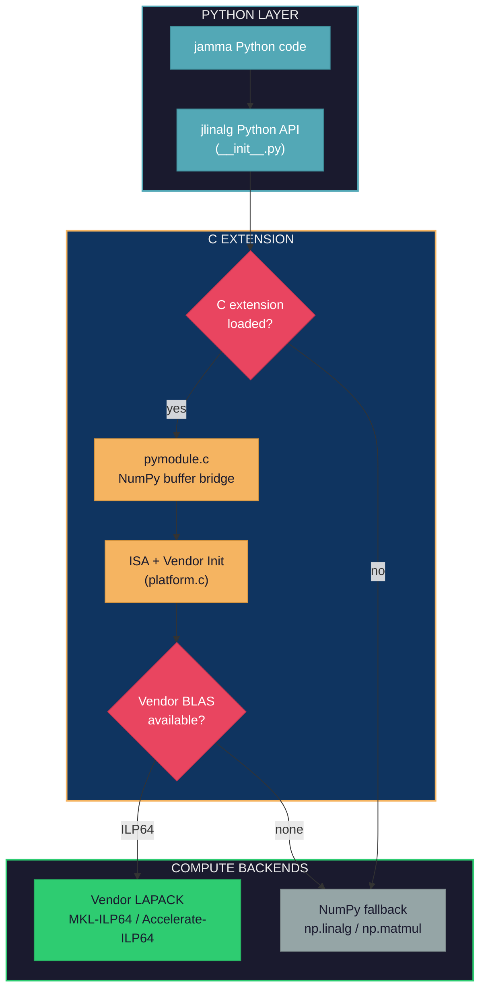
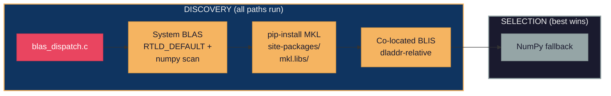

# jlinalg Architecture

jlinalg is JAMMA's controlled C compute layer, providing BLAS and LAPACK
operations with vendor dispatch when ILP64 system BLAS is available and
falling back to NumPy when no suitable vendor library is found. This
eliminates numpy BLAS compatibility issues (LP64 integer overflow at >46k
samples, scipy ILP64 incompatibility) by dispatching directly to vendor
LAPACK routines (DSYEVD/DSYEVR) for eigendecomposition and symmetric
BLAS specialization (DSYRK, DGEMM).

## Layer Diagram



The Python API in `__init__.py` tries to import the `_jlinalg` C extension.
If the import fails (not compiled, ABI mismatch), every function falls back to
an equivalent NumPy implementation. When the C extension loads, `jlinalg_init()`
in `platform.c` detects the CPU ISA and populates the dispatch table.

## Dispatch Chain



`blas_dispatch.c` uses a discover-all-then-select-best model. All discovery
paths run unconditionally:

1. **System BLAS** -- `dlsym(RTLD_DEFAULT, ...)` finds BLAS symbols already
   loaded in the process, then scans numpy's shared libraries for MKL/BLIS
   symbols and `/proc/self/maps` on Linux.

2. **pip-installed MKL** -- Searches `site-packages/mkl.libs/` for
   `libmkl_rt` and loads it with `dlopen`.

3. **Co-located BLIS** -- Uses `dladdr` to find jlinalg's `.so` path and
   looks for a BLIS shared library relative to it.

The best candidate is selected by priority: ILP64 with LAPACK (dsyevd) >
ILP64 BLAS-only > NumPy fallback > LP64 (detected but not wired). LP64
backends are excluded from the dispatch table because different FP
accumulation order produces results that diverge from GEMMA's tolerances.

## File Structure

### Python Layer

| File | Purpose |
|------|---------|
| `__init__.py` | Public API with NumPy fallbacks when C extension unavailable |
| `_compile_jlinalg.py` | Dev-mode compiler script (per-file compilation with ISA-specific flags) |

### C Extension

| File | Purpose |
|------|---------|
| `include/jlinalg.h` | Public C API, ABI version, function pointer typedefs |
| `src/pymodule.c` | Python/NumPy bridge (buffer extraction, GIL release, error translation) |
| `src/platform.c` | ISA detection (CPUID/hwcap), vendor BLAS dispatch init |
| `src/blas_dispatch.c` | Vendor BLAS/LAPACK discovery via dlopen/dlsym, dispatch wrappers |

### Test Infrastructure

| File | Purpose |
|------|---------|
| `tests/test_boundaries.c` | C-level boundary tests (compiled against Unity test framework) |
| `tests/unity/unity.c` | Unity test framework (embedded) |

## Thread Model

jlinalg delegates threading to the vendor BLAS library. Thread count is
controlled via `threadpoolctl` or environment variables (`MKL_NUM_THREADS`,
`OMP_NUM_THREADS`). The GIL is released during computation
(`Py_BEGIN_ALLOW_THREADS` in pymodule.c).

## Benchmarking Guide

### Running Benchmarks

**End-to-end throughput comparison:**

```bash
uv run python scripts/bench_jlinalg.py
uv run python scripts/bench_jlinalg.py --runs 10 --sizes 1000,4000,10000
uv run python scripts/bench_jlinalg.py --skip-eigh
```

This benchmarks jlinalg operations against NumPy (system BLAS) and reports
GFLOPS and throughput ratios.

**pytest-benchmark microbenchmarks:**

```bash
uv run pytest tests/test_jlinalg_dgemm.py -n0 --benchmark-only -m benchmark
```

Always use `-n0` (no parallelism) for benchmarks to avoid cross-test
interference.

### Running the Test Suite

```bash
# Quick: jlinalg tests only
uv run pytest tests/test_jlinalg_*.py -x

# With benchmarks (must use -n0 to avoid parallel interference)
uv run pytest tests/test_jlinalg_*.py -x -n0 --benchmark-only -m benchmark

# C-level boundary tests
uv run pytest tests/test_jlinalg_unity.py -x

# Full project test suite
uv run pytest tests/ -x
```

## Contributing Guide

### Adding a New Operation

1. **Add function pointer typedef** in `include/jlinalg.h`
2. **Add vendor-dispatch wrapper** in `src/blas_dispatch.c`
3. **Add Python bridge** in `src/pymodule.c` (buffer extraction, GIL release,
   error code to exception translation)
4. **Add fallback** in `__init__.py` (NumPy implementation in the
   `except ImportError` block)
5. **Register source files** in BOTH `_compile_jlinalg.py` AND `hatch_build.py`
   -- missing from either causes undefined symbol errors
6. **Write tests** in `tests/test_jlinalg_new_op.py`

### Compilation Flags

- **Baseline sources** (`src/*.c`): `-O2 -fno-fast-math` (strict IEEE 754)
- All C extensions must be registered in BOTH `hatch_build.py` (wheel builds)
  AND `_compile_jlinalg.py` (dev-mode compile). Missing from either causes
  undefined symbol errors at different stages.

### ABI Versioning

`JLINALG_ABI_VERSION` in `jlinalg.h` must be bumped whenever:

- A function pointer or global state variable is added to blas_dispatch.c
- A function signature changes
- A new extern is added that pymodule.c exports

`pymodule.c` exposes `ABI_VERSION` as a Python integer. Callers can guard
against ABI mismatches by checking this value.
