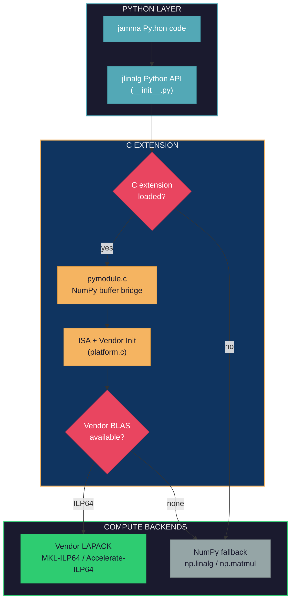
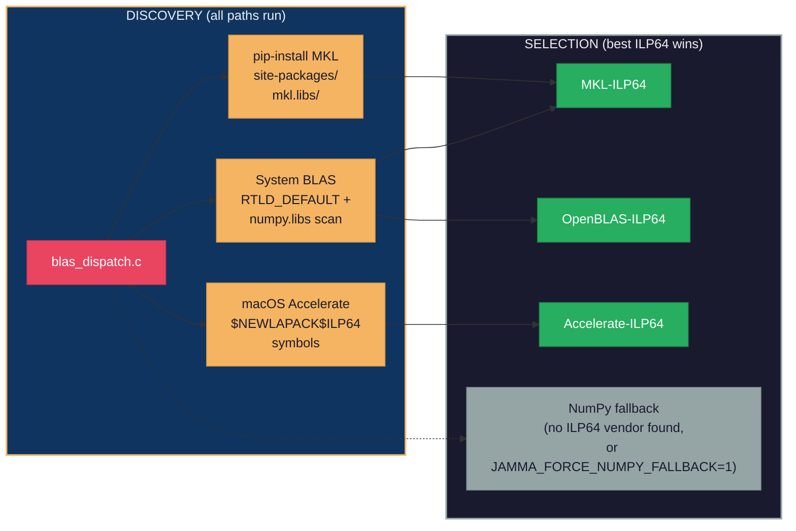

# jlinalg Architecture

jlinalg is JAMMA's controlled C compute layer, providing BLAS and LAPACK
operations with vendor dispatch when ILP64 system BLAS is available and
falling back to NumPy when no suitable vendor library is found. This
eliminates numpy BLAS compatibility issues (LP64 integer overflow at >46k
samples, scipy ILP64 incompatibility) by dispatching directly to vendor
LAPACK routines (DSYEVD/DSYEVR) for eigendecomposition and symmetric
BLAS specialization (DSYRK, DGEMM).

## Layer Diagram



The Python API in `__init__.py` tries to import the `_jlinalg` C extension.
If the import fails (not compiled, ABI mismatch), every function falls back to
an equivalent NumPy implementation. When the C extension loads, `jlinalg_init()`
in `platform.c` detects the CPU ISA and populates the dispatch table.

## Dispatch Chain



LP64 backends (plain MKL, OpenBLAS, Accelerate) are detected during discovery
but are **not wired** into the dispatch table -- the NumPy fallback is used
instead, for FP-accumulation consistency with GEMMA validation tolerances.

`blas_dispatch.c` uses a discover-all-then-select-best model. The discovery
paths run unconditionally:

1. **System BLAS** -- `dlsym(RTLD_DEFAULT, ...)` finds BLAS symbols already
   loaded in the process, then scans directories for ILP64 MKL or OpenBLAS
   symbols (`numpy.libs/`, `numpy/.dylibs/`) and `/proc/self/maps` on Linux.
   `jamma.jlinalg._blas_dirs.probe_plan()` names the candidate directories;
   `blas_dispatch.c` still does every `opendir`/`dlopen`/`dlsym` call.

2. **pip-installed MKL** -- Scans the `mkl.libs/` directories `probe_plan()`
   names for `libmkl_core`, `libmkl_sequential`, and `libmkl_intel_ilp64`,
   loaded with `dlopen` in that dependency order.

3. **macOS Accelerate-ILP64** -- On macOS 13.3+, looks up the
   `$NEWLAPACK$ILP64`-suffixed symbols (`dsyevd_$NEWLAPACK$ILP64` etc.) that
   ship in the system Accelerate framework.

The best candidate is selected by priority: **vendor ILP64 LAPACK (dsyevd) >
NumPy fallback > LP64 (detected but not wired)**. LP64 backends are excluded
from the dispatch table because different FP accumulation order produces
results that diverge from GEMMA's validation tolerances.

## File Structure

### Python Layer

| File | Purpose |
|------|---------|
| `__init__.py` | Public API with NumPy fallbacks when C extension unavailable |
| `_compile_jlinalg.py` | Dev-mode compiler script; calls the `run_build(JLINALG_SPEC)` facade in `_build_support/compile_and_link.py` |
| `_blas_dirs.py` | Candidate BLAS library directories for `blas_dispatch.c`'s discovery scans. Pure `importlib`/`pathlib`; no dlopen |

### C Extension

| File | Purpose |
|------|---------|
| `include/jlinalg.h` | Public C API, ABI version, function pointer typedefs |
| `src/pymodule.c` | Python/NumPy bridge (buffer extraction, GIL release, error translation) |
| `src/platform.c` | ISA detection (CPUID/hwcap), vendor BLAS dispatch init |
| `include/blas_dispatch_internal.h` | Private selected-backend state shared by discovery and operation wrappers |
| `src/blas_dispatch.c` | Vendor BLAS/LAPACK discovery via dlopen/dlsym and selected-backend ownership. Candidate directories come from `_blas_dirs.probe_plan()` (Python); C keeps every dlopen/dlsym call |
| `src/blas_operations.c` | DGEMM, DSYRK, DSYEVD, and DSYEVR wrappers over the selected backend |
| `src/eigh.c` | Eigendecomposition dispatcher: vendor DSYEVD then DSYEVR, then `JLINALG_EXT_UNAVAILABLE` for NumPy fallback. Only LAPACK-related C source. `jlinalg_eigh_c` requires tightly packed row-major storage (`ldk == ldz == N`); a padded stride returns `JLINALG_EXT_BAD_STRIDE` rather than being serviced by a second code path, since no caller in the tree ever passes one. A `prefer_dsyevr` flag lets the caller skip the DSYEVD attempt outright -- the memory plan that already reserved DSYEVR's smaller footprint passes it through `jlinalg.eigh(K, driver="dsyevr")` so the driver that runs matches the one that was budgeted, rather than being decided a second time by an allocation failure. `status->driver_used` reports which routine actually ran. |
| `src/snp_stats.c` | SNP statistics kernel (chunked mean/variance/MAF) |

There are no hand-rolled LAPACK implementations in the tree. As of commit
`663a22b` (`refactor: strip JAX and own-BLAS`), the architectural commitment
is **vendor ILP64 LAPACK > NumPy fallback** with nothing in between -- if
vendor LAPACK is unavailable on a target platform, jlinalg falls through to
NumPy, never to a translated C routine. The `LAPACK_SOURCES` tuple in
`_build_support/build_models.py` holds only the `eigh.c` dispatcher (it
gets strict IEEE 754 flags) -- no translated LAPACK routines are listed.

## Thread Model

jlinalg delegates threading to the vendor BLAS library. Thread count is
controlled via `threadpoolctl` or environment variables (`MKL_NUM_THREADS`,
`OMP_NUM_THREADS`). The GIL is released during computation
(`Py_BEGIN_ALLOW_THREADS` in pymodule.c).

## Benchmarking Guide

### Running Benchmarks

**End-to-end throughput comparison:**

```bash
uv run python scripts/bench_jlinalg.py
uv run python scripts/bench_jlinalg.py --runs 10 --sizes 1000,4000,10000
uv run python scripts/bench_jlinalg.py --skip-eigh
```

This benchmarks jlinalg operations against NumPy (system BLAS) and reports
GFLOPS and throughput ratios.

**pytest-benchmark microbenchmarks:**

```bash
uv run pytest tests/test_jlinalg_dgemm.py -n0 --benchmark-only -m benchmark
```

Always use `-n0` (no parallelism) for benchmarks to avoid cross-test
interference.

### Running the Test Suite

```bash
# Quick: jlinalg tests only
uv run pytest tests/test_jlinalg_*.py -x

# With benchmarks (must use -n0 to avoid parallel interference)
uv run pytest tests/test_jlinalg_*.py -x -n0 --benchmark-only -m benchmark

# Full project test suite
uv run pytest tests/ -x
```

## Contributing Guide

### Adding a New Operation

1. **Add function pointer typedef** in `include/jlinalg.h`
2. **Add vendor-dispatch wrapper** in `src/blas_operations.c`; discovery and
   selected-backend ownership stay in `src/blas_dispatch.c`
3. **Add Python bridge** in `src/pymodule.c`. Keep it to memory-safety
   checks only (dtype, contiguity, alignment, writeability) and error-code
   translation; put the semantic contract (argument values, shape math) in
   the Python validator in step 4, so a bad call raises identical text
   whether or not the C extension is loaded (`dgemm`/`dsyrk` are the model).
4. **Add a public Python function** in `__init__.py`: a `_validate_<op>`
   that raises on a bad call, a `_<op>_numpy_impl` (unchecked NumPy compute),
   and the public `<op>()` that validates once and dispatches to whichever
   backend the module bound (`_<op>_backend`).
5. **Register source files** in `src/jamma/_build_support/build_models.py`
   -- add to `BASELINE_SOURCES` for routines that should compile with the
   default flags, or `LAPACK_SOURCES` for LAPACK routines that need strict
   IEEE 754. The three compile entry points (`hatch_build.py`,
   `_compile_jlinalg.py`, `_compile_accel.py`) all import from
   `_build_support` and stay in sync automatically.
6. **Write tests** in a new `tests/test_jlinalg_<op>.py`, alongside the existing
   `test_jlinalg_dgemm.py` and `test_jlinalg_dsyrk.py`

### Compilation Flags

Compile flags are owned by `src/jamma/_build_support/build_models.py`
(`BASE_CFLAGS`, `LAPACK_CFLAGS`, `BASELINE_SOURCES`, `LAPACK_SOURCES`,
`LINK_FLAGS_BY_PLATFORM`). The strict-IEEE-754 split is the central
invariant:

- **`BASELINE_SOURCES`** (everything except `eigh.c`): `BASE_CFLAGS` --
  `-O3 -ftree-vectorize -fno-math-errno -fno-trapping-math -funroll-loops
  -fno-finite-math-only`. Optimised for throughput.
- **`LAPACK_SOURCES`** (`eigh.c`): `LAPACK_CFLAGS` -- `-O2 -fno-fast-math`.
  LAPACK dispatch and any future LAPACK-related C must keep strict IEEE 754
  semantics so vendor-LAPACK error bounds stay valid.

The pre-commit hook `scripts/check_compile_flag_literals.py` bans bare
`-O3`/`-fno-fast-math`/`-fopenmp` literals anywhere outside
`_build_support/`. The dev-mode `-march=native` flag lives in
`LMM_ACCEL_SPEC.dev_extra_cflags` in `build_models.py`, applied only on
the dev rebuild path so it can never reach the portable wheel build. A second hook
(`scripts/verify_compile_invocations_match.py`) enforces that the three
compile entry points all import from `_build_support` rather than
duplicating flag/source lists.

### Debugging

- Set `JAMMA_FORCE_NUMPY_FALLBACK=1` to force the NumPy fallback path even
  when vendor BLAS/LAPACK is available. Used by the weekly sanitizer
  workflow to exercise the pure-Python paths and during numerical-divergence
  debugging when vendor-LAPACK output needs to be cross-checked against the
  NumPy reference.
- Set `JLINALG_NO_VENDOR_DGEMM=1` to leave vendor dgemm unwired while the
  extension stays loaded, so `blas_has_dgemm` reports 0. Reproduces an
  LP64-only host: `dgemm()` binds `_dgemm_backend` to the NumPy
  implementation rather than `py_dgemm`, so the C entry point is never
  called and never has the chance to raise.
- Set `JAMMA_SANITIZE=address,undefined` (or any subset) at build time to
  rebuild C extensions with `-fsanitize=...`. Used by
  `.github/workflows/sanitizers.yml`. See `docs/TESTING.md` §1.10.

### ABI Versioning

`JLINALG_ABI_VERSION` in `jlinalg.h` must be bumped whenever:

- A function pointer or selected-backend state field is added to the BLAS
  dispatch internals
- A function signature changes
- A new extern is added that pymodule.c exports

`pymodule.c` exposes `ABI_VERSION` as a Python integer. Callers can guard
against ABI mismatches by checking this value.
