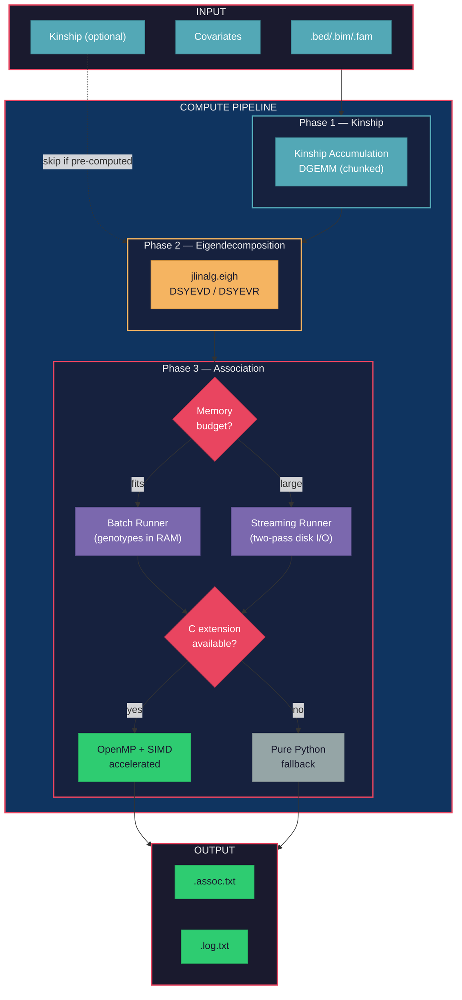
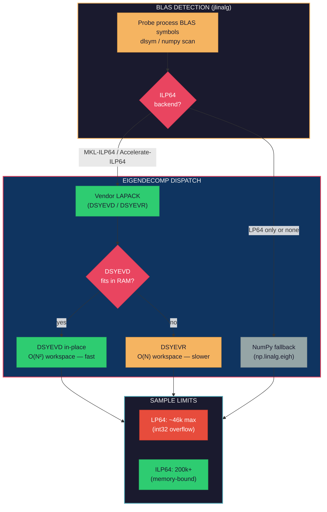
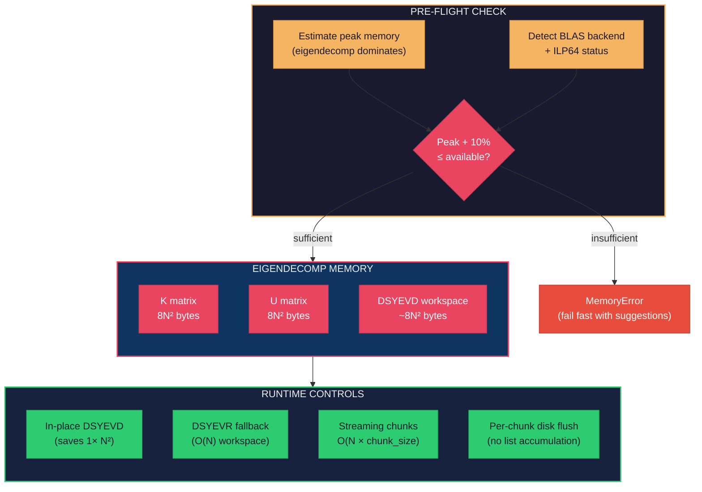

# JAMMA User Guide

## Installation

### macOS (Intel or ARM)

```bash
pip install jamma
```

That's it. macOS Accelerate BLAS handles large matrices natively.

### Linux / Windows

For small datasets (<46k samples), the standard install works:

```bash
pip install jamma
```

For large-scale GWAS (>46k samples), install [numpy-mkl](https://github.com/michael-denyer/numpy-mkl) first — standard numpy uses 32-bit BLAS integers which overflow at ~46k samples. Pre-built ILP64 wheels are available for Python 3.11–3.14:

```bash
pip install psutil loguru threadpoolctl click progressbar2 bed-reader
pip install numpy \
  --index-url https://michael-denyer.github.io/numpy-mkl \
  --force-reinstall --upgrade
pip install jamma --no-deps
```

**From Git (latest development version):**

```bash
pip install psutil loguru threadpoolctl click progressbar2 bed-reader
pip install numpy \
  --index-url https://michael-denyer.github.io/numpy-mkl \
  --force-reinstall --upgrade
pip install git+https://github.com/michael-denyer/jamma.git --no-deps
```

> **Why `--no-deps`?** JAMMA depends on `numpy>=2.4.6`, so a normal install will
> pull in standard numpy and overwrite the ILP64 build. `--no-deps` prevents this;
> you install the runtime dependencies manually instead.

### From Source (development)

```bash
git clone https://github.com/michael-denyer/jamma.git
cd jamma
uv sync
```

### Platform Support

| Platform | `pip install jamma` | Notes |
|----------|---------------------|-------|
| Linux x86_64 | Full support | ILP64 for >46k samples |
| ARM Mac (M1+) | Full support | Accelerate BLAS |
| ARM Linux | Full support | OpenBLAS |
| Intel Mac (macOS 13.3+) | Full support | Accelerate BLAS |
| Windows (10+) | Full support | ILP64 for >46k samples |
| Windows Server (2016+) | Full support | ILP64 for >46k samples |

JAMMA's heavy computation (eigendecomposition, matrix multiplication, REML optimization) is BLAS-bound. Intel MKL delivers the best throughput, particularly at scale. Apple Accelerate is a close second on Apple Silicon. OpenBLAS works correctly everywhere but is less tuned for these workloads.

### Backend Selection

JAMMA auto-detects the best available backend. Force a specific backend with:

```bash
# CLI flag
jamma -lmm 1 --backend numpy -bfile data/my_study -k kinship.cXX.npy

# Environment variable (overrides CLI flag)
export JAMMA_BACKEND=numpy
```

Priority: `JAMMA_BACKEND` env var > `--backend` flag > auto-detect (C+NumPy if C extension available, else NumPy fallback).

### Pipeline Overview



## Input Data Format

JAMMA uses PLINK binary format (`.bed`, `.bim`, `.fam` files):

```text
my_study.bed   # Binary genotype data
my_study.bim   # SNP information
my_study.fam   # Sample information
```

## Commands

### Kinship Matrix Computation (`-gk`)

Compute genetic relatedness matrix from genotype data:

```bash
jamma -gk 1 -bfile data/my_study -o kinship -outdir output
```

**Options:**

- `-bfile PATH` — PLINK binary file prefix (required)
- `-gk MODE` — Kinship type: 1 = centered, 2 = standardized
- `-ksnps PATH` — SNP list file to restrict kinship computation (one RS ID per line)
- `-n INT` — Phenotype column in .fam file (1-based, default: 1)
- `-maf FLOAT` — MAF threshold (default: 0.0, no filter for gk mode)
- `-miss FLOAT` — Missing rate threshold (default: 1.0, no filter for gk mode)
- `--legacy-text` — Write kinship files in GEMMA text format (`.cXX.txt`) instead of binary `.npy`
- `-o PREFIX` — Output file prefix
- `-outdir DIR` — Output directory

**Note:** Monomorphic SNPs (variance = 0) are always filtered to match GEMMA behavior.

**Note:** `-gk 2` (standardized kinship) cannot be used with `-loco` mode.

**Output:**

- `output/kinship.cXX.npy` — Kinship matrix (binary NumPy format, default)
- `output/kinship.log.txt` — Run log

Binary `.npy` is the default output format (10-100x faster I/O at scale). Use
`--legacy-text` for GEMMA-compatible text format (`.cXX.txt`):

```bash
# Default: binary .npy output (fast)
jamma -gk 1 -bfile data/my_study -o kinship -outdir output

# GEMMA-compatible text output
jamma -gk 1 -bfile data/my_study -o kinship -outdir output --legacy-text
```

The reader auto-detects format, so existing `.cXX.txt` files still work as `-k` input.

**Using GEMMA-generated files with JAMMA:**

```bash
# GEMMA produced kinship.cXX.txt — pass it directly to JAMMA
jamma -lmm 1 -bfile data/my_study -k output/kinship.cXX.txt -o assoc -outdir output

# GEMMA produced eigenvalue/eigenvector files — use -d/-u
jamma -lmm 1 -bfile data/my_study \
  -d output/result.eigenD.txt -u output/result.eigenU.txt \
  -o assoc -outdir output
```

JAMMA reads GEMMA's text formats natively (space- or tab-separated). No conversion needed.

### LMM Association Testing (`-lmm`)

Run univariate linear mixed model association tests:

```bash
jamma -lmm 1 -bfile data/my_study -k output/kinship.cXX.npy -o assoc -outdir output
```

**With covariates:**

```bash
jamma -lmm 1 -bfile data/my_study -k output/kinship.cXX.npy \
  -c covariates.txt -o assoc -outdir output
```

**Options:**

- `-bfile PATH` — PLINK binary file prefix (required)
- `-k PATH` — Kinship matrix file (required unless `-loco` or `-d`/`-u` are used)
- `-lmm MODE` — Test type: 1 = Wald (default), 2 = LRT, 3 = Score, 4 = All
- `-c PATH` — Covariate file (GEMMA format: whitespace-delimited, first column should be intercept)
- `-loco` — Enable leave-one-chromosome-out analysis (mutually exclusive with `-k`)
- `-d PATH` — Pre-computed eigenvalue file (`.eigenD.npy` or `.eigenD.txt`)
- `-u PATH` — Pre-computed eigenvector file (`.eigenU.npy` or `.eigenU.txt`)
- `-eigen` — Write eigendecomposition files (`.eigenD.npy`, `.eigenU.npy`; text with `--legacy-text`)
- `-n INT|"INT INT ..."` — Phenotype column(s) in .fam file (1-based, default: 1). Multiple columns can be space- or comma-separated (e.g., `-n "1 2 3"` or `-n "1,2,3"`)
- `-snps PATH` — SNP list file to restrict association testing (one RS ID per line)
- `-ksnps PATH` — SNP list file to restrict kinship computation (one RS ID per line)
- `-hwe FLOAT` — HWE p-value threshold; exclude SNPs below this value (default: 0.0, disabled)
- `-lmin FLOAT` — Minimum lambda for optimization (default: 1e-5)
- `-lmax FLOAT` — Maximum lambda for optimization (default: 1e5)
- `-widv PATH` — Individual residual weights for kinship and observation scaling (one weight per line)
- `-cat INT [INT ...]` — Covariate column indices to one-hot encode as categorical (1-based)
- `-maf FLOAT` — MAF threshold (default: 0.01)
- `-miss FLOAT` — Missing rate threshold (default: 0.05)
- `--mem-budget GB` — Memory budget in GB (default: available - 10%)
- `--no-check-memory` — Disable pre-flight memory checks
- `--legacy-text` — Write kinship and eigen files in GEMMA text format instead of binary `.npy`
- `--backend auto|numpy|numpy-streaming` — Force compute backend (default: auto)
- `-v` / `--verbose` — Verbose output
- `--version` — Show version and exit

**Note:** Monomorphic SNPs (variance = 0) are always filtered to match GEMMA behavior.

**Output:**

- `output/assoc.assoc.txt` — Association results
- `output/assoc.log.txt` — Run log

## Output Format

### Association Results (`.assoc.txt`)

Tab-separated file. The first 7 columns are always present; stat columns depend on `-lmm` mode:

**Common columns (all modes):**

| Column | Description |
| ------ | ----------- |
| `chr` | Chromosome |
| `rs` | SNP identifier |
| `ps` | Position |
| `n_miss` | Number of missing genotypes |
| `allele1` | Effect allele |
| `allele0` | Reference allele |
| `af` | Allele frequency |

**Mode-specific stat columns:**

| Column | `-lmm 1` (Wald) | `-lmm 2` (LRT) | `-lmm 3` (Score) | `-lmm 4` (All) |
| ------ | :-: | :-: | :-: | :-: |
| `beta` | yes | — | yes | yes |
| `se` | yes | — | yes | yes |
| `logl_H1` | yes | yes | — | yes |
| `l_remle` | yes | — | — | yes |
| `l_mle` | — | yes | — | yes |
| `p_wald` | yes | — | — | yes |
| `p_lrt` | — | yes | — | yes |
| `p_score` | — | — | yes | yes |

Following GEMMA, `logl_H1` is the REML likelihood calculated by the Wald test
in mode 1 and the alternative-model MLE likelihood calculated by the LRT in
modes 2 and 4. The validation reader also accepts older mode-2 files that
omit this diagnostic column.

### Kinship Matrix

**Binary format (`.cXX.npy`, default):** NumPy binary array. 10-100x faster I/O than
text at scale. Read with `numpy.load("kinship.cXX.npy")`.

**Text format (`.cXX.txt`, with `--legacy-text`):** Space-separated N×N matrix where
N is the number of samples. Compatible with GEMMA format.

**Format auto-detection:** When you pass a `.txt` path (e.g., `-k kinship.cXX.txt`),
JAMMA checks for a `.npy` sibling file with the same stem. If a `.npy` file exists
and its modification time is at least as recent as the `.txt` file, the `.npy` is
loaded instead (much faster at scale). If the `.txt` file is newer — for example,
because you regenerated it with GEMMA — JAMMA ignores the stale `.npy` and re-parses
the text file. Passing a `.npy` path directly always loads the binary file.

**Important:** If you regenerate a `.txt` file externally (e.g., with GEMMA) and an
older `.npy` sibling exists from a previous JAMMA run, the `.npy` is automatically
skipped because the `.txt` is newer. To be safe, delete stale `.npy` files when
regenerating kinship or eigen files outside JAMMA.

## LOCO Analysis

Leave-one-chromosome-out (LOCO) analysis eliminates proximal contamination by
excluding the test chromosome's SNPs from the kinship matrix. JAMMA computes
per-chromosome LOCO kinship via streaming subtraction from a full kinship matrix,
processing one chromosome at a time for memory efficiency.

```bash
# LOCO association (kinship computed internally per chromosome)
jamma -lmm 1 -bfile data/my_study -loco -o loco_results -outdir output
```

**Key constraints:**

- `-loco` is mutually exclusive with `-k` (kinship is computed internally)
- `-loco` is mutually exclusive with `-gk 2` (standardized kinship not supported in LOCO mode)
- `-loco` does not support multi-phenotype (`-n "1 2 3"`). Run each phenotype separately when using `-loco`
- `-hwe` is not supported with `-loco` (HWE filtering requires a single-pass architecture)

## Eigendecomposition Reuse

For multi-phenotype workflows, eigendecomposition (O(n^3)) dominates runtime.

**Automatic reuse (recommended):** Pass multiple phenotype columns with `-n`. JAMMA
computes eigendecomposition once and reuses it across all phenotypes:

```bash
# All three phenotypes in one invocation — eigendecomp computed once
jamma -lmm 1 -bfile data/my_study -k kinship.cXX.npy \
  -n "1 2 3" -o results -outdir output
```

**Manual reuse:** Save eigendecomposition files and reload them in subsequent runs:

```bash
# First phenotype: compute kinship + eigen, save both
jamma -lmm 1 -bfile data/my_study -k kinship.cXX.npy \
  -eigen -n 1 -o pheno1 -outdir output

# Second phenotype: reuse eigendecomposition (skips kinship + eigen entirely)
jamma -lmm 1 -bfile data/my_study \
  -d output/pheno1.eigenD.npy -u output/pheno1.eigenU.npy \
  -n 2 -o pheno2 -outdir output
```

**Output files when `-eigen` is used:**

- `output/pheno1.eigenD.npy` — Eigenvalues (binary NumPy format)
- `output/pheno1.eigenU.npy` — Eigenvectors (binary NumPy format)

Use `--legacy-text` to write GEMMA-compatible text files (`.eigenD.txt`, `.eigenU.txt`)
instead. When `--legacy-text` is used with `-eigen`, JAMMA also writes `.npy` sidecar
files alongside the text files for faster subsequent reads.

The reader auto-detects format using the same sibling rule as kinship: passing a `.txt`
path checks for a newer `.npy` sibling first. See [Kinship Matrix](#kinship-matrix) for
details on the auto-detection logic.

**Note:** `--legacy-text` only affects kinship and eigen file writes. It has no effect
on association output (`.assoc.txt` is always text format).

## SNP Filtering

Restrict which SNPs are used for kinship computation and/or association testing:

```bash
# Restrict association to specific SNPs
jamma -lmm 1 -bfile data/my_study -k kinship.cXX.npy \
  -snps snp_list.txt -o filtered -outdir output

# Restrict kinship computation to specific SNPs
jamma -gk 1 -bfile data/my_study -ksnps kinship_snps.txt \
  -o kinship -outdir output

# HWE quality control
jamma -lmm 1 -bfile data/my_study -k kinship.cXX.npy \
  -hwe 0.001 -o qc -outdir output
```

**SNP list file format:** One SNP RS ID per line (first whitespace-delimited token used).

**HWE filtering:** JAMMA uses a chi-squared goodness-of-fit test (df=1) via pure NumPy.
SNPs with p-value below the threshold are excluded from association testing.
HWE filtering is supported on the streaming backend (`numpy-streaming`) only; it is
not available on the batch backend.
See [GEMMA_DIVERGENCES.md](GEMMA_DIVERGENCES.md) for differences from GEMMA's
Wigginton exact test.

## Phenotype Selection

For .fam files with multiple phenotype columns, select which to use:

```bash
# Single phenotype (default)
jamma -lmm 1 -bfile data/my_study -k kinship.cXX.npy -n 1

# Multiple phenotypes (space-separated)
jamma -lmm 1 -bfile data/my_study -k kinship.cXX.npy -n "1 2 3"

# Multiple phenotypes (comma-separated)
jamma -lmm 1 -bfile data/my_study -k kinship.cXX.npy -n "1,2,3"
```

The `-n` flag uses 1-based indexing matching GEMMA: `-n 1` selects column 6
(standard phenotype), `-n 2` selects column 7, etc.

**Multi-phenotype mode** computes eigendecomposition once and reuses it across all
phenotypes. Each phenotype produces a separate output file with `.phenoN.` suffix
(e.g., `result.pheno1.assoc.txt`, `result.pheno2.assoc.txt`). Single-phenotype runs
produce output without the suffix (e.g., `result.assoc.txt`).

Samples with missing values (NA/-9) in any selected phenotype column are excluded from
the analysis. The sample mask is the intersection across all phenotype columns,
ensuring consistent results.

**Early sample filtering:** When samples are excluded due to missing phenotype or
covariate data, JAMMA filters them before kinship computation (not after). The kinship
matrix is accumulated at (n_valid x n_valid) size directly, avoiding a full
(n_samples x n_samples) allocation. This reduces peak memory proportionally to the
number of excluded samples.

**Note:** LOCO mode (`-loco`) does not support multi-phenotype. Run each phenotype
separately when using `-loco`.

## Python API

### One-call GWAS (recommended)

The simplest way to run a complete GWAS from Python:

```python
from jamma import gwas

# With pre-computed kinship
result = gwas("data/my_study", kinship_file="data/kinship.cXX.txt")
print(f"Tested {result.n_snps_tested} SNPs in {result.timing['total_s']:.1f}s")

# Compute kinship from scratch, save it for reuse
result = gwas("data/my_study", save_kinship=True, output_dir="output")

# With covariates
result = gwas(
    "data/my_study",
    kinship_file="k.txt",
    covariate_file="covars.txt",
    lmm_mode=2,  # LRT test
)

# LOCO analysis (leave-one-chromosome-out)
result = gwas("data/my_study", loco=True)

# Several phenotypes against one eigendecomposition (the CLI's -n "1 2 3")
result = gwas("data/my_study", phenotype_columns=[1, 2, 3])

# Or reuse a written eigendecomposition across separate calls
result = gwas("data/my_study", write_eigen=True, phenotype_columns=[1])
result = gwas(
    "data/my_study",
    eigenvalue_file="output/result.eigenD.npy",
    eigenvector_file="output/result.eigenU.npy",
    phenotype_columns=[2],
)

# SNP filtering and HWE QC
result = gwas(
    "data/my_study",
    kinship_file="k.txt",
    snps_file="snps.txt",
    hwe=0.001,
)
```

`gwas()` handles the full pipeline: load data, compute or load kinship,
eigendecompose, run LMM association, and write results. Returns the same
`PipelineResult` as `PipelineRunner.run()`: association paths, sample and SNP
counts, and a timing breakdown. Every keyword is one `PipelineConfig` field. For a single phenotype, access `result.pve_estimate` for the PVE
(proportion of variance explained) estimate and `result.pve_se` for the
standard error of PVE computed via the delta method from the REML second
derivative at the null model optimum.

For multiple phenotypes, `result.phenotype_results` retains each column's output
path, tested count, PVE, PVE standard error, and timing. The top-level PVE fields
are `None`; the top-level timing sums the work across phenotypes. Genotype
filtering and covariate preparation are shared across the common sample mask.
Genotype chunks are still rotated separately for each phenotype.

### Low-level API

For more control, use the component functions directly:

#### Kinship Computation

```python
from pathlib import Path

from jamma.kinship import compute_kinship_streaming

# Compute kinship directly from the PLINK binary files (no full load into RAM)
K = compute_kinship_streaming(Path("data/my_study"))
```

#### LMM Association

```python
from jamma.lmm import run_lmm_association_numpy
from jamma.lmm.eigen import eigendecompose_kinship
from jamma.lmm.schema import LmmConfig

eigenvalues, eigenvectors = eigendecompose_kinship(K)

# NumPy runner (loads full genotype matrix)
run_result = run_lmm_association_numpy(
    genotypes=data.genotypes,
    phenotypes=phenotypes,
    kinship=None,  # Not needed when eigenvalues/eigenvectors provided
    snp_info=snp_info,  # list of dicts with chr, rs, pos, a1, a0
    eigenvalues=eigenvalues,
    eigenvectors=eigenvectors,
    config=LmmConfig(lmm_mode=1),  # 1=Wald, 2=LRT, 3=Score, 4=All
)
results = run_result.associations  # list[AssocResult]
pve = run_result.pve               # heritability estimate
pve_se = run_result.pve_se         # SE of PVE via delta method (None if flat likelihood)
```

The NumPy backend supports Wald, LRT, Score, all-tests modes, and LOCO. HWE filtering (`-hwe`) is supported on the streaming backend only (`numpy-streaming`).

## Large-Scale Eigendecomposition (>46k samples)

JAMMA's LMM requires eigendecomposition of the N×N kinship matrix. The default
numpy stack uses LP64 BLAS (32-bit integers), which overflows at ~46k samples
(46k × 46k = 2.1 billion elements > int32 max).



### NumPy with MKL ILP64 (Linux / Windows)

Install numpy-mkl using the commands in [Linux / Windows](#linux--windows) above. Pre-built ILP64 wheels are available for numpy 2.4.6 (Python 3.11–3.14) and 2.5.1 (Python 3.12–3.14), Linux and Windows.

> **Note:** scipy does not support ILP64 — it hardcodes `ilp64=False` in
> `get_lapack_funcs()` ([scipy#23351](https://github.com/scipy/scipy/issues/23351)).
> JAMMA does not use scipy at runtime (it is a dev-only dependency for tests).
> JAMMA uses `jlinalg.eigh` which dispatches to vendor DSYEVD/DSYEVR via the jlinalg
> C layer, correctly using ILP64 when an ILP64 BLAS backend is available.

**Verify ILP64 is active:**

```python
import numpy as np
cfg = np.show_config(mode="dicts")
blas = cfg["Build Dependencies"]["blas"]
print(f"BLAS: {blas['name']}")           # Should show: mkl
print(f"Symbol suffix: {blas.get('symbol suffix', 'none')}")  # Should show: _64
```

**Testing the ILP64 build:**

```bash
# Run JAMMA's validation suite to confirm equivalence
uv run pytest tests/test_kinship_validation.py tests/test_validation.py \
  tests/test_validation_assoc.py -v

# Quick eigendecomposition sanity check
python -c "
import numpy as np
n = 50000  # Exceeds LP64 limit
K = np.random.randn(n, 100) @ np.random.randn(100, n)
K = (K + K.T) / 2
vals, vecs = np.linalg.eigh(K)
print(f'Eigendecomposition of {n}x{n} matrix: OK')
print(f'Top eigenvalue: {vals[-1]:.2f}')
"
```

### MKL License Note

MKL is distributed under the [Intel Simplified Software License (ISSL)](https://www.intel.com/content/www/us/en/developer/articles/tool/onemkl-license-faq.html),
which permits free redistribution with no royalty fees. However, the ISSL is **not
an open source license** — it restricts reverse engineering and decompilation, and
is not GPL-compatible.

This does not affect JAMMA itself (GPL-3.0). JAMMA calls numpy APIs (BSD
licensed) and has no direct dependency on MKL. Users who install MKL-backed numpy
wheels do so as a separate, optional runtime choice. Users requiring a pure
GPL/FOSS stack can use standard numpy with OpenBLAS (the default), which works
for datasets up to ~46k samples.

### Alternative Approaches for >46k Samples

If MKL ILP64 is not available:

1. **GPU eigendecomposition**: cuSOLVER on NVIDIA GPUs uses different integer interfaces
2. **Approximate methods**: Randomized SVD or truncated eigendecomposition
3. **Sample subsetting**: Use ~40k representative samples for kinship computation

## Performance Tips

### Platform

JAMMA's current performance optimizations target **Intel x86_64 Linux** — the
typical Databricks / HPC environment for large-scale GWAS:

- **BLAS/LAPACK**: Tuned for Intel MKL (shipped via `numpy-mkl` wheels).
  OpenBLAS works but is slower and segfaults above ~50k samples.
- **C extension**: The OpenMP-parallelized `_lmm_accel` extension provides an
  8-16x speedup over pure NumPy for the LMM compute phase on mouse_hs1940. The
  margin is largest on `-lmm 4`, where the C kernel evaluates the
  log-determinant as a mantissa product, and it grows with covariate count
  because the Pab table recursion gets more expensive.
- **ARM / Apple Silicon**: Runs correctly via Accelerate BLAS. Thread control
  (`blas_threads()`) is not available on Accelerate — Apple provides no public
  API and `VECLIB_MAXIMUM_THREADS` is only read at library load time. The C
  extension still uses every physical core for its OpenMP threads.
  `JAMMA_BLAS_THREADS` has no effect on Accelerate.

### General Tips

1. **Use the C extension** for best performance — it is auto-compiled on first use and provides OpenMP-parallelized SNP processing
2. **Streaming mode** (`numpy-streaming`) works on all platforms and supports arbitrarily large datasets with full pipeline support (LOCO, multi-phenotype, HWE filtering)
3. **Batch processing**: JAMMA automatically batches kinship computation
4. **Memory**: For very large datasets, the streaming backend (`numpy-streaming`) is auto-selected when batch mode won't fit in memory

## Telemetry

JAMMA collects **local-only** benchmark telemetry to help you track performance
across runs. No data is ever transmitted to any server.

### What Is Collected

Each `-lmm` run appends one JSON line to `~/.jamma/benchmarks.jsonl` with these fields:

| Field | Description |
| ----- | ----------- |
| `timestamp` | ISO 8601 UTC timestamp |
| `jamma_version` | JAMMA version string |
| `n_samples` | Number of samples analyzed |
| `n_snps` | Number of SNPs tested |
| `backend` | Runner name (`numpy-batch`, `numpy-streaming`, or `numpy-loco`) |
| `n_cvt` | Number of covariates (optional) |
| `lmm_mode` | LMM test mode: 1=Wald, 2=LRT, 3=Score, 4=All (optional) |
| `loco` | Whether LOCO mode was used (optional) |
| `kinship_s` | Kinship computation time in seconds (optional) |
| `lmm_s` | LMM computation time in seconds (optional) |
| `total_s` | Total pipeline time in seconds (optional) |
| `rotation_s` | Rotation time in seconds (optional) |

Additional optional fields may be present depending on configuration: `n_chunks`,
`eigendecomp_s`, `peak_memory_gb`, `cpu_model`, `blas_backend`, `blas_threads`,
`total_ram_gb`, `numpy_version`, `platform`. See `jamma.core.telemetry.BenchmarkRecord`
for the full schema.

No genotype data, phenotype data, or file paths are recorded.

### Where It Is Stored

Telemetry is written to `~/.jamma/benchmarks.jsonl` as newline-delimited JSON.
Each line is independently parseable. The file is append-only; JAMMA never reads
it back. You can safely delete it at any time.

### How to Opt Out

Disable telemetry with either:

1. **CLI flag** (per-run):

   ```bash
   jamma --no-telemetry -lmm 1 -bfile data/study -k kinship.cXX.txt
   ```

2. **Environment variable** (persistent):

   ```bash
   # JAMMA-specific
   export JAMMA_NO_TELEMETRY=1

   # Or use the universal convention (also disables telemetry in other CLI tools)
   export DO_NOT_TRACK=1
   ```

`JAMMA_NO_TELEMETRY` disables telemetry for any non-empty value.
`DO_NOT_TRACK` follows the [Do Not Track convention](https://consoledonottrack.com/):
only `DO_NOT_TRACK=1` opts out; `DO_NOT_TRACK=0` explicitly opts in.

Kinship-only mode (`-gk`) does not emit telemetry regardless of these settings.

## Environment Variables

| Variable | Default | Description |
| -------- | ------- | ----------- |
| `JAMMA_BACKEND` | auto-detect | Force backend: `auto`, `numpy`, or `numpy-streaming`. Auto-detect prefers C+NumPy, then NumPy fallback. |
| `JAMMA_BLAS_THREADS` | `physical_cores` | Thread count for NumPy BLAS operations (eigendecomp, matmul). Controls MKL/OpenBLAS via `threadpoolctl`, not OpenMP. **Linux only** — has no effect on macOS Accelerate. |
| `JAMMA_LOCO_WORKERS` | `1` | Parallel chromosome workers in LOCO mode. Each worker holds a full K_loco matrix (`n_samples^2 x 8` bytes), so increase with caution. |
| `JAMMA_NO_TELEMETRY` | *(unset)* | Set to any non-empty value to disable benchmark telemetry. See [Telemetry](#telemetry). |
| `DO_NOT_TRACK` | *(unset)* | Universal telemetry opt-out convention. Set to `1` to disable JAMMA telemetry. See [Telemetry](#telemetry). |

```bash
# Example: 4 BLAS threads, 2 LOCO workers
export JAMMA_BLAS_THREADS=4
export JAMMA_LOCO_WORKERS=2
jamma -lmm 1 -bfile data/my_study -loco -o output
```

**Note:** `JAMMA_BLAS_THREADS` scopes thread control to BLAS libraries (MKL, OpenBLAS)
and does not affect OpenMP (`libgomp`/`libomp`). It has no
effect on macOS Accelerate (which provides no thread-count API). If you have C
extensions compiled with `-fopenmp`, use `OMP_NUM_THREADS` separately.

## Validation

JAMMA results match GEMMA within validated tolerances:

- Kinship matrices: < 1e-8 relative difference
- P-values (Wald/Score): < 1e-4 relative difference
- P-values (LRT): < 5e-3 relative difference (MLE subtraction amplification)
- Beta coefficients: < 1e-2 relative difference (lambda propagation)
- Log-likelihood (REML): < 1e-6 relative difference
- Log-likelihood (MLE/logl_H1): < 5e-3 relative difference on real data
- Significance calls: 100% agreement at all thresholds
- Effect directions and SNP rankings: identical

### Optimizer Divergence on Weak-Signal SNPs

GEMMA uses Brent's method for lambda optimization; JAMMA uses grid search followed by
golden section refinement. Both converge to within 1e-5 of the true optimum for
strong-signal SNPs. However, weak-signal SNPs — where the optimization landscape is
flat and lambda converges near the lower bound (1e-5) — can produce slightly different
optima between the two methods. This propagates to per-SNP MLE log-likelihood (logl_H1)
with up to ~0.14% relative difference on real datasets (observed on mouse_hs1940 at
SNP index 596 of 10768). The quantities that drive scientific conclusions (p-values,
effect directions, significance rankings) are unaffected.

See [GEMMA_EQUIVALENCE.md](GEMMA_EQUIVALENCE.md) for empirical validation and formal error
propagation analysis.

## Memory Safety

JAMMA includes pre-flight memory checks that fail fast before OOM instead of crashing silently.



### Pre-flight Checks

By default, JAMMA estimates memory requirements before large allocations:

```bash
# Check memory estimate without running
jamma -lmm 1 -bfile data/large_study -k kinship.cXX.txt --mem-budget 64
```

If the estimate exceeds available memory, you'll get a clear error:

```text
MemoryError: LMM requires ~128.5GB but only 64.0GB available
  Breakdown: kinship=74.5GB, eigendecomp=37.0GB, association=17.0GB
```

### Controlling Memory Behavior

```bash
# Set explicit memory budget (GB)
jamma -lmm 1 ... --mem-budget 128

# Disable checks (use at your own risk)
jamma -lmm 1 ... --no-check-memory
```

### Programmatic Memory Estimation

```python
from jamma.core.memory import estimate_lmm_memory, estimate_streaming_memory

# Full pipeline estimate (before starting anything; streaming is the
# production path, so genotypes are counted per chunk, not in full)
from jamma.core.memory import available_ram_gb, fits

full = estimate_streaming_memory(n_samples=200_000)
print(f"Full pipeline peak: {full.peak_gb:.1f}GB")
print(f"Eigendecomp phase: {full.eigen_gb:.1f}GB")
print(f"Available: {available_ram_gb():.1f}GB")
print(f"Sufficient: {fits(full.peak_gb, available_ram_gb())}")

# LMM-only estimate (after eigendecomp is done, kinship freed)
lmm_gb = estimate_lmm_memory(n_samples=200_000, n_snps=95_000)
print(f"LMM phase: {lmm_gb:.1f}GB")
```

## Troubleshooting

### Memory errors on large datasets

JAMMA runs a pre-flight memory check before kinship and eigendecomposition. The
check estimates peak memory (dominated by eigendecomposition: K + U + workspace)
and applies a 10% safety margin based on empirical benchmarks. When vendor DSYEVR
is available (via jlinalg BLAS dispatch), JAMMA automatically falls back from DSYEVD
(faster, O(N^2) workspace) to DSYEVR (slower, O(N) workspace) when DSYEVD won't
fit — this can increase the maximum sample count by ~40% for a given machine size.

**Approximate sample limits by machine size:**

| Machine RAM | ~Available | Max samples |
|-------------|------------|-------------|
| 512GB       | 490GB      | ~142k       |
| 256GB       | 240GB      | ~100k       |
| 128GB       | 120GB      | ~70k        |
| 64GB        | 58GB       | ~49k        |
| 32GB        | 28GB       | ~34k        |
| 16GB        | 14GB       | ~24k        |

These limits assume the streaming pipeline (CLI default). Actual limits depend on
available memory at runtime — other processes reduce headroom.

**In-place imputation:** JAMMA imputes missing genotypes in-place (no extra copy),
so imputation does not add a full genotype matrix to peak memory.

**If the pre-flight check rejects your run:**

1. **Free memory** from other processes or previous runs
2. **Use `--no-check-memory`** to bypass the check (at your own risk):

   ```bash
   jamma -gk 1 --no-check-memory -bfile data/study
   jamma -lmm 1 --no-check-memory -bfile data/study -k kinship.txt
   ```

### Results differ from GEMMA

Small numerical differences (< 1e-5) are expected due to different optimization algorithms. Scientific conclusions (significance, rankings) should be identical. If you see larger differences, please open an issue.
